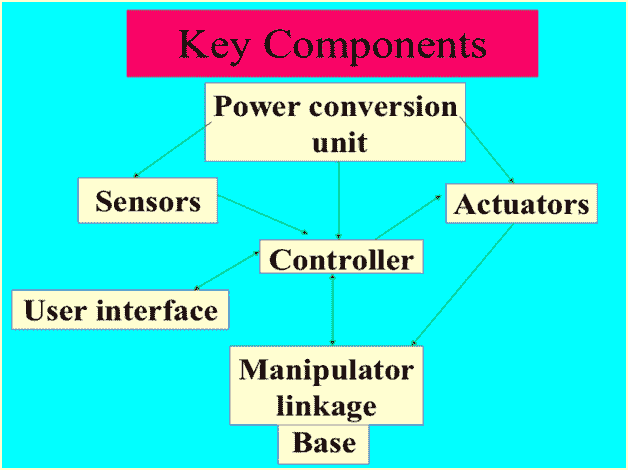

# 机器人的部件

> 原文：<https://www.javatpoint.com/components-of-robot>

**考虑机器人结构显示机器人的不同部件有:**

* * *

## 考虑机器人的关键组件是:-

*   **电源-** 机器人的工作电源由电池、液压、太阳能或气动电源提供。
*   **执行器-** 执行器是机器人内部使用的能量转换装置。执行器的主要功能是将能量转化为运动。
*   **电动机(DC/交流)-** 电动机是用于将电能转换为其等效机械能的机电元件。在机器人中，马达用于提供旋转运动。
*   **传感器-** 传感器提供任务环境的实时信息。机器人配备了触觉传感器，它模仿人类指纹触摸感受器的机械特性，视觉传感器用于计算环境中的深度。
*   **控制器-** 控制器是机器人的一部分，协调机械系统的所有运动。它还通过各种传感器接收来自周围环境的输入。机器人控制器的核心是一个与输入输出和监控设备相连的微处理器。控制器发出的命令激活运动控制机构，该机构由各种控制器、执行器和放大器组成。