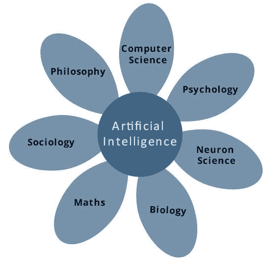

# 机器人学中的人工智能

> 原文：<https://www.javatpoint.com/artificial-intelligence-in-robotics>

随着机器或计算机的发明，它们执行不同任务的能力呈指数级增长。人类已经在不同的工作领域发展了计算机系统的能力，随着时间的推移，速度在增加，体积在减小。

* * *

## 什么是人工智能

按照人工智能创始人约翰·麦卡锡的说法，它是“工程和科学发展出来的智能机器，尤其是一种智能计算机程序”。

这是一种开发计算机、计算机控制的机器人或智能思考软件的方式，与智能人类的思考方式相似。

人工智能是通过研究人脑如何思考以及人类如何在试图解决问题的同时决定、学习和工作，然后将这项研究的结果用作开发智能系统和软件的基础来实现的。

* * *

## 人工智能的目标

*   **用于在机器中实现人类智能-** 创建像人类一样理解、学习、思考和行为的系统。
*   **用于开发专家系统-** 展示智能行为、学习、解释、演示和建议用户的系统。

* * *

## 人工智能的贡献是什么

人工智能是基于心理学、计算机科学、生物学、数学、语言学和工程学等学科的技术和科学。人工智能的一个主要目标是开发与人类智能相关的计算机功能，如学习、推理和解决问题。

考虑对人工智能有贡献的不同领域是:-

* * *

## 有无人工智能编程

| 用人工智能编程 | 没有人工智能的编程 |
| 人工智能程序可以通过一起使用高度独立的信息来吸收新的修改。因此，你甚至可以在不影响程序结构的情况下修改程序中的一条微小信息。 | 程序的修改会导致其结构的改变。 |
| 一个带有人工智能的计算机程序可以回答它想要解决的**类**问题。 | 没有人工智能的计算机程序可以回答它要解决的**具体**问题。 |
| 简单快速的程序修改。 | 修改并不快捷和容易。这可能会对程序产生不利影响。 |

## 人工智能的应用

*   **专家系统-** 有各种各样的应用程序，它们集成了机器、特殊信息和软件来提供建议和推理。这些系统向用户提供解释和建议。
*   **Gaming -** AI 在扑克、象棋、井字游戏等战略游戏中发挥主要作用。使用人工智能，机器可以根据一般知识想到大量可能的动作。
*   **自然语言处理-** 使用自然语言处理，可以与能够理解人类所说的自然语言的计算机进行交互。
*   **视觉系统-** 这些系统解释、理解和领会计算机上的视觉输入。
*   **智能机器人-** 机器人是为了执行人类赋予的任务而设计的。他们嵌入了传感器来检测来自外部环境的物理数据，如热、光、声音、压力等。它们有多个传感器、高效处理器和大内存，以展示智能。此外，他们有能力从错误中学习，他们可以很容易地适应新环境。