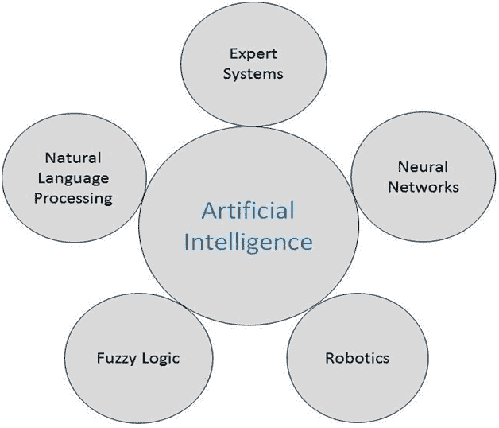

# 人工智能研究领域

> 原文：<https://www.javatpoint.com/artificial-intelligence-research-areas>

人工智能的工作领域在广度和深度上都是巨大的。因此，在继续之前，进一步考虑人工智能领域的繁荣和共同研究领域是:-

*   **专家系统-** 在人工智能中，专家系统用于通过对知识的推理来解决复杂的问题，主要由 if-then 规则而不是传统的程序代码来表示。一般来说，专家系统是利用人类专家的决策能力的计算机系统。
*   **神经网络-** 神经网络是一个相互联系的系统？神经元？它们在彼此之间交换消息。在机器学习中，人工神经网络属于受生物神经网络(存在于大脑内部的动物神经系统)启发的一类模型，用于近似函数或估计大量通常未知的输入。
*   **Robotics -** Robotics 是人工智能(AI)的一个分支，它主要由电气工程、机械工程和计算机科学工程组成，用于机器人的建造、设计和应用。机器人学是构建或设计机器人应用的科学。机器人学的目标是设计一个高效的机器人。
*   **模糊逻辑-** 模糊逻辑是 1965 年作为模糊集合论的提出而引入的。它被应用到各个领域，从人工智能到控制理论。模糊逻辑是多值逻辑的一种形式，其中变量的真值表值可以是 0 到 1 之间的实数。
*   **自然语言处理-** 自然语言处理(NLP)是利用英语等自然语言与智能系统进行通信的方法。自然语言处理系统的输入输出是语音和文字。

* * *

## 语音识别

语音和语音这两个术语在专家系统、自然语言处理和机器人学中都很常见。由于这些术语可以互换使用，所以它们的目标是不同的。

语音识别和语音识别的区别如下:

| 声音识别 | 语音识别 |
| 语音识别的目的是识别谁在说话。 | 语音识别的目的是理解和领会**所说的是什么。** |
| 这个识别系统需要培训，因为它是以人为本的。 | 这种识别系统不需要训练，因为它不依赖于说话者。 |
| 它用于通过分析一个人的声音、音调、音高和口音等来识别这个人。 | 它用于免提计算、菜单导航或地图。 |
| 依赖于说话者的语音识别系统很容易开发。 | 与说话人无关的语音识别系统很难开发。 |