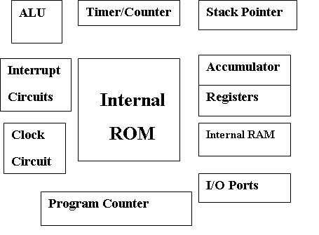
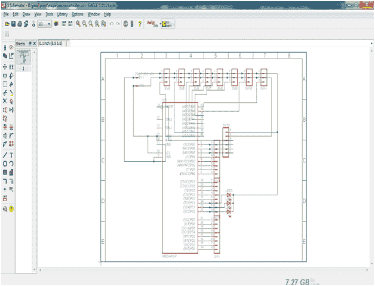
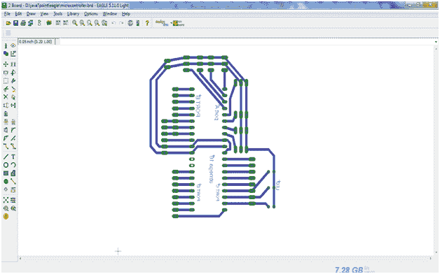

# 机器人学中的微控制器

> 原文：<https://www.javatpoint.com/robotics-microcontroler>

微控制器是微处理器的高级版本。它包括片上中央处理器、只读存储器、随机存取存储器、输入输出单元、中断控制器等。

因此，微控制器用于嵌入式系统内部的高速信号处理操作。它是嵌入式系统设计中使用的主要组件。

考虑微控制器的框图:

* * *

## 微控制器的基本元件

*   **算术和逻辑单元(ALU)—**微控制器内部用于执行算术和逻辑运算的 ALU。它对存储在寄存器中的数据执行逻辑运算。
*   **累加器-** 累加器是存储中间算术和逻辑运算数据的寄存器。
*   **工作寄存器-** 寄存器是用于将微控制器内部的数据存储在不同地址位置的存储设备。
*   **程序计数器-** 程序计数器用于计数微控制器内部执行的程序数量。
*   **堆栈指针-** 堆栈指针充当指向特定地址的指针。它是一个寄存器，用于存储堆栈中处理器发出的最后一个程序请求的地址。
*   **时钟电路-** 时钟电路用于产生所需的时钟脉冲作为微控制器的参考信号。
*   **中断电路-** 中断电路用于在微控制器根据优先级要求先服务较高优先级的进程时，产生中断信号。
*   **内部 ROM -** 内部 ROM 是用于存储嵌入式系统中信息的只读存储器。它充当微控制器内部存储指令和数据的主存储器。
*   **I/O 端口-** I/O 端口用于将传感器、键盘等输入设备与输入端口连接，将液晶显示器、蜂鸣器等输出设备与微控制器中可用的输出端口连接。

考虑 Atmega-16 微控制器电路在 eagle 软件上的示意图是，

考虑在完成微控制器端子和头部 is 之间的布线后的 PCB 板布局，

完成电路板布局后，运行它以生成 PDF。生成的 PDF 用于将上述布局打印在头顶投影仪纸张(称为 OHP 纸张)或蜡纸上，以设计印刷电路板。