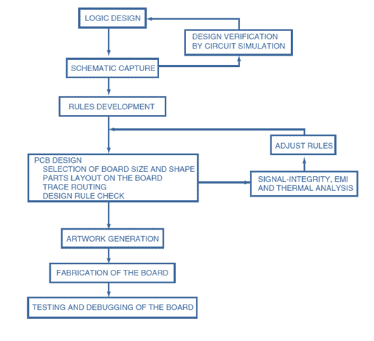

# 印刷电路板的设计

> 原文：<https://www.javatpoint.com/robotics-designing-of-pcb>

印刷电路板使用蚀刻的铜通路连接电子元件，它还为机器人电路提供机械强度。多氯联苯由多层有机和无机介电材料组成。

流程图中总结的总体印刷电路板设计流程如下所示

eagle 软件用于生成电路布局。在印刷电路板中，导电板上使用铜走线。预定义的轨道减少了布线，因此减少了由于连接丢失而引起的故障。

* * *

## 印刷电路板设计所需的材料:

*   激光打印机
*   头顶投影仪(OHP)纸张或蜡纸。
*   熨斗
*   两个塑料托盘
*   钢丝绒
*   印刷电路板/铜板
*   黑色永久标记
*   钻床
*   蚀刻溶液(氯化铁)

因此，利用上述材料组合设计了机器人所需的电子硬件。