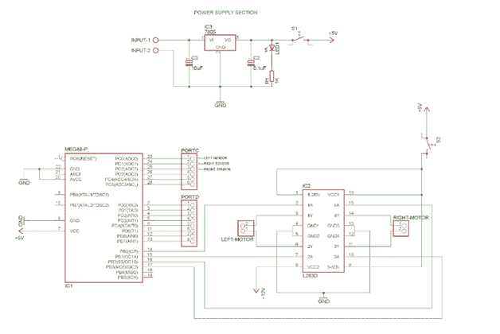
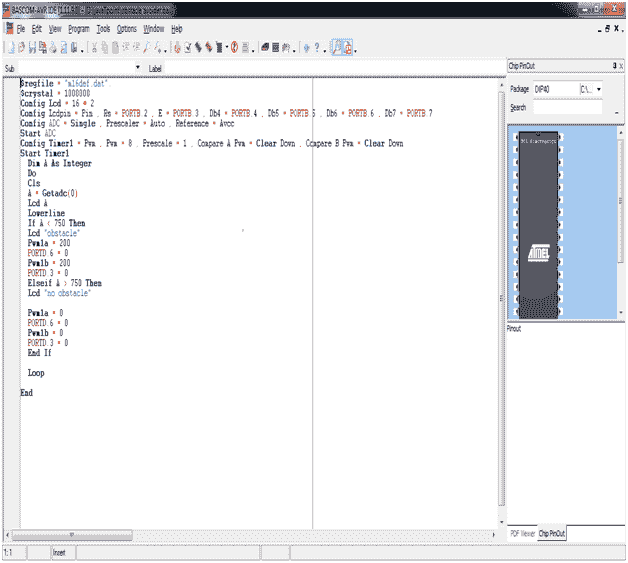

# 避障机器人

> 原文：<https://www.javatpoint.com/obstacle-avoider-robot>

避障机器人是移动机器人的重要组成部分。避障是用于检测机器人或任何车辆路径中物体存在的任务。

避障机器人是一种智能设备，用于保护机器人免受任何物理损伤。它会自动感知并克服前进道路上的障碍。

* * *

## 工作:

在本项目中，我们将研究如何使用 AVR ATmega16 微控制器和模拟红外传感器设计和仿真避障机器人。设计的机器人是自动机器人，即机器人的操作不需要手动控制。

在避障机器人中，我们使用 ATmega16 微控制器的模数转换器将模拟信号转换为数字值。将红外传感器信号转换为数字等效信号后，即阈值(在我们的项目中为 3V)。根据上述比较的输出，微控制器向机器人的 DC 电机驱动器集成电路(L293D)发送控制信号，以使机器人向前、向左或向右移动。传感器输出比较、模数转换和机器人控制的上述操作一直持续到电源接通。

* * *

## 所需硬件:

*   12V，1A DC 适配器-1 件
*   模拟红外传感器-3 件套
*   自动电压调节器微控制器板-1 件
*   DC 电机驱动器-1 件
*   AVR USB 程序员-1 个部件
*   1 对 1 连接器-15 件
*   10 至 10 FRC 母接头-2 件
*   机器人 1 号

* * *

## 所需软件:

*   集成开发环境
*   阿沃杜德
*   winavr-2010 年款
*   USBasp 驱动程序

* * *

## 电路图:

考虑基于 eagle 软件的避障机器人电路图是:-



* * *

## 源代码:

```

$regfile = "m16def.dat".
$crystal = 1000000
Config Lcd = 16 * 2
Config Lcdpin = Pin , Rs = Portb.2 , E = Portb.3 , Db4 = Portb.4 , Db5 = Portb.5 , Db6 = Portb.6 , Db7 = Portb.7
Config Adc = Single , Prescaler = Auto , Reference = Avcc
Start Adc
Config Timer1 = Pwm , Pwm = 8 , Prescale = 1 , Compare A Pwm = Clear Down , Compare B Pwm = Clear Down
Start Timer1
  Dim A As Integer
  Do
  Cls
  A = Getadc(0)
  Lcd A
  Lowerline
  If A < 750 Then
  Lcd "obstacle"                                            '
  Pwm1a = 200
  Portd.6 = 0
  Pwm1b = 200
  Portd.3 = 0
  Elseif A > 750 Then
  Lcd "no obstacle"

  Pwm1a = 0
  Portd.6 = 0
  Pwm1b = 0
  Portd.3 = 0
  End If

  Loop

End

```

考虑使用 BASCOM-AVR 集成开发环境(IDE)的避障机器人中使用的源代码截图是:-

