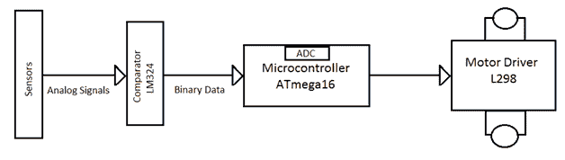
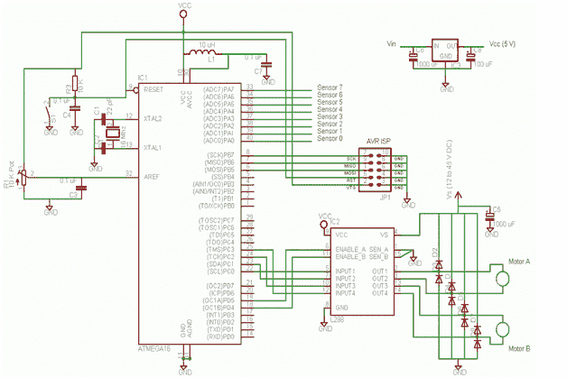
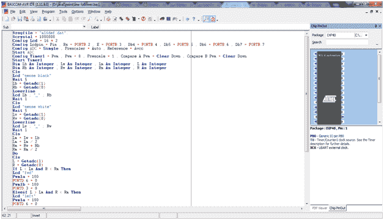
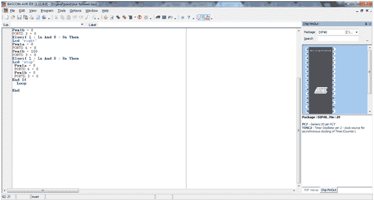

# 直线跟随机器人

> 原文：<https://www.javatpoint.com/line-follower-robot>

* * *

## 什么是线跟随器:

线跟随机器人是一种能够沿着一条路径行进的自主机器。路径可以像黑色表面上的白线一样看到(反之亦然)，也可以像磁场一样看不见。

* * *

## 线跟随机器人的要求:

感知一条线并操纵机器人保持在路径上，同时利用反馈机制不断纠正错误的动作，形成了一个简单有效的闭环系统。作为一名程序员，我们有机会？教书？机器人如何沿着这条线走，因此它赋予机器人像人类一样对刺激做出反应的特性。

考虑线从动机器人的实际应用是:

*   用于在车间移动的工业机器人的引导系统
*   带嵌入式磁铁的自动驾驶汽车。

* * *

## 所需硬件:

*   12V，1A DC 适配器-1 件
*   模拟红外传感器-3 件套
*   自动电压调节器微控制器板-1 件
*   DC 电机驱动器-1 件
*   AVR USB 程序员-1 个部件
*   1 对 1 连接器-15 件
*   10 至 10 FRC 母接头-2 件
*   机器人 1 号

* * *

## 所需软件:

*   集成开发环境
*   阿沃杜德
*   winavr-2010 年款
*   USBasp 驱动程序

* * *

## 框图:



## 算法:

1.  r =最右边的传感器读数为 0，L =最左边的传感器读数为 0。如果右侧(或左侧)没有传感器为 0，则 L(或 R)等于 0。
2.  如果所有传感器读数为 1，则转到步骤 3，

如果左下右移

如果左>右向左移动

如果左=右向前移动

6.  如果线最后一次出现在左边，逆时针移动；如果线最后一次出现在右边，顺时针移动。重复步骤 3，直到找到线。

* * *

## 电路图:

考虑基于 eagle 软件的线路跟随机器人的示意电路是:-



**源代码:**

```

$regfile = "m16def.dat".
$crystal = 1000000
Config Lcd = 16 * 2
Config Lcdpin = Pin , Rs = Portb.2 , E = Portb.3 , Db4 = Portb.4 , Db5 = Portb.5 , Db6 = Portb.6 , Db7 = Portb.7
Config Adc = Single , Prescaler = Auto , Reference = Avcc
Start Adc
Config Timer1 = Pwm , Pwm = 8 , Prescale = 1 , Compare A Pwm = Clear Down , Compare B Pwm = Clear Down
Start Timer1
Dim Lb As Integer , Lw As Integer , Lm As Integer , L As Integer
Dim Rb As Integer , Rw As Integer , Rm As Integer , R As Integer
Cls
Lcd "sense black"
Wait 5
Lb = Getadc(1)
Rb = Getadc(0)
Lowerline
Lcd Lb ; "_" ; Rb
Wait 1
Cls
Lcd "sense white"
Wait 5
Lw = Getadc(1)
Rw = Getadc(0)
Lowerline
Lcd Lw ; "_" ; Rw
Wait 1
Cls
Lm = Lw + Lb
Lm = Lm / 2
Rm = Rw + Rb
Rm = Rm / 2
Do
Cls
L = Getadc(1)
R = Getadc(0)
If L < Lm And R < Rm Then
Lcd "fwd"
Pwm1a = 100
Portd.6 = 0
Pwm1b = 100
Portd.3 = 0
Elseif L > Lm And R < Rm Then
Lcd "left"
Pwm1a = 100
Portd.6 = 0
Pwm1b = 0
Portd.3 = 0
Elseif L < Lm And R > Rm Then
Lcd "right"
Pwm1a = 0
Portd.6 = 0
Pwm1b = 100
Portd.3 = 0
Elseif L > Lm And R > Rm Then
Lcd "stop"
 Pwm1a = 0
 Portd.6 = 0
 Pwm1b = 0
 Portd.3 = 0
End If
  Loop

End

```

考虑使用 BASCOM-AVR 集成开发环境(IDE)的 Line Follower 机器人中使用的源代码截图是:-

 