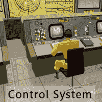
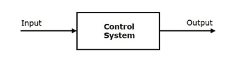
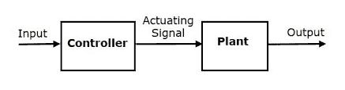
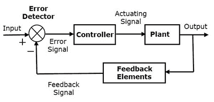

# 控制系统教程

> 原文：<https://www.javatpoint.com/control-system-tutorial>

控制系统教程提供控制系统库的基本和高级概念。我们的控制系统教程是为初学者和专业人士设计的。

我们的控制系统教程包括控制系统教程的所有主题，如控制系统介绍、分类、传递函数、信号流图、梅森增益公式、框图、状态空间模型等。

## 控制系统介绍

控制系统是通过改变输入来控制输出的系统。第一个控制系统装置是詹姆斯·瓦特的飞球调速器，发明于 1767 年。发明飞球调速器的目的是通过调节发动机的蒸汽供应来保持发动机的速度不变。

在控制系统中，系统的行为由微分方程描述。微分方程可以是常微分方程，也可以是差分方程。

控制系统有两种类型:

1.  开环控制系统。
2.  闭环控制系统。

## 开环控制系统

开环控制系统是一种控制动作独立于所需输出信号的系统。在这个系统中，输出信号不与输入信号进行比较，这意味着在这个系统中没有反馈信号。开环控制系统也称为无反馈控制系统或无反馈控制系统。

### 例子

1.  **自动洗衣机** -在本系统中，操作时间是手动设定的。设定时间结束后，无论是否获得所需的清洁度，机器都会停止运转，因为没有机器能够感应到的反馈信号。
2.  浸没棒-在这个系统中，棒加热水，但需要多少热水，棒无法感知。

### 开环控制系统的优点

1.  开环系统很简单。
2.  这些都是经济的。
3.  需要较少的维护，并不难。

### 开环控制系统的缺点

1.  开环系统是不准确的。
2.  这些系统不可靠。
3.  这些很慢。
4.  不可能优化。

## 闭环控制系统

闭环控制系统是一个控制动作依赖于期望输出的系统。在该系统中，将输出信号与参考输入信号进行比较，并产生误差信号，然后将该误差信号馈送给控制器以减小误差，从而获得期望的输出。

### 例子

1.  自动电熨斗。
2.  伺服稳压器。
3.  空调。

### 闭环系统的优点

1.  这些系统更可靠。
2.  闭环系统更快。
3.  许多变量可以同时处理。
4.  优化是可能的。

### 闭环系统的缺点

1.  闭环系统很贵。
2.  维护很困难。
3.  这些系统很难安装。

### 开环系统和闭环系统的区别

| S.No | 开环控制系统 | 闭环系统 |
| one | 这些更容易构建。 | 这些很难建造。 |
| Two | 这些系统不可靠。 | 这些系统是可靠的。 |
| three | 这些系统很慢。 | 这些系统速度更快。 |
| four | 这些系统通常更稳定。 | 这些系统不太稳定。 |
| five | 不可能优化。 | 优化是可能的。 |
| six | 例子——干手器、洗衣机。 | 伺服稳压器、空调。 |

* * *

## 控制系统索引

* * *

**控制系统**

*   [教程](control-system-tutorial)
*   [控制系统分类](control-system-classification)
*   [物理系统的数学建模和表示](control-system-mathematical-modelling-and-representation-of-physical-system)
*   [传递函数](control-system-transfer-function)
*   [控制系统中的框图](control-system-block-diagram)
*   [信号流程图](control-system-signal-flow-graphs)
*   [梅森增益公式](control-system-mason-gain-formula)
*   [线性时不变系统的瞬态和稳态分析](control-system-transient-and-steady-state-analysis-of-linear-time-invariant-systems)

*   [一阶系统时间响应](control-system-time-response-of-first-order-system)
*   [二阶系统的时间响应](control-system-time-response-of-second-order-system)
*   [劳斯-赫维茨稳定性准则](control-system-routh-hurwitz-stability-criterion)
*   [P、PI 和 PID 控制器](control-system-p-pi-and-pid-controller)
*   [状态空间模型](control-system-state-space-model)

**面试问题**

*   [控制系统](control-systems-interview-questions)
*   [电机](electrical-machines-interview-questions)

* * *

## 先决条件

在学习控制系统教程之前，你必须具备 JAVA 语言的基础知识。

## 观众

我们的控制系统教程旨在帮助初学者和专业人士。

## 问题

我们保证您在本控制系统教程中不会发现任何问题。但是如果有任何错误，请在联系表格中发布问题。

* * *