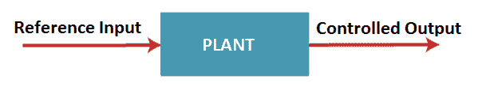
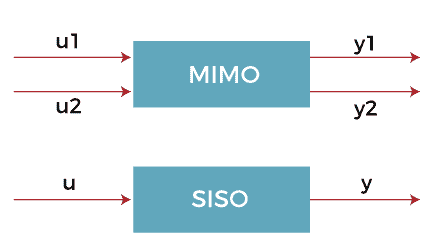
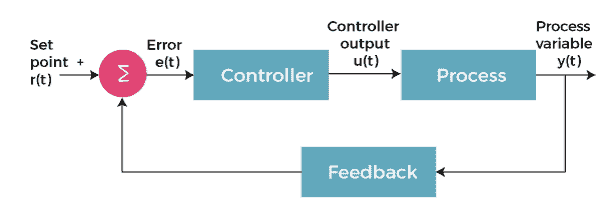
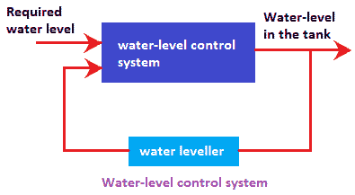

# 控制系统的基本概念

> 原文：<https://www.javatpoint.com/basic-concepts-of-control-system>

在开始介绍控制系统的概念之前，我们先来讨论一下系统。

### 系统

系统是不同组件的**排列，它们作为一个集体单元一起执行特定的任务。**物理系统**被定义为系统中的物理对象执行目标的集体动作，例如教室。教室里有长凳、桌子、风扇、灯、黑板等。，共同构成了一个物理系统。**

风筝是由棍子和纸组成的，湖里的水也是一种物理系统。

## 操纵系统

控制是指调节或**指示**。因此，控制系统是各种物理元件的**互连**，这些物理元件以某种方式连接，以调节或指导自身或其他系统。

让我们考虑一个在日常生活中使用的最好的例子，**空调。**

它通过遥控器接收用户的输入，处理指令，并将空气输送到相应的房间。空调中的温度控制装置根据用户的要求保持温度。当达到所需温度时，空调自动关闭压缩机。一旦温度开始变化，它就会再次打开压缩机。设置可以通过远程手动完成。

空调有三个控制器，**温度控制，恒湿器，**和**空气状态**。温度控制温度，恒湿器控制相对湿度，空气调节器控制室内气流。

因此，我们可以得出这样的结论:控制系统是物理组件的互连，通过一些控制动作来提供期望的功能。

现在，让我们讨论一些基本术语，这些术语将在本教程中有所帮助。

### 植物

系统中被控制或调节的部分被称为过程工厂。在控制系统中，它通常被称为传递函数，它规定了没有反馈的系统输入和输出之间的关系。这意味着植物可以是任何有输入并提供输出的东西。

工厂可以有一个或多个输出和输入。传感器用于测量工厂的输出，而执行器驱动工厂的输入。

工厂示意图如下所示:

系统中的输入变量通常称为参考输入，输出称为控制器输出。

### 控制器

控制器是系统的组成部分。它也可能位于系统外部。控制器的功能是控制工厂或过程。每个系统都接受输入，并在分析输入的性质后定义输出。控制系统中的控制器是减小系统的**实际值**和**期望值**之间的差值的机构。这里，实际值表示真实值，而期望值是设定点或目标值。

### 投入

它是来自外部能源的信号，施加到控制系统，以产生所需的输出。

或者

它是能够在系统中产生任何响应的期望动作。

控制系统中常用的输入类型有 **SISO** (单输入单输出)和**多输入多输出**(多输入多输出)。SISO 意味着系统为单个输入产生单个输出，而多输入多输出为多个输入产生多个输出。如下所示:

控制系统中的参考输入也称为**设定点**，即期望值。它作为使用负反馈进行误差控制的误差控制调节的基础。

### 输出

它是控制系统施加的输入信号的实际响应。输入被激励到系统中，输出是该输入的处理结果。输出是过程的一小部分或整个过程的结果。

### 干扰

干扰是一种对控制系统的输出值有不利影响的信号。干扰可以是内部的，也可以是外部的。系统自身产生的内部干扰和系统外部产生的外部干扰。这种干扰作为系统和正常输入的**额外输入**，并进一步影响系统的输出。

## 控制系统术语

控制系统的术语分为:

*   自动控制系统
*   手操纵系统
*   线性控制系统
*   时变控制系统
*   时不变控制系统

### 自动控制系统

没有任何人为干预的自动控制系统被称为**自动控制系统**，例如自动驾驶控制系统。它是一种动态系统，其中微分方程一般描述过程。自动控制系统的其他例子有冰箱、自动售票机等。

在**反馈**的帮助下，闭环系统允许系统校正输出中的扰动，这使得系统成为自动控制系统。

### 手操纵系统

由人工干预调节的控制系统称为手动控制系统。它定义了系统外人员执行的**手动控制**。例子包括签署文件和银行对账。手动控制的主要功能是干扰或修改过程。

控制系统可以是自动的或手动的，或者两者都有。当系统涉及类似性质的大型交易时，需要自动控制。手动控制基于所需的判断。

### 线性控制系统

顾名思义，它描述的是输入和输出之间的**线性**关系。或者

用线性微分方程描述输入输出关系的系统称为**线性系统**。这样的系统也遵循叠加原理。

### 时变控制系统

用变系数微分方程描述输入输出关系的系统称为时变系统。

### 时不变控制系统

用常系数微分方程描述输入输出关系的系统称为时不变系统。

### 负反馈

闭环系统的框图如下所示:

当控制器的输入被激发时，它产生一个控制设备的启动信号。在这种情况下，输出会自动调整，直到达到所需的响应。该反馈有助于系统纠正输出中的变化，**消除其中的错误**。因此，闭环系统也被称为自动闭环系统。

我们都熟悉控制系统中的反馈路径。反馈路径有助于分析错误。传递函数最好地描述了输入和输出之间的关系，因此有助于通过反馈分析误差。

## 控制系统的基本概念

控制系统定义了各种组件之间的互连。系统的单个组件本质上可以是**电气、液压、机械、热、**或**化学**。设计良好的控制系统往往会对整个系统产生最佳的响应。它还可以有效地处理外部、内部和时间相关的干扰。控制系统的基本概念是:

1.  为了最小化误差
2.  为了最小化时间响应

实际值和期望值之间的误差越小，系统的响应就越好。这是因为没有一个系统希望在两者之间有任何误差。系统的最小时间响应有助于系统中的负载变化。

### 例子

让我们考虑一个水箱中**水位控制系统**的例子。当泵打开时，它允许水流入水箱。一旦油箱加满至所需液位，泵将关闭。

水位控制系统的框图如下所示:

有些人使用随机方法来指示油箱已加满，并手动切换开和关按钮。但是，在有许多坦克和巨大系统的工业和工作场所，这个过程是自动进行的。传感器向系统提供信号。

### 工作

**水位传感器**向系统发出信号，通知水箱中的液位。系统将该水位与所需水位进行比较。该系统进一步提供适当的响应以获得水箱中所需的水位。如果水位低于所需值，它会打开泵，水从入口流入水箱。这是一个**反馈控制系统**的例子，传感器信号从输出端反馈。它将系统的实际输出与所需值进行比较，并进行相应的调整。

* * *