# 控制系统框图

> 原文：<https://www.javatpoint.com/control-system-block-diagram>

任何系统都可以用一组微分方程来描述，也可以用包含所有组件及其连接的示意图来表示。然而，这些方法不适用于复杂的系统。

框图表示是这两种方法的组合。框图是使用块的系统的表示。

用框图表示任何系统，都需要求出系统的传递函数，即输出的拉普拉斯与输入的拉普拉斯之比。

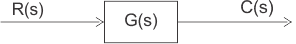

**其中**

```

	R(s) = Input
	C(s) = output
	G(s) = transfer function

```

然后，系统可以表示为

```

C(s) = R(s).G(s)

```

**求和点**:当我们想要将不同的输入信号应用到同一个模块时，最终的输入信号就是所有输入的总和。输入信号的求和由一个称为求和点的交叉圆表示，如下图所示。

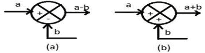

**起飞点**:当有一个以上的区块，并且我们想要对所有的区块应用相同的输入时，我们使用一个起飞点。通过使用输出点，相同的输入传播到所有块，而不影响其值。下图显示了对多个模块的相同输入的表示。

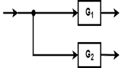 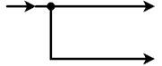

## 如何绘制框图:

考虑一个简单的 R-L 电路


申请 KVL

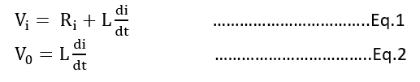

现在在初始条件为零的情况下，对等式 1 和等式 2 进行拉普拉斯变换

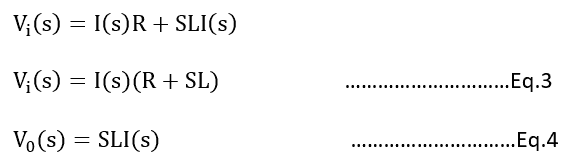

从等式 3 和等式 4

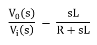

来自图:

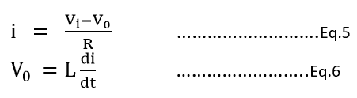

现在进行等式 5 和等式 6 的拉普拉斯变换

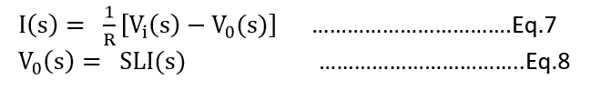

对于等式 5 的右侧，我们将使用一个求和点。

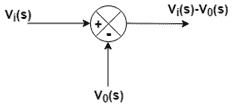

这里，求和点的输出被提供给块，并且块的输出是 I(s)

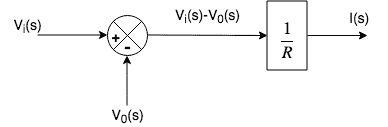

现在，输出 I(s)被给予包含元素 SL 的另一个块，并且这个块的输出是 V0。

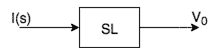

通过结合以上两个图，我们得到了所需的框图。

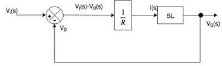

**闭环控制系统**

有反馈路径的系统称为闭环控制系统。在该系统中，输出反馈到误差检测器，然后与输入信号进行比较。反馈信号可以是负的或正的。

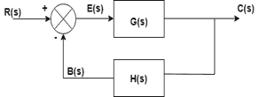

为了积极的反馈

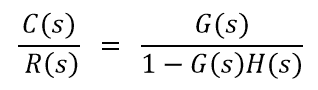

对于负面反馈

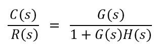

## 框图简化规则

**规则 1 .级联中的区块**

当两个或多个块串联**时，得到的块是各个块的乘积。**

 **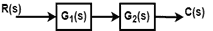 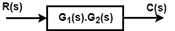

**第 2 号规则平行方块**

当两个或多个块并行连接时，得到的块就是各个块的总和。

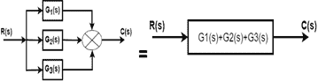

**第三条规则:将起飞点移至街区前方**

当起飞点移动到一个区块之前(区块之前)时，在起飞点分支中引入相同的传递函数。

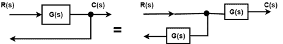

**第四条规则:将起跳点移至拦网后**

当起飞点在块之后移动时，那么在起飞点分支中引入具有传递函数倒数的块。

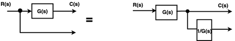

**第 5 条规则将求和点移出区块**

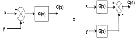

**规则 6:将求和点移动到块的前面**

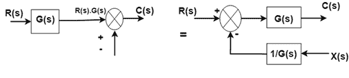

**规则 7:互换两个求和点**

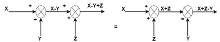

**规则 8:将起飞点移出求和点**

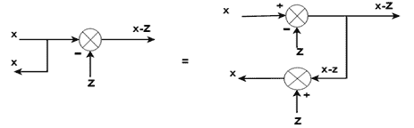

**规则 9:将起飞点移至求和点之前**

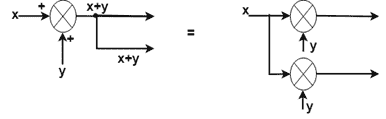

**规则 10:取消正向循环**

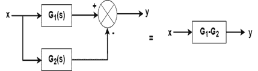

## 例子

用块归约技术求下面的传递函数。

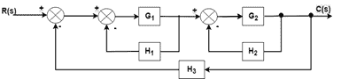

## 解决办法

**第一步**:有两个内部闭环。首先，我们将移除这个循环。

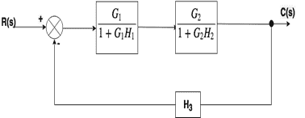

**第二步**:当两个区块串联或串联时，我们将使用规则 1

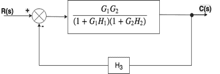

**第三步**:现在我们来解这个循环。

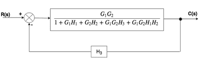

**第四步**:

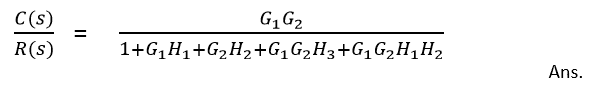**