# 信号流程图(SFG)

> 原文：<https://www.javatpoint.com/control-system-signal-flow-graphs>

**简介**:框图化简是确定控制系统传递函数的绝佳方法。然而，在一个复杂的系统中，这是一个非常困难和耗时的过程，这就是为什么 S.J .梅森开发了一种替代方法，即 SFG，它将输入和输出系统变量图形化地联系起来。在信号流图中，传递函数被称为透射率。

**SFG 的特点** : SFG 是一组线性代数方程的变量之间关系的图形表示。它不需要任何还原技术或过程。

*   它表示一个网络，其中节点用于表示由直接分支连接的系统变量。
*   SFG 是一个代表一组方程式的图表。它由节点和分支组成，这样 SFG 的每个分支都有一个代表信号流的箭头。
*   它只适用于线性系统。

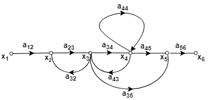

## SFG 使用的术语

**节点**:表示等于所有信号之和的系统变量。来自节点的输出信号不影响节点变量值。

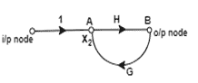

**分支**:分支定义为从一个节点到另一个节点的路径，方向由分支箭头指示。

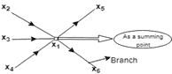

作为求和点的节点:

```
x1 = Summing point
x1 =  x2+x3+x4

```

作为传输(输出)点的节点:

```
x1 = x5+x6

```

**输入节点或来源**:只有输出分支的节点。

**输出节点或宿**:是一个只有传入分支的节点。

**正向路径**:是分支箭头方向从输入节点到输出节点的路径。

**循环**:是在同一个节点开始和结束的路径。

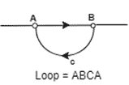
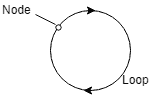

**非接触循环**:如果没有任何公共节点，则称循环为非接触。

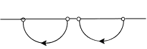

**正向路径增益**:正向路径上所有分支增益的乘积称为正向路径增益。

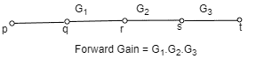

**环路增益**:环路增益是在环路中传播的支路增益的乘积。

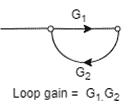

## SFG 和梅森增益公式的构造:

一个系统的 SFG 是由下列方程构成的

## 例子

考虑由以下方程组描述的系统


其中 x1 为输入，x <sub>5</sub> 为输出。

**步骤 1** -第一步是绘制所有节点。

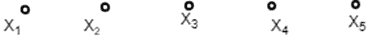

**第二步** -画出方程(1)的 SFG

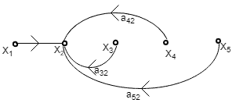

**第三步** -画出方程(2)的 SFG


**步骤 4** -画出方程(3)的 SFG


**第五步** -画出方程(4)的 SFG

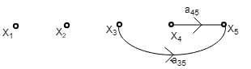

**第六步** -现在借助上图画出完整的信号流程图。

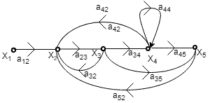