# 控制系统:示例和说明

> 原文：<https://www.javatpoint.com/control-system-examples-with-explanation>

在这里，我们将讨论与框图简化、信号流图、梅森增益公式和控制系统基本概念相关的例子。这些例子将基于 MCQ，因为这也将有助于竞争性考试。

### 例 1:

求给定框图的传递函数。

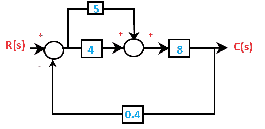

1.  Ten
2.  Seven point seven
3.  Four point five
4.  Two point four one six

**回答:** (d) 2.416

**解决方案:**在给定的框图中，R(s)是输入，C(s)是输出。系统的传递函数将是输出和输入的比率。它由下式给出:

居权证/居权证

让我们从求解系统传递函数的步骤开始。

**第一步:**我们将首先使用两个并行块的值相加的规则将两个块并行组合，形成一个等价块。如下所示:

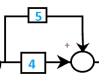

4 + 5 = 9

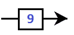

求解后，框图现在将显示为:

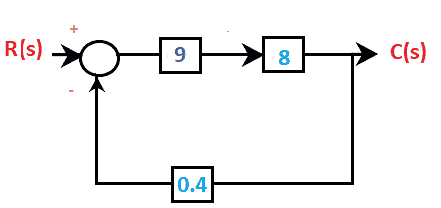

**步骤 2:** 现在，我们将使用级联中两个块的值相乘形成等效块的规则来串联组合块。如下所示:

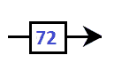

9x8 = 72

第二步后的框图将显示为:

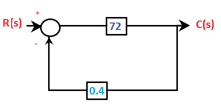

我们只剩下一个闭环。闭环传递函数由下式给出:

c(s)/R(s)= 72/1+72x 0.4 = 72/29.8 = 2.416

碳/硫= 2.416

### 例 2:

线性系统的传递函数由下式给出:

1.  系统输出 Vo(t)与输入 Vi(t)的比值。
2.  系统输出 dVo(t)/dt 和输入 dVi(t)/dt 的导数之比。
3.  所有初始条件为零的系统的输出 Vo 和输入 Vi 的拉普拉斯变换的比率。
4.  系统输出 Vo 和输入 Vi 的傅里叶变换之比。

**答案:** (c)系统输出 Vo(s)和输入 Vi(s)的拉普拉斯变换的比率。

**解:**对于给定的框图或特征方程，线性系统的传递函数总是用拉普拉斯表示。它被计算为系统输入和输出的拉普拉斯变换的比率。

例如，

VO =(1+t2VI

上述方程的传递函数可以通过首先取拉普拉斯算出，其由下式给出:

Vo (s) = (1/s + 2/s 3 ) Vi(s)

Vo (s)/ Vi(s) = (1/s + 2/s 3 )

因此，传递函数为(1/s + 2/s 3 )。它是在假设所有初始条件为零后得到的。

### 例 3:

求给定框图的传递函数。

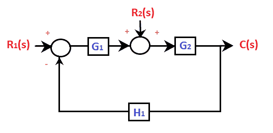

1.  c(s)= G1R1(s)/(1+G1H1)+G2R2(s)/(1+G1G2H1
2.  c(s)= G1G2R1(s)/(1+G1G2H1)+G2R2(s)/(1+G1G2H1
3.  c(s)= G2R1(s)/(1+G1G2H1)+R2(s)/(1+G1G2H1
4.  c(s)= G1G2R1(s)R2(s)/(1+G1G2H1

**答案:**(b)C(s)= G1G2R1(s)/(1+G1G2H1)+G2R2s)/(1+G1G2H

**解:**以上问题是多输入的系统。让我们考虑一些可能有助于解决多输入问题的步骤。

1.  将一个输入和其他输入视为零。
2.  对每个输入执行上述步骤。
3.  重新排列框图，确定具有单个非零输入的传递函数。
4.  对所有输入重复步骤 3。
5.  将所有传递函数相加，得到最终输出。

为了解决上述问题，请遵循以下步骤:

**步骤 1:** 在给定的图中，有两个输入 R1 和 R2。让我们首先设置 R1 =0。

如此安排的框图将显示为:

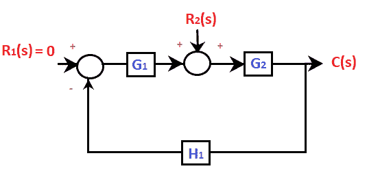

生成的框图现在将显示为:

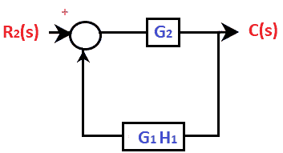

传递函数将是:

c2(s)/R2(s)= G2/(1+G1G2H1

c2(s)= G2R2(s)/(1+G1G2H1...(1)

**步骤 2:** 现在假设 R2 = 0

如此安排的框图将显示为:

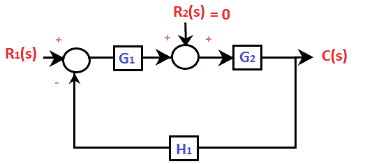

生成的框图现在将显示为:

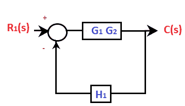

传递函数将是:

c1(s)/R1(s)= G1G2/(1+G1G2H1

c1(s)= G1G2R1(s)/(1+G1G2H1...(2)

现在，将这两个方程相加，我们将得到所需的传递函数。它由下式给出:

C(s)= C1(s)+C2(s)

c(s)= G1G2R1(s)/(1+G1G2H1)+G2R2(s)/(1+G1G2H1

c(s)=(G1G2R1(s)+G2R2(s))/(1+G1G2H1

### 例 4:

系统类型表示以下数量:

1.  原点为零
2.  原点的极点
3.  无穷远处的极点
4.  有限极点

**回答:** (b)原点的极点

**解:**系统的类型通常表示原点的极数。如果原点有两个极点，则意味着系统是类型 2。类型 1 表示开环传递函数，原点有一个极点。类似地，我们可以说，如果系统在原点没有极点，它被归类在类型 0 系统下。

### 例 5:

在给定的信号流图中，y/x 等于:

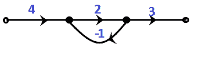

1.  Two point five
2.  eight
3.  six
4.  four

**回答:** (b) 8

**解决方案:**信号流图中只有一个回路。环路增益由下式给出:

2/( 1 + 2(1)) = 2/3

所有其他分支串联或级联。因此，等效结果将是三个节点上所有值的乘积。

y/x = 4 x 2/3 x 3 = 8

### 示例 6:

信号流图的目的是找出:

1.  系统的传递函数
2.  系统的可控性
3.  系统的稳定性
4.  系统的可观测性

**回答:** (a)系统的传递函数

**求解:**利用控制系统中的信号流图求系统的传递函数，如梅森增益公式。它是专门为寻找信号流图的传递函数而设计的，包括非接触环路和前向路径增益。

### 例 7:

求给定信号流图的传递函数。

1.  10/9
2.  22/15
3.  44/23
4.  23/24

**回答:** (c) 44/23

**解:**我们知道信号流图的传递函数一般是用梅森增益公式计算的，公式如下:

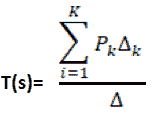

哪里，

Pk 是正向路径增益

这是环路增益。

环路增益计算如下:

1 -所有环路增益之和+两个非接触环路增益积之和-三个非接触环路增益积之和

∑k通过消除所有接触正向路径 Pk 的环路来计算。

让我们讨论给定信号流图的解。

根据给定的图表，有两条前向路径。

P1 = 5

P2 = 1x2x3x4 = 24

有四个独立的闭环。

L1 = -5

L2 = -2

L3 = -3

L4 = -4

只有两个非接触环，即 L2 和 L4。这两个循环的乘积是:(-2) x (-4) = 8

因此，给定信号流图的传递函数为:

= 5 (1 + 3) + 24/ 1 + (5 + 2 + 3 + 4) + 8

= 44/23

### 例 8:

求传递函数 F(s)的初始值 f(t)= 4/s2+2s+5，其中 F(s)是函数 F(t)的拉普拉斯变换。

1.  four
2.  4/5
3.  Zero
4.  one

**回答:** (c) 0

**解:**传递函数的初始值由下式给出:

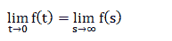

所以，我们将把，s =无穷大放入给定的传递函数 F(s) = 4 /s 2 +2s + 5。

我们得到，

F(s) = 0

### 例 9:

以下哪种说法是不正确的？

1.  传递函数沿着信号流图中的分支表示
2.  简化框图是一个复杂的过程
3.  传递函数沿框图中的分支表示
4.  框图中没有自循环

**回答:** (c)传递函数沿框图中的分支表示

**解决方案:**我们来详细讨论一下这四种说法。

*   **传递函数在信号流图**
    中沿分支表示，信号流图以分支的形式与节点相连。我们找到了从一端到另一端的分支的前向路径和增益。因此，第一种说法是正确的。
*   **框图的简化是一个复杂的过程。**
    框图的简化涉及到各个步骤，因为每一步都需要绘制框图。减少需要仔细遵循。因此，第二种说法也是正确的。
*   **传递函数沿框图中的分支表示。**
    在方框图的情况下，传递函数在方框内表示，而不是沿着分支。因此，第三种说法是不正确的。
*   **框图中没有自循环。**
    信号流图中存在自循环。因此，最后一种说法是正确的。

### 示例:10

给定框图的传递函数为:

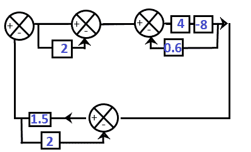

1.  -1.714
2.  1\. 714
3.  -2.9
4.  One point five nine

**回答:** (a) -1.714

**解决方案:**这里，给定的框图有三个循环。所以，我们将首先解决这三个循环。

步骤 1、2 和 3 标记如下:

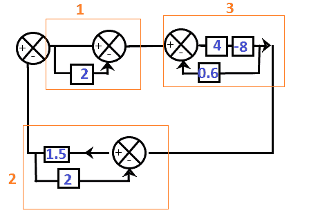

**第一步:**有一个区块和一条单位线平行。当与一个块并联时，单位线被认为是 1。按照规则，并行块的等值是相加的。所以，

= 2 + 1 = 3

**步骤 2:** 它包含两个块，其中一个块出现在反馈路径中。

因此，我们将使用传递函数公式，其中 G(s)和 H(s)分别为 1.5 和 1。

= 1.5/1 + 1.5x2

= 1.5/4

**步骤 3:** 级联中的前两个块将相乘。

= 5 x -8 = -40

它的反馈路径值为 0.6。因此，我们将使用传递函数公式:

一般事务人员/1 -一般事务人员

其中，G(s)和 H(s)分别为-40 和 0.6。

该块的结果值将是:-40/ 1 + (40)(0.6)

= -40/25

生成的框图现在将显示为:

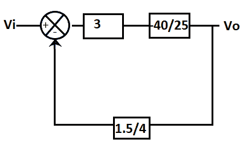

**第 4 步:**框图的传递函数为:

VO(s)/Vi(s)=-(40/25)x3/{ 1+40/25 x3 x 1.5/4)

= (-120/25)/ 2.8

= -120/70

= -1.714

* * *