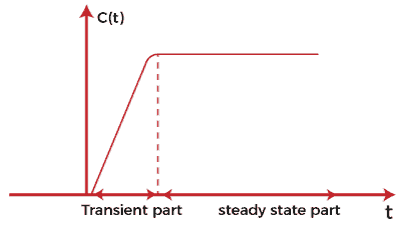
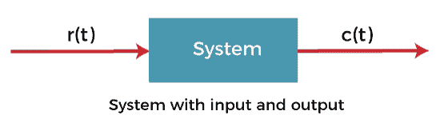
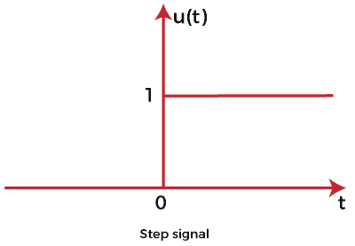
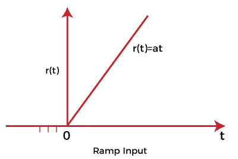
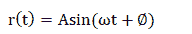
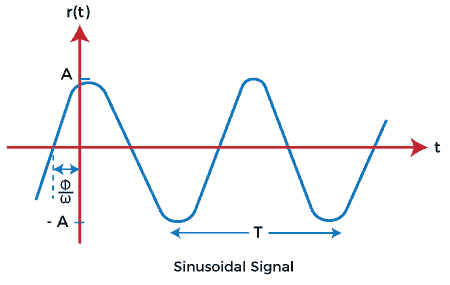
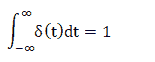
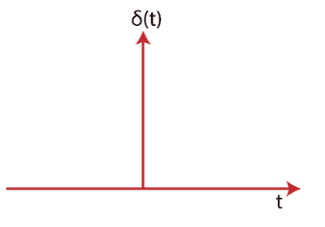

# 控制系统-时间响应分析

> 原文：<https://www.javatpoint.com/control-system-time-response-analysis>

时间响应分析的主要目的是评估系统相对于时间的性能。时间响应图如下所示:

它由两部分组成，**瞬态部分**和**稳态部分**。

向控制系统施加输入后，输出需要一些时间才能达到稳定状态。该阶段的响应称为**瞬态响应**，并构成图的瞬态部分，如上所示。瞬态部分被称为**稳态部分**后达到稳态启动时的曲线图。

为了描述一个系统，我们需要发展系统的输入和输出之间的关系，它们是时间的函数。用来描述这种行为的最常见模型被称为**微分方程**。通过对系统施加不同的输入，可以借助微分方程对系统进行分析。

公共输入信号如下所示:

测试信号 r(t)作为系统的输入，产生响应 c(t)。系统的输入信号可以有多种形式。

#### 注意:输入和输出是随时间变化的函数。

这里，我们将讨论控制系统的**瞬态响应、**稳态响应和**标准信号**。

## 瞬时特性

当时间变得很大时，时间响应的一部分达到 **0** (零)。在包含极点和零点的图形分析中，位于 s 平面左半部分的极点给出瞬态响应。我们也可以说，它是输出持续增加或减少的响应的一部分。瞬态响应也称为响应的**临时部分**。

或者

瞬态响应被定义为系统响应从平衡状态的变化。

例如，

**双极晶体管的开关时间**

BJT 或双极结型晶体管的特性描述了瞬态特性。

## 稳态响应

瞬态响应之后的响应称为稳态响应。在包含极点和零点的图形分析中，**虚轴**上的极点给出稳态响应。我们也可以说，这是产出保持不变的反应的一部分。输出也可以以恒定的幅度和频率周期性变化。稳态响应也称为响应的稳态部分。它是输入信号的函数，因此也被称为系统的**强制响应**。

让我们讨论一些例子，我们将找到给定方程的瞬态和稳态项。

### 例子

**例 1:** 5 + 2e^-t

**解决方案**:

这里，方程的瞬态部分是 2e^-t，因为当 t 趋近于无穷大时，项变为 0。因此，2e^-t 是一个暂时的术语。在第一项 5 的情况下，当 t 接近无穷大时，它将保持不变。因此，5 是方程的稳态项。

**例 2** : 10 + 5e^t

**解决方案**:

这里，第一项，10，是方程的稳态项，因为当 t 接近无穷大时，它将保持不变。在第二项 5e^t 的情况下，当 t 接近无穷大时，结果是无穷大。因此，它不是一个暂时的术语。这是因为无限的力量永远是无限的。

所以，方程中只有一个稳态项。

## 标准信号

1.  阶跃输入信号
2.  斜坡输入信号
3.  正弦输入信号
4.  脉冲输入信号

### 阶跃输入信号

对于正值，阶跃输入显示恒定的时间值。时间信号的负值为零。信号的初始值为，过渡为步长形式，具有恒定值。如果信号的常数值为 1，则称为**阶跃输入信号**，表示为:

该信号的值为:

t=0 时为 0，并且

t>0 时为 1

该图是一个变量 t 的函数。

### 斜坡输入信号

斜坡输入信号的图形为**斜坡**的形状。它描绘了从某个特定点开始的线性增长。斜坡信号的值显示了相对于时间的恒定变化。对于负值，信号值为 0。这意味着它显示正输入的输出。

斜坡函数表示为:

该信号的值为:

对于 t>0 和

t<0 时为 0

如果 t>0 时 A 的值为 1。该信号被称为单位斜坡信号。

### 正弦输入信号

正弦输入的振荡可以用**正弦**形式的方程来描述。线性过程对正弦曲线的响应是正弦的。信号由下式给出:

控制系统中的正弦信号表示为:

正弦波从零开始，覆盖正值，达到零，覆盖负值，再次达到零，如上图所示。

### 脉冲输入信号

脉冲信号是一种高振幅信号，持续时间非常短。意味着当时间到达零时，震级接近 ***无穷大*** 。因此，我们可以说信号的值在 t =0 时是无穷大。否则，其值为 0。

它从-无穷大到无穷大的积分是 1，如上所示。

它是物理上不存在的信号，是基于面积概念定义的。它不是基于振幅概念。脉冲输入信号表示为:

* * *