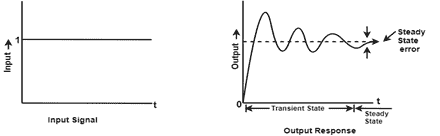
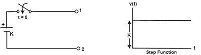
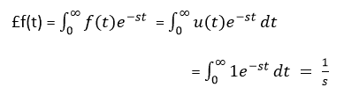
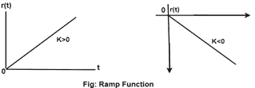
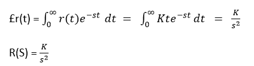
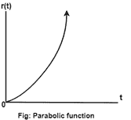
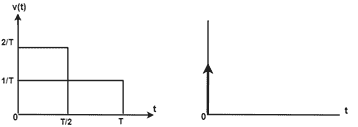
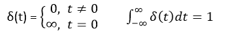
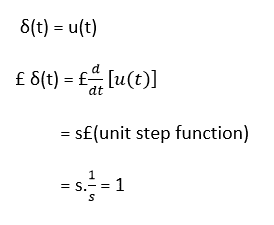

# 线性时不变(LTI)系统的瞬态和稳态分析

> 原文：<https://www.javatpoint.com/control-system-transient-and-steady-state-analysis-of-linear-time-invariant-systems>

## 时间响应分析

当任何系统的能量状态受到干扰，并且干扰发生在输入端、输出端或两端时，那么从一种状态改变到另一种状态需要一些时间。从一种状态变为另一种状态所需的时间称为**暂态时间**，在此期间的电流和电压值称为**暂态响应**。

根据系统的参数，瞬态可能会有持续或衰减的振荡。

因此，控制系统的时间响应分为两部分-

1.  瞬态响应分析
2.  稳态分析。

**瞬态响应**

它处理系统在输入时的响应性质。

**稳态分析**

它处理输入和输出之间稳态误差大小的估计。

**不同类型的标准测试信号**

影响系统性能的各种输入或干扰在数学上表示为标准测试信号。

*   阶跃信号(突然输入)
*   斜坡信号(速度型输入)
*   抛物线信号(加速度输入类型)
*   脉冲信号(突然冲击)

## 注意

*   阶跃信号和脉冲信号是有界输入信号。
*   斜坡信号和抛物线信号是无界输入信号。
*   阶跃信号、斜坡信号和周期信号用于时域分析。稳态分析只需要一个脉冲信号。

**时域分析的特征**

*   代表控制系统的每一个传递函数都是一种特殊类型的顺序。
*   稳态分析取决于系统的类型。
*   系统的类型由开环传递函数决定。H(S)

**暂态时间**:从一种状态变为另一种状态所需的时间称为暂态时间。

**瞬态响应**:时间变化过程中电流和电压的值称为瞬态响应。



因此，我们可以说瞬态响应是响应随着时间的增加而变为零的部分，稳态响应是瞬态消失后总响应的一部分。如果稳态响应是输出与输入不匹配的部分，则系统存在稳态误差。

## 瞬态分析的测试输入信号

为了分析控制系统的时间响应，使用了以下输入信号。

## 阶跃函数



单位阶跃函数由 u(t)表示，定义为

```

u(t) = 0   ; t=0
= 1     ;0=t

```

**拉普拉斯变换**:



阶跃函数也叫位移函数。如果输入为 R(S)，则 R(s) = 1/s

## 斜坡函数



该函数从原点开始，随着时间线性减少或增加，如上图所示。

那么设 r(t)是斜坡函数

```

r(t) = 0       ;      t<0
= Kt     ;     t>0

```

其中“K”是直线的斜率，对于正值“K”，斜率是向上的，对于负值“K”，斜率是向下的

**拉普拉斯变换**



## 抛物线函数



当 t <0 and is a quadratic function of time when t> 0 时，r(t)的值为零。

```

 Therefore r(t) = 0     ; t<0
 = (Kt^2)/2    ;   t>0

```

其中‘K’是单位抛物线函数 K = 1 的常数。单位抛物线函数定义为

```

r (t) = 0     ;  t<0 
       = t^2/2    ; t>0

```

**拉普拉斯变换**


## 脉冲函数



单位脉冲函数定义为



因此，我们可以说，除了振幅为无穷大的 t=0 处，脉冲函数在任何地方都为零。



* * *