# 一阶系统的时间响应

> 原文：<https://www.javatpoint.com/control-system-time-response-of-first-order-system>

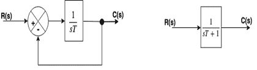
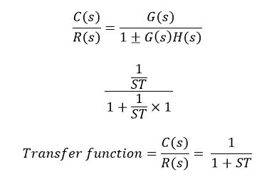

在上面的传递函数中，s 的幂是分母中的幂。这就是为什么上面的传递函数是一阶的，系统被称为**一阶系统**。

### 输入为单位步长时 1 st 订单系统的响应

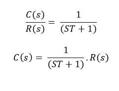

对于单位步骤，

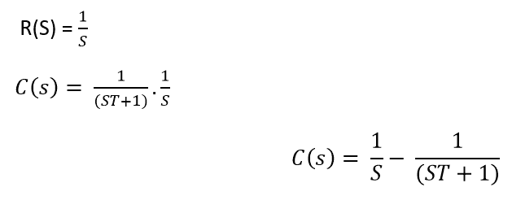

现在，上面方程的部分分数将是:

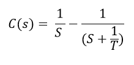

取上式的逆拉普拉斯为:

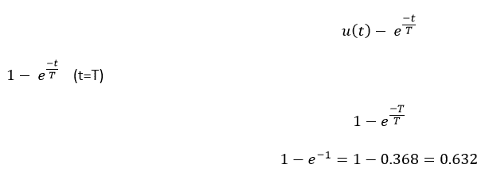

其中 T 被称为系统的时间常数，它被定义为信号达到最终或稳态值的 63.2 %所需的时间。时间常数意味着系统达到最终值的速度。时间常数越小，系统响应越快。如果时间常数较大，系统运行缓慢。

### 单位斜坡信号下一阶系统的时间响应为-

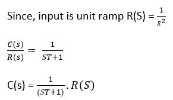

现在，把 R(S)的值放在等式中

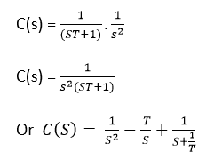

现在取上面等式的拉普拉斯逆

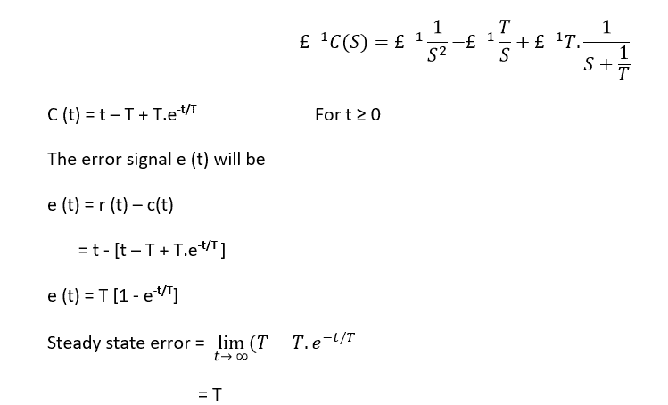

稳态误差等于‘T’，其中‘T’是系统的时间常数。对于小的时间常数，误差很小，系统的响应增加。

### 具有单位脉冲函数的 1 st 阶系统的响应为-

脉冲值= 1

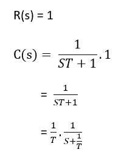

逆拉普拉斯

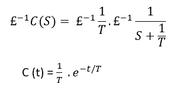