# 二阶系统的时间响应

> 原文：<https://www.javatpoint.com/control-system-time-response-of-second-order-system>

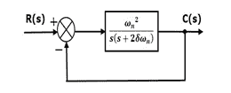
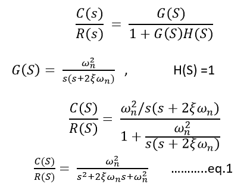

在上面的传递函数中，s 的幂是分母的 2。这就是为什么上面的传递函数是二阶的，这个系统被称为**二阶系统**。

**单位阶跃二阶系统的时间响应**

从等式 1

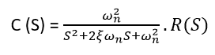

对于单位步长，输入为

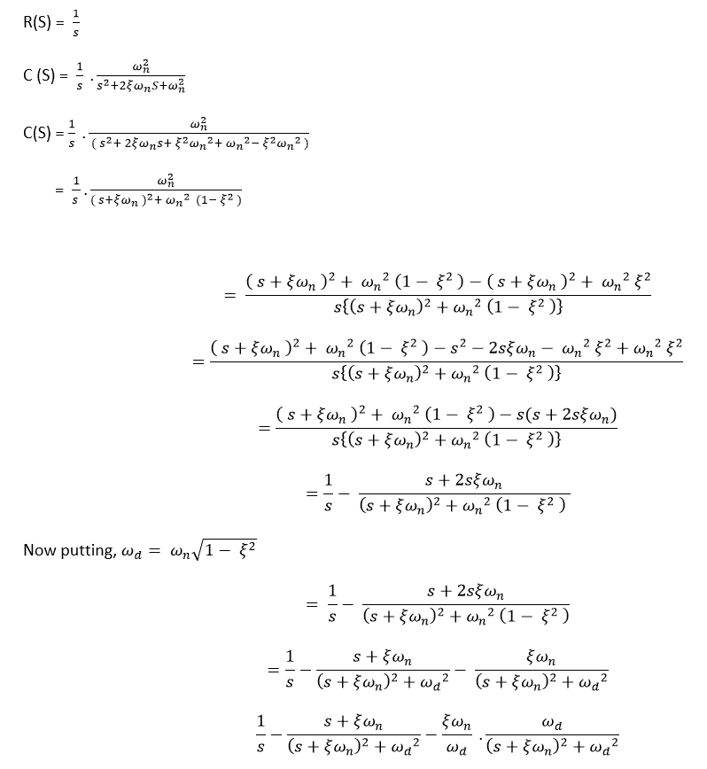

现在取上面方程的拉普拉斯逆

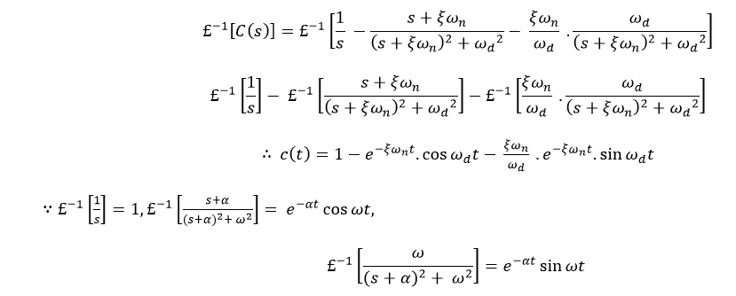

这个等式也可以写成

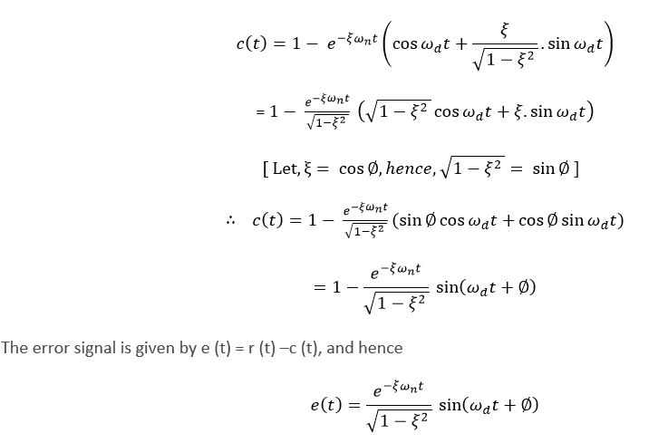

## 二阶系统的瞬态响应规范

控制系统的性能用对单位阶跃输入的瞬态响应来表示，因为很容易产生基本为零的初始条件。

以下是常见的瞬态响应特性:

1.  延迟时间。
2.  上升时间。
3.  高峰时间。
4.  最大峰值。
5.  建立时间。
6.  稳态误差。

### 延迟时间

响应在第一时间达到最终值的 50%所需的时间称为延迟时间。

### 上升时间

对于过阻尼系统，响应从最终值的 10%上升到 90%所需的时间，对于欠阻尼系统，响应从 0%上升到 100%所需的时间称为系统的上升时间。

### 高峰期

响应达到时间响应的第一个峰值或第一个峰值过冲所需的时间称为峰值时间。

### 最大过调量

第一次峰值和稳定输出之间的差值称为最大过冲。它的定义如下

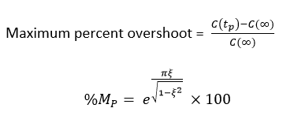

### 建立时间(t <sub>s</sub>

响应达到并保持在其最终值的指定范围(2%至 5%)内所需的时间称为建立时间。

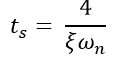

### 稳态误差(e <sub>ss</sub> )

当时间 t’趋于无穷大时，实际输出和期望输出之间的差值称为系统的稳态误差。


## 示例- 1

当二阶系统受到单位阶跃输入时，ξ = 0.5，ωn = 6 rad/sec。确定上升时间、峰值时间、建立时间和峰值过冲。

## 解决方案:

**给定** -

```

ξ = 0.5 ω n = 6 rad/sec

```

**上升时间:**

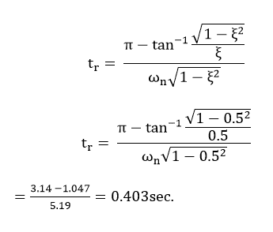

**高峰时间:**

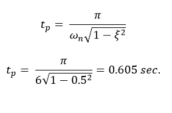

**建立时间:**

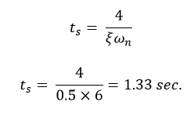

**最大超调量:**

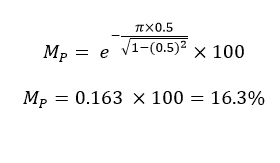

* * *