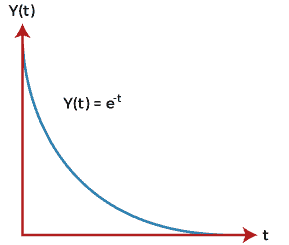
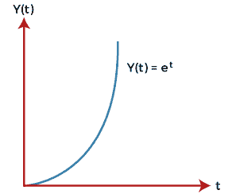
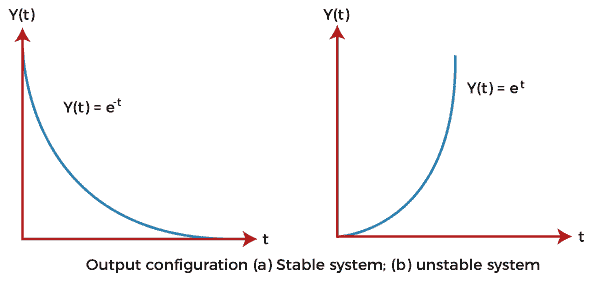
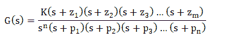
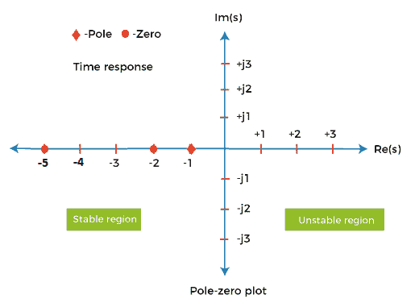
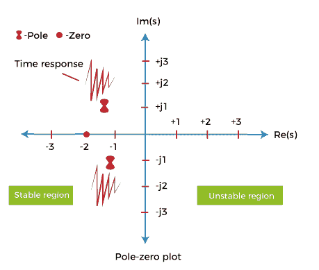

# 稳定性条件

> 原文：<https://www.javatpoint.com/stability-conditions>

控制系统的本质要求是**稳定。**表示系统的输出要跟随输入。如果输入是有限的，为了满足稳定性条件，输出也需要是有限的。

一个 **LTI** (线性时不变)系统在下列条件下应该是稳定的:

1.  **BIBO** (有界输入有界输出)
    是指在任何初始条件下，系统以有界输出信号响应有界输入信号。如果满足了这样一个条件，系统就说是 BIBO。它通常用于信号处理系统。
2.  **线性输入和输出**与初始条件
    无关这意味着如果输入为零，则输出也应该为零，与任何初始条件无关。

让我们考虑两个描述如下方程的系统:

1.  y(t) = x(t)
2.  y(t) = {x(t)}^-1

哪里，

x(t) = e^-t

两种情况下的输入都是 **e^-t** (指数反函数)。图表如下所示:

上述输入是有界输入。现在，为了条件稳定，输出也需要有界。上图显示输出减少并达到值 0。因此，系统是**稳定的。**

让我们考虑一个正指数图的情况。正指数图(Y(t) = e^t)如下所示:

在这种情况下，输出随时间增加。它趋于无穷大。当输出趋于无穷大时，它变得**不稳定。**

### 关于极点和零点位置的稳定性

根据极点和零点，我们可以将传递函数表示为:

这里，z 代表**零，**和 p 代表**极点。**给定传递函数的分子等于零的 s 值被称为系统的**零点**。同样，给定传递函数的分母等于零的 s 值称为系统极点。

分子的根可以表示为？z1，-z2，-z3...-zm，被称为**零。**

分母的根可以表示为？p1，-p2，-p3...-pn，称为**极点。**极点是传递函数为无穷大的 s 值。因为它是分母的一部分。1/无穷大= 0。

零点和极点都可以是实数或复数。

让我们考虑一个例子。

**例:G(s) = (s + 5)(s + 2)/ (s + 1)**

这里，分子有两项，分母有一项。这意味着上述传递函数包括两个零和一个极点。

将分子等于 0，

(s + 5)(s + 2) = 0

s = **-5，-2**

因此，零是-5 和-2。

将分母等于 0，

(s + 1) = 0

s = **-1**

因此，极点为-1。

极点和零点如下图所示。

### 平面图

s 变量等于 **jw。**表示变量 s 是复数。我们也可以用 s 的值来构造一个情节。传递函数提供极点和零点，可以用图形绘制出来。

考虑下面的例子。

**例:G(s) = 5 (s + 2)/ s^2 + 2s + 2**

解决方案:

零可以通过将分子等于 0 来获得。它由下式给出:

5 (s + 2) = 0

S = -2

极点是通过将分母等于 0 得到的。它由下式给出:

s^2 + 2s + 2 = 0

解决后，我们得到:

-1 + j 和-1 -j。

极点-零点图如下所示:

我们来讨论系统相对于极点**位置的稳定性。**

负实部在 s 平面左半部的极点被认为是陈旧系统的极点。因此，我们可以说稳定系统具有闭环传递函数，极点仅位于 s 平面的左半部分。

如果一个极点或一个以上的极点出现在位于假想轴上的 s 平面或极点的右半部，则系统是不稳定的。

在开始讨论劳斯·赫维茨标准之前，让我们讨论一下它的一些概念。

### 劳斯·赫维茨准则的基本概念

*   劳斯标准没有提供位于 s 平面右半部分的特征方程根的精确位置。这是因为如果任何一个根靠近 s 平面的右半部分，系统就会变得不稳定。
*   它不知道根是真实的还是复杂的。真正的根是实数的形式。复数根用 1 表示，包括虚部。
*   它只适用于线性系统。
*   特征方程为**代数时有效。**这意味着如果特征方程的任何系数是指数或复数，则该准则无效。

* * *