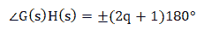
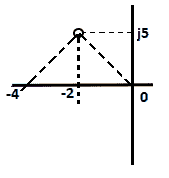
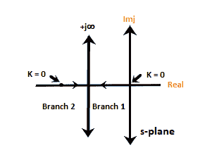

# 根轨迹的角度和大小条件

> 原文：<https://www.javatpoint.com/angle-and-magnitude-condition-of-root-locus>

根轨迹的角度条件帮助我们确定给定点是否存在于根轨迹分支上。借助根轨迹上的大小条件，我们可以求出系统增益‘K’的值。

对于一般闭环系统，特征方程由下式给出:

1 + G(s)H(s) = 0

G(s)H(s) = 0 - 1

G(s)H(s) = -1

我们知道 s 型飞机很复杂。因此，就复变量而言，上述方程可以写成:

G(s)H(s) = -1 + j0

因为 s 平面是复杂的，所以 G(s)H(s)也是复杂的。要使**的**的任何值位于根轨迹上，它必须满足上述等式。

上面方程的两边都是矩形，转换成极坐标形式后，我们可以把两边的角度和大小相等。

根轨迹的两个条件是角度条件和大小条件。我们开始吧。

## 角度条件

G(s)H(s) = -1 + j0

上述角度方程可以表示为:

哪里，

q = 0，1，2...

点-1 + j0 位于负实轴点上，其可以作为 180 度、540 度，... **(2q + 1)180。**这些值可以通过将 q = 0、1、2 等的值放入来计算。

对于 q = 0，我们得到 180 度，对于 q = 1，我们得到(2 + 1) x 180 = 540 度。同样，我们可以找到更多的值。

点-1 + j0 的根轨迹图如下所示:

因此，我们可以将角度条件定义为任何 s 值，方程(1 + G(s)H(s) = 0)的根由下式给出:

角度值是奇数的倍数(1，3，5，7，9...)的 180 度。

s 平面上的任何点要在根轨迹图上，都需要满足上述条件。在“q”的不同值下计算的角度应该是正 180 度或负 180 度的奇数倍。

### 根轨迹中角度条件的使用

根轨迹中角度条件的常用方法是测试 s 平面中的任意点。它用于查找给定点是否存在。

## 量值条件

通过将特征方程的两边相等来计算量值条件，特征方程由下式给出:

1 + G(s)H(s) = 0

G(s)H(s) = -1

|G(s)H(s)| = |-1 + j0| = 1

在幅度条件下，系统增益“K”未知。我们在 s 平面的任何一点都找不到该点的大小。因此，该条件不适于检查根轨迹图上点的存在。但是，如果使用角度条件已经满足 s 平面中的点，则还需要验证幅度条件。

如果已知角度条件下该点位于根轨迹上，系统增益“K”的值也可以通过幅度条件得到。

幅度条件由下式给出:

|G(s)H(s)| = 1

大小条件的使用取决于根轨迹上的点，这通过角度条件来验证。

### 量值条件的使用

如果已知该点位于角度条件所验证的根轨迹上，则可以借助大小条件来确定 K 的值。

考虑下面的例子。

**例:测试根轨迹上是否存在-2 + 5j 点。考虑 G(s)H(s) = K/s(s + 4)的系统。**

解决方案:我们将首先使用角度条件进行验证。

G(s)H(s) = K/s(s + 4)

放 s = -2 + j5，我们得到:

= K +j0/ (-2 + j5)(-2 + j5 + 4)

= K +j0/ (-2 + j5)(2 + j5)

将其转换为极坐标并考虑角度，我们得到:

角度 G(s)H(s) = 0 /111.8 x 68.2 = -180 度。

得到的角度是正负 180 度的倍数。因此，验证了角度条件。

(-2 + 5j) = 111.8 度的角度值

(2 + 5j) = 68.2 度的角度值

我们可以使用任何科学计算器将矩形转换为极坐标。

现在，我们知道给定点-2 + 5j 存在于根轨迹上。我们可以使用幅度条件，它由下式给出:

|G(s)H(s)| = 1

s = -2 +5j 时的 G(s)H(s)值将为:

|K|/5.3851 X 5.3851 = 1

求解后，K = 29

因此，s=-2 + 5j 是方程的根之一。

### 确定“K”值的图解法

为了确定系统增益 K 的值，我们需要根轨迹上的点的先验知识，即已知位于根轨迹上的点的位置。

K 的值由下式给出:

**K** =从开环极点到根轨迹上一点的相量长度的乘积/从开环零点到根轨迹上一点的相量长度的乘积

考虑下面的例子。

**例:1 求系统 G(s)H(s) = K/s(s + 4)的系统增益 K 的值**

**假设根轨迹图上已经存在点-2 + j5。**

**解:**我们给出根轨迹上确定了一个点-2 + j5。

系统 G(s)H(s) = K/s(s + 4)有两个极点，没有零点。这是因为分子没有 s 值。

将分母等于零，我们得到:

s(s + 4) = 0

s = 0 和 s = -4

因此，开环极点为 0 和-4。

现在，我们将加入点 0、-4 和-2 + j5，如下所示:

从 s = 0 到点 p = 0 的长度

从 s = -4 到 q 点的长度

p =(22+52)1/2

P = (29) 1/2

同样，q =(22+52)1/2

q = (29) 1/2

我们知道，

**K** =从**开环极点**到根轨迹上一点的相量长度的乘积/从**开环零点**到根轨迹上一点的相量长度的乘积

由于没有开环零点，分母的值将被假定为 1。

K = p x q = 29

**例:2**

**求给定系统根轨迹的性质 G(s)H(s) = K/s(s + 2)**

**解:**给我们一个系统 G(s)H(s) = K/s(s + 2)有两个极点，没有零点。

我们知道，

1 + G(s)H(s) = 0

1 + K/s(s + 2) = 0

s(s + 2) + K = 0

s 2 + 2s + K = 0

为了构造高阶系统的根轨迹，我们将首先找到这样形成的特征方程的根。

s 2 + 2s + K = 0

求解方程，我们得到根-1 + (1 - k) 1/2 和-1 - (1 - k) 1/2。

现在，我们将在不同的 K 值下找到两个根的不同值，如下表所示:

| K 的值 | S = -1 + (1 - k) 1/2 | S = -1 - (1 - k) 1/2 |
| Zero | Zero | -2 |
| Zero point two | -0.105 | -1.895 |
| Zero point eight | -0.552 | -1.448 |
| one | -1 | -1 |
| ... | ... | ... |
| 无穷 | -1+j * | -1+j * |

从上表中，我们可以得出结论，从 0 和-2 到无穷大有两个分支。起始值 0 和-2 也是给定传递函数或开环极点的根。我们也可以说支路数等于开环极点数，这里是 2。

* * *