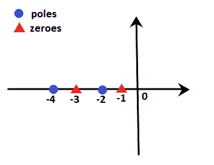
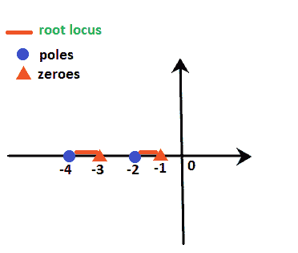
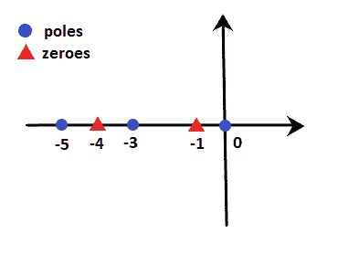
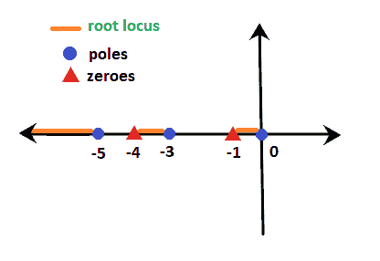
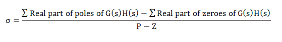

# 根轨迹规则

> 原文：<https://www.javatpoint.com/rules-of-root-locus>

在这里，我们将讨论绘制根轨迹所需的六个基本规则。我们还将讨论一个有助于我们轻松实施规则的示例。

### 规则 1

我们知道，方程的根可以是实数或复数，也可以是两者的组合。根轨迹通常关于实轴对称。因此，该图需要关于 s 平面的实轴对称。

### 规则二

系统的传递函数一般用 G(s)H(s)表示，其中 H(s)是反馈路径。让我们假设开环传递函数是相同的，极点和零点是

在给定的特征方程中，极点可以大于零点数，或者零点数可以大于极点数有两种情况。

假设根轨迹中的分支数量为 n，当我们绘制根轨迹时，这两种情况都会出现。每种情况都给出了默认条件，有助于确定终止或接近无穷大的分支数量。

**病例 1:** P > Z

在上述情况下，我们假设根轨迹中的分支数量将等于开环极点的数量。这是因为这里的极数更多。

(氮=磷)

在这种情况下，分支将从开环极点的位置开始。这里，在 P 处的多个分支中，Z 个分支将终止于开环零点的位置。其余分支(P - Z)将接近无穷大。

例如，

设 P = 3，Z = 1

然后，

根轨迹分支数= 3 =极点数

P - Z = 3 - 1 = 2

这意味着 3 个分支将从开环极点的位置开始

在开环零点位置终止的分支数量= 1

接近无穷大的分支数量= P - Z = 2

**病例 2:** Z > P

在上面的例子中，我们假设根轨迹中的分支数量将等于开环零点的数量。这是因为这里的零的数量更多。(N = Z)

在这种情况下，分支将终止于开环零点的有限位置。这里，在 Z 处的分支数量中，P 数量的分支将从开环极点的位置开始。剩余的分支(Z - P)将接近从无穷远处开始的有限零点。

例如，

设 P = 1，Z = 3

然后，

根轨迹分支的数量= 3 =零的数量

Z - P = 3 - 1 = 2

这意味着 1 个分支将从开环极点的位置开始

终止于有限开环极点位置的分支数量= 3 =所有根轨迹分支

从无穷大开始的分支数量= Z - P = 2

### 规则 3

如果朝向右手侧的实轴上的开环极点和零点之和相对于该点为**奇数**，则称根轨迹上存在一点。

例如，

设极点为-2 和-4，零为-1 和-3。我们需要发现点-2.2 和-3.4 是否位于根轨迹上。

我们知道-2.2 位于-2 和-3 之间，而点-3.4 位于-3 和-4 之间。

我们知道-2.2 位于-2 和-3 之间，而点-3.4 位于-3 和-4 之间。

**点-2.2:** 在点-2.2，右侧的极点和零点之和为 2，即 1 个极点和 1 个零点。这意味着总和是偶数。根据规则 3，总和应该是奇数。因此，点-2.2 不在根轨迹上。我们也可以说-2 和-3 之间的任何一点都不在根轨迹上。

**点-3.4:** 在点-3.4，右侧的极点和零点之和为 3，即 1 个极点和 2 个零点。意思是总和是奇数。根据规则 3，总和应该是奇数。因此，点-3.4 位于根轨迹上。我们也可以说-3 和-4 之间的任何一点都将位于根轨迹上。

点之间的根轨迹面积如下所示:

这里，橙色线代表根轨迹所在的区域。

让我们考虑一个更好理解的例子。

**例:G(s)H(s)= K(s+1)(s+4)/s(s+3)(s+5)。找出根轨迹存在于实轴的哪个部分。**

**解:**我们知道分母表示极点，分子表示零点。因此，对于给定的传递函数，0，-3 和-5 是极点，而-1 和-4 是零点。这意味着有 3 个极点和 2 个零点。

实轴上的这些极点和零点将显示为:

根据规则 3，

*   **0 和-1** 之间的部分(例如-0.4 点)仅包含一个极点，右侧没有零点。这意味着总和是奇数(即 1)。所以，它存在于根轨迹上。
*   **-1 和-3** 之间的部分(例如点-2.1)在右侧仅包含一个极点和一个零点。这意味着极点和零点之和是偶数(即 2)。所以，它不存在于根轨迹上。
*   **-3 和-4** 之间的部分(例如-3.5 点)在右侧包含两个极点和一个零点。这意味着总和是奇数(即 3)。所以，它存在于根轨迹上。
*   **-4 和-3** 之间的部分(例如-4.3 点)在右侧包含两个极点和两个零点。这意味着极点和零点之和是偶数(即 4)。所以，它不存在于根轨迹上。
*   大于 **-5** 的部分(例如-8.6 点)在右侧包含三个极点和两个零点。这意味着总和是奇数(即 5)。所以，它存在于根轨迹上。

因此，用橙色标记的线描绘了根轨迹存在的部分。如下所示:

### 规则 4

我们已经讨论过(P - Z)为给定的传递函数提供了趋近于无穷大的分支数目。关于这种接近无穷大的分支的信息在规则 4 下定义，称为**渐近线。**这些渐近线的角度由下式给出:

= (2q + 1)180 / P - Z

哪里，

q = 0，1，2，3，4...(P - Z - 1)

这些总是关于实轴对称的。

### 规则 5

规则 4 描述了关于接近无穷大的分支的指导方针或信息，称为渐近线。但是，这些角度不足以绘制根轨迹，而且这些分支在 s 平面中的位置也同样重要，由规则 5 定义。

**质心**是渐近线在实轴上的公共点相交的点。它可以计算为:

#### 注意:质心的值总是真实的，可以是正的，也可以是负的。它可以是根轨迹的一部分，有时也可以不是。

### 规则 6

最后一条规则是分离点。它也是根轨迹上给定方程出现多个根的点。它是针对系统增益 k 的特定值计算的

或者

它可以被定义为根轨迹上的一个点，对于特定的 k 值，有两个或多个根出现在这个点上。

根轨迹分支总是以 180/n 的角度离开分离点。

哪里，

N =接近分离点的分支数量。

角度值可以是正的，也可以是负的。

让我们讨论一些关于分离点存在的预测:

*   如果两个极之间的截面位于根轨迹上，则在相邻放置的极之间至少存在一个分离点。
    例如
    **G(s)H(s) = K/s(s + 3)**

上述传递函数在 0 和-3 处有两个极点。根据规则 3，0 和-3 之间的截面上的点(例如，点-2.2)有一个极点，右侧没有零点。它表示零和极点之和为 1，即奇数。因此，根轨迹存在 0 和-3 之间的部分。

因此，它们之间必须至少存在一个分离点。

* * *