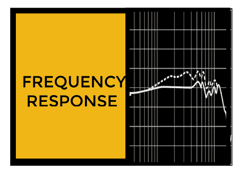
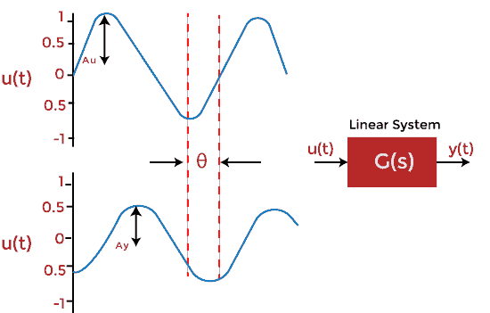
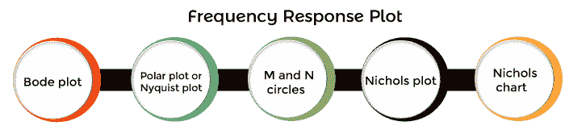

# 频率响应的基本概念

> 原文：<https://www.javatpoint.com/basic-concepts-of-frequency-response>

输入信号的频率在特定范围内变化，并研究系统的输出。系统输出响应的变化

输入被称为系统的频率响应。

频率响应用 JW 表示，它由相位函数和幅度函数组成。它们也被称为系统的频率响应，可以对开环和闭环系统进行评估。

开环传递函数由下式给出:

G(s) = G(jw)

其中，s = jw

|G(s)|或| G(jw)|代表传递函数的大小。

∠G(jw)代表传递函数的相位。

这里，我们将考虑系统在不同频率输入下的响应。频率响应是系统对正弦输入信号的稳态响应。例如，如果系统具有正弦输入，输出也将是正弦的。这些变化可以发生在幅度和相移上。

设 G(s) = 1/(Ts + 1)

它是时间常数形式的传递函数。我们假设所有参数都处于稳定状态。

G(jw) = 1/(Tjw + 1)

让输入为 Asin(wt)。

| G(jw)| = K/(1+w2T2)1/2

它代表幅度。

角度 G(s)由下式给出:

tan〔t0〕-1〔t1〕(tw)

上述分析表明，当输入为 Asinwt 时，稳态输出(Css)由下式给出:

CSS(t)= a . k . sin(wt-tan-1(tw))/(1+w、2、2 ) 1/2

### 正弦传递函数

如果控制系统的输入是正弦的，则称之为正弦输入。同样，当输入为正弦输入形式时，系统的响应称为**正弦响应。**

正弦传递函数定义为系统响应与正弦输入的比值，由下式给出:

正弦传递函数=响应/正弦输入

用 T(jw)表示。

如果正弦传递函数在频域中表示，则称为频域传递函数。

让我们讨论频率响应方法的优缺点。

### 频率响应的优势

频率响应方法的优点如下:

*   它包括简单的计算。
*   频率响应法在控制系统设计中易于实现。这也有助于我们找到系统的稳定性。
*   它提供了系统的稳定性分析，而不需要任何复杂和耗时的过程。
*   系统的频率响应和阶跃响应密切相关。一个已知参数给出了另一个参数的概念。
*   我们可以在不知道传递函数的情况下获得给定控制系统的频率响应。
*   即使系统具有中等程度的非线性，也可以对其进行稳定性分析。
*   我们也可以将频率响应应用于具有非理性传递函数的系统。例如 e-2Ts 。
*   它包括简单和便宜的设备。
*   在控制系统复杂的情况下，最好使用奈奎斯特图技术。这是分析这种情况下稳定性的唯一方法。
*   噪声干扰的影响很容易分析。
*   与时域相比，使用频率响应的闭环系统的调节和性能更容易。

### 频率响应的缺点

频率响应方法的缺点如下:

*   频率响应方法更适用于线性系统。在非线性系统或具有中等非线性的系统的情况下的结果没有显示精确的结果。因此，它通常只适用于线性系统。
*   获得频率响应的实用方法是耗时的。
*   频率响应和阶跃响应之间存在关系，但并不像预期的那样精确。但是，如果我们使用傅里叶变换来描述它，精确的关系是可能的，由于复杂的计算，这很难应用。

### 频率响应图

我们可以以图形形式或分析形式进行频率响应分析。可用于频率响应分析的各种图形技术如下:

让我们讨论一下上面列出的所有地块的简短描述。

**山羊的情节**

这是一个频率响应图，包含幅度和相位两个图形。第一个图是正弦传递函数对对数 w 的幅度图。

另一个图表示相角，它是针对开环和闭环系统绘制的。

**极坐标图或奈奎斯特图**

它是极坐标上给定传递函数的幅度与其相角的关系图。极坐标图中的频率从零到无穷大不等。极坐标图绘制在极坐标表上，这是图形的形式。该图由同心圆和径向线组成。

极坐标图的延伸称为奈奎斯特图。奈奎斯特图中的频率从-无穷大到无穷大不等。

**M 和 N 圈**

它用于从奈奎斯特图中获得闭环函数值。它也用于控制系统的设计。

奈奎斯特图用于确定开环系统的稳定性。但是，它没有提供给定传递函数的精确值。因此，为了这个目的，控制理论中的 M 和 N 圈由阿尔伯特·霍尔提出。

在奈奎斯特曲线上，创建了 M 和 N 个圆的曲线。这些图形之间的交集提供了闭环传递函数值。

**尼科尔斯图表**

它通常用于确定闭环系统的稳定性和频率响应。它是增益(开环)与相位的关系图。各种参数，如谐振频率、带宽、增益裕量等。闭环系统的，可以从尼科尔斯图的开环图中确定。

如果尼科尔斯图与 M 和 N 圆的曲线重叠，则各曲线的交点决定了相位角和闭环频率响应的大小。

**尼科尔斯图**

控制设计中的尼科尔斯图用于评估线性系统的稳定性和强度。也可以说，借助尼科尔斯图设计的控制系统具有鲁棒性。

在本教程中，我们将讨论三个最重要的频率响应图，即波特图、极坐标图和奈奎斯特图。
