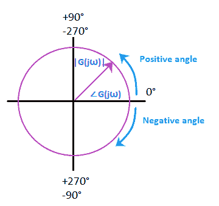
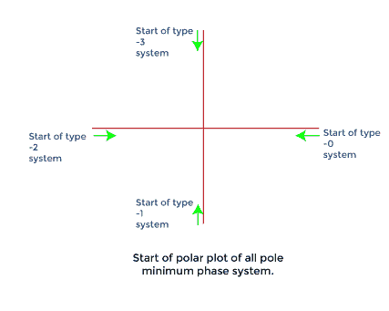
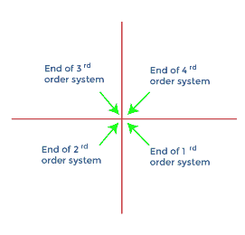
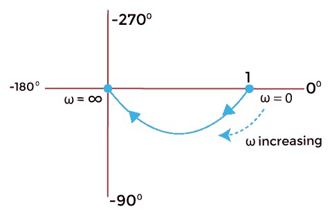
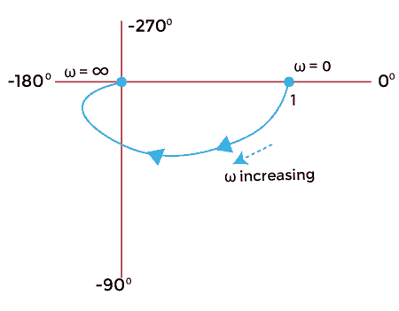
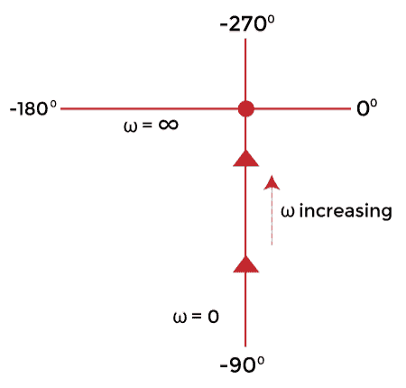
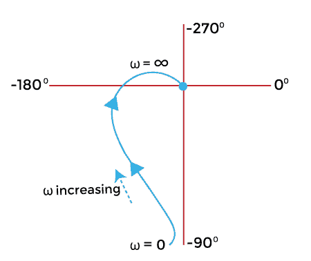
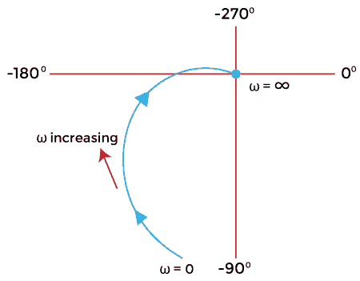
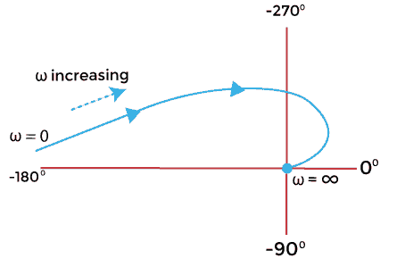
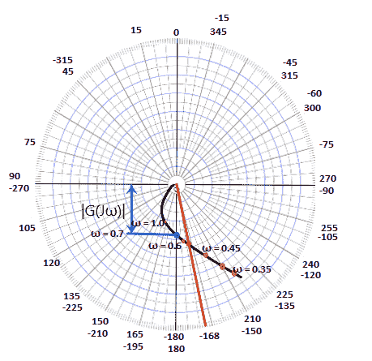

# 极坐标图

> 原文：<https://www.javatpoint.com/polar-plot>

正弦传递函数的极坐标图是在**极坐标上 G(jω)的幅值与 G(jω)的相角的关系图。**极坐标图中的频率从**零**到**无穷大不等。**极坐标图绘制在极片上，极片是图形的形式，图形由同心圆和径向线组成。

极片图上的同心圆代表幅度，径向线代表相角。图上的每个点都显示了幅度和相位角的信息。

极坐标图的示例如下所示:

极坐标图中的正角度以逆时针方向测量，而负角度以顺时针方向测量。这两个角度都是相对于参考点，即 0 度轴测量的。

矩形形式的传递函数 G(jω)可以写成:

**G（jω） = GR（jω） + GI（jω）**

哪里，

G R (jω)是传递函数 G(jω)的实部

G I (jω)是传递函数 G(jω)的虚部

如前所述，极坐标图中的角频率从零到无穷大不等。我们不应该与奈奎斯特图混淆，奈奎斯特图是极坐标图的延伸。角频率(ω)从零到无穷大变化，而奈奎斯特图从负值无穷大到正值无穷大变化。

极坐标图的主要优势在于，它在单个图中描绘了系统在整个频率范围内的**频率响应**特性。因为所有的东西看起来都是一个单独的块，所以它不能显示开环传递函数中每个因素的贡献。

极坐标图的**积分**因子由下式给出:

G(s) = 1/s

哪里，

S = jω

s 是传递函数

G（jω） = 1/jω

它是负虚轴。

极坐标图的**导数**因子由下式给出:

G（jω） = jω

它是正虚轴。

**极点和零点相加的效果**

*   在极坐标图中添加极点会将其端点移动-90 度。
*   在极坐标图中添加零会将其端点移动+90 度。

### 系统的类型和顺序

极坐标图中的系统类型决定了极坐标图开始的象限。下图显示了所有极点的极坐标图的起点。

极坐标图中系统的顺序决定了极坐标图结束的象限。所有极点的极坐标图的末端如下图所示。

## 标准传递函数的极坐标图

在这里，我们将讨论各种标准传递函数的极坐标图。

### 类型 0

**顺序:1**

设 G(s) = 1/(1 + sT)

Put，s= jω

G（jω） = 1/（1 + jωT）

上述量值和角度形式的传递函数可以表示为:

g(jω)= 1/[(1+ω2)1/2【tan】-1]

如果我们考虑分子中的角度部分，由于从分母到分子的转换，我们需要插入负号，反之亦然。

g(jω)= 1★★★★★★★★★★★★★★★★★★★★★★★★◎

让我们在零和无穷大处找到上面函数的值。

当ω = 0 时

G（jω） = 1∠0/1

G（jω） = 1∠0

就是因为 tan -1 0 = 0

当ω =无穷大时

G（jω） = 0∠-90

就是因为 tan-1∩= 90 度

值为 0 和无穷大时的极坐标图将显示为:

**订单 2:**

既然，是 2 阶系统；该函数包括幂为 2 的最高导数变量。

让，G(s)= 1/(1+sT1)(1+sT2

Put，s= jω

G（jω） = 1/（1 + jωT 1 ） （1 + jωT 2 ）

上述量值和角度形式的传递函数可以表示为:

g(jω)= 1/[(1+ω2【1】)【1/2】【tan】–1

如果我们考虑分子中的角度部分，由于从分母到分子的过渡，我们需要插入一个负号，如下所示:

g(jω)= 1∑tan〖t0〗1〗t1〖t〗t1〖t1〗t1〖tan〖T4〗1〖t5〖t〗t1〖T6〗2〖T7〗/(1+ω〖t8〗2〖T9〗t

让我们在零和无穷大处找到上面函数的值。

当ω = 0 时

G（jω） = 1∠（-0 - 0）/1x1

G（jω） = 1∠0

就是因为 tan -1 0 = 0

当ω =无穷大时

G（jω） = 0∠（-90 - 90）/1

G（jω） = 0∠-180

就是因为 tan-1∩= 90 度

值为 0 和无穷大时的极坐标图将显示为:

### 类型 1

**顺序:1**

设 G(s) = 1/s

Put，s= jω

G（jω） = 1/jω

G（jω） = 1/（ω∠90）

如果我们考虑分子中的角度部分，由于从分母到分子的过渡，我们需要插入一个负号，如下所示:

G（jω） =1∠-90 /ω

让我们在零和无穷大处找到上面函数的值。

当ω = 0 时

G（jω） =∞ ∠-90

这是因为函数直接除以ω。1/0 =无穷大。

tan -1 0 = 0

当ω =无穷大时

G（jω） = 0∠-90

这是因为函数直接除以ω。1/无穷大=零。

tan-1∑= 90 度

值为 0 和无穷大时的极坐标图将显示为:

**订单:2**

设 G(s) = 1/s(1 + sT)

Put，s= jω

G（jω） = 1/ jω（1 + jωT）

上述量值和角度形式的传递函数可以表示为:

g(jω)= 1/ω* 90[(1+ω2)1/2【tan】-1]

如果我们考虑分子中的角度部分，由于从分母到分子的转换，我们需要插入负号，反之亦然。

g(jω)= 1√90-tan-1/ω(1+ω)1/2

让我们在零和无穷大处找到上面函数的值。

当ω = 0 时

G（jω） =∞ ∠-90

这是因为函数直接除以ω。1/0 =无穷大。

tan -1 0 = 0

当ω =无穷大时

G（jω） = 0∠（-90-90）

G（jω） = 0∠-180

这是因为函数直接除以ω。1/无穷大=零。

tan-1∑= 90 度

值为 0 和无穷大时的极坐标图将显示为:

**顺序:3**

让，G(s)= 1/s(1+sT1)(1+sT2

Put，s= jω

G（jω） = 1/ jω （1 + jωT 1 ） （1 + jωT 2 ）

上述量值和角度形式的传递函数可以表示为:

g(jω)= 1/ω* 90[(1+ω2)【t1/2】【tan】-1]

如果我们考虑分子中的角度部分，由于从分母到分子的过渡，我们需要插入一个负号，如下所示:

g(jω)= 1√90-tan〖t1〗t〗1〖T2〗1〖T3〗tan〖t1〖t5〖t1〗t1〗〖T6〖2〖T7〗2/φ(1+ω〖t8〗2〖T9〗

让我们在零和无穷大处找到上面函数的值。

当ω = 0 时

G（jω） =∞ ∠-90

这是因为函数直接除以ω。1/0 =无穷大。

tan -1 0 = 0

当ω =无穷大时

G（jω） = 0∠（-90 -90 -90）

G（jω） = 0∠-270

这是因为函数直接除以ω。1/无穷大=零。

tan-1∑= 90 度

值为 0 和无穷大时的极坐标图将显示为:

### 类型 2

**顺序:4**

Let，G(s)= 1/s2(1+sT1)(1+sT2

Put，s= jω

g(jω)= 1/j222(1+JT1)(1+JT2

上述量值和角度形式的传递函数可以表示为:

g(jω)= 1/ω√180[(1+ω】)1/2【tan】

如果我们考虑分子中的角度部分，由于从分母到分子的过渡，我们需要插入一个负号，如下所示:

g(jω)= 1∑180-tan〖t0〗1〗t1〖t〗1〖T3〗tan〖t1〗t1〖t5〗t1〖t1〖T6〗2〖T7〗/(1+ω〖t8〗2〖T9〗

让我们在零和无穷大处找到上面函数的值。

当ω = 0 时

G（jω） = ∞ ∠（-180 - 0 - 0）/1x1

G（jω） = ∞ ∠-180

这是因为函数直接除以ω。1/0 等于无穷大。

tan -1 0 = 0

当ω =无穷大时

G（jω） = 0∠（-180 - 90 - 90）/1

G（jω） = 0∠-360

这是因为函数直接除以ω。1/无穷大等于零。

tan-1∑= 90 度

值为 0 和无穷大时的极坐标图将显示为:

### 极坐标图的增益裕量和相位裕量

增益余量为 Kg。它由下式给出:

**Kg = 1/GBT3】**

G B 是量值圆上切割 180 度轴的点(B)处的值。如果点 B 位于单位圆内，则增益裕量为正。否则，就是负面的。

相位裕量由下式给出:

**Y = 180+θ**

哪里，

θ是增益交越频率下 G(jω)的相角。当量值曲线与外部单位圆相交时，计算相角。从交叉点到图的末端所画的线决定了角度θ。它可以是积极的，也可以是消极的。

借助一个例子，可以更好地理解相位裕量和增益裕量。

## 例子

让我们讨论一个极坐标图的例子。

**例:单位反馈系统的开环传递函数由 G(s) = 1/s(s + 1)(2s + 1)给出。绘制极坐标图，并确定增益裕量和相位裕量。**

解决方案:传递函数由下式给出:

G(s) = 1/s(s + 1)(2s + 1)

上面的函数清楚地描述了系统是类型 1 和顺序 3。它的形式是:

g(s)= 1/s(1+sT1)(1+sT2

Put，s = jω

G =1/ jω （jω + 1）（2jω + 1）

上述量值和角度形式的传递函数可以表示为:

g(jω)= 1/ωⅲ90[(1+ω)【1/2】【tan】【ω】[(1+ω1/2]

如果我们考虑分子中的角度部分，由于从分母到分子的过渡，我们需要插入一个负号，如下所示:

g(jω)= 1∑90-tan〖t1〗1〖t1〗〗〖tan〖T2〗1〗T3〖2ω〗ω(1+ω〖T4〗2〖t5〗2〖T6〗1/2〖T7〗(1+4ω〖t8〖2〗

现在，让我们从上面的等式中分离出幅度和角度项。

| g(jω)| = 1/ω((1+ω2)(1+4ω2))1/2

| g(jω)| = 1/ω(1+4ω+2+2+4ω)1/2

| g(jω)| = 1/ω(1+5ω+4ω)1/2

角度 g(jω)= = 90-tan-1【π-tan】-1【2ω】

我们知道上述函数在零和无穷大时的值。

当ω = 0 时

G（jω） =∞ ∠-90

当ω =无穷大时

G（jω） = 0∠-270

让我们求出不同频率下 G(jω)的幅值和相位。

| **弧度/秒(ω)** | Zero point three five | Zero point five | Zero point six | Zero point seven | One |
| **&#124;G（j）&#124;** | Two point two two | One point two | Zero point nine | Zero point seven | Zero point three |
| **角度 G(jω)** | -144 | -162 | -171 | -180 | -198 |

极坐标图如下所示:

这里，每两条线有 **15 度的间隙。**我们指定了一点的正负角度值。它基于这样的概念:正角度是逆时针测量的，负角度是顺时针测量的。当我们从顺时针方向的 0°角度开始，我们可以注意到角度负值的增加。同样，当我们从顺时针方向的 0°角开始时，我们可以注意到角度正值的上升。

让我们计算增益裕量和相位裕量。

我们可以在极坐标图中看到，星等圆在点 0.7 处切割 180 度轴。因此，它将是 G B 的值。

增益裕量为 Kg = 1/G B

千克= 1/0.7

千克= 1.428

相位裕量由下式给出:

y = 180+θ

我们可以清楚地看到标有红色的点。它是震级曲线与单位圆的交点。从交点(用红色标记)画出的线决定了θ角，它等于(-168)度。

所以，相角等于

Y = 180 - 168

Y = 12 度

因此，增益裕量为 1.428，相位角为 12 度。

* * *