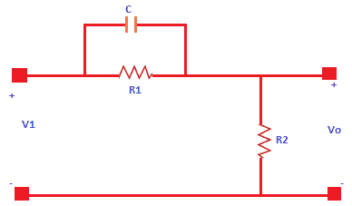
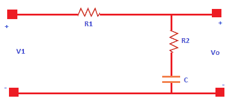
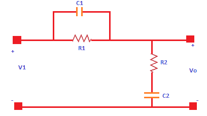

# 控制系统:补偿器

> 原文：<https://www.javatpoint.com/control-system-compensators>

补偿器来源于**补偿这个词。**指为提供合适的性能而对结构布置进行的调整。

反馈在控制系统中的作用至关重要。为了提高系统的性能，调整有时会成为获得可接受的反馈性能的重要部分。这是因为我们经常需要改变或修改系统的参数。在这种情况下，补偿器有助于提高控制系统的性能。

在重新设计控制系统时，将称为补偿器的附加组件添加到控制系统的结构中。添加它是为了弥补系统性能的不足。补偿器的类型可以是**液压、电气、机械、**等。

## 补偿器的类型

控制系统中的补偿器分为:

*   超前补偿器
*   滞后补偿器
*   滞后超前补偿器

### 超前补偿器

控制系统中的超前补偿器产生具有相位超前的输出。在这里，领先意味着领先。这是一种后继活动。

让我们考虑一个超前补偿器图。如下所示:

它由两个电阻(R1 和 R2)和一个电容 c 组成。系统的传递函数由下式给出:

传递函数=输出/输入

引线补偿器图的输出是一个 RC 电路，它描述了输出连接在第二个分支上。它只有一个电阻，R2。

电路的输出是 R2。

R2

让我们找到输入。

输入将是元件(电容器和电阻器)的串联或并联组合。电阻器 R1 与电容器 C1 并联。等效并联组合进一步与电阻器 R2 串联连接。

电路中两个元件 a 和 b 的并联组合是 x b / a + b

将是:R1(1/Cs)/ (R1 + 1/Cs)

等效输入为:

vI(s)= R2+R1(1/Cs)/(R1+1/Cs)

因此，滞后补偿器的传递函数将为:

传递函数=输出/输入=伏至/伏至

= R2 / {R2 + R1（1/Cs）/ （R1 + 1/Cs）}

= R2（R1Cs + 1）/ {R1R2Cs + 1/（R1 + R2））

将上述传递函数除以 R1 + R2，得到:

R2/（R1 + R2） （R1Cs + 1）/{R1R2Cs/（R1 + R2） + 1}

让，T = **R1C**

A **= R2/ (R1 + R2)**

所以，上面的传递函数可以写成:

**Vo/VI(s)= A(Ts+1)/(TAs+1)**

我们知道传递函数的分子决定系统的零点，分母决定极点。

因此，从给定的传递函数，我们可以得出结论:

极点= -1/AT

零= - 1/T

超前补偿器可引入系统的最大角度由下式给出:

相角= **sin -1 (1 - A / 1 + A)**

也可以写成 90 - 2tan -1 (A) 1/2

给定最大角度下的最大频率为: **1/T(A) 1/2**

### 滞后补偿器

控制系统中的滞后补偿器产生具有相位滞后的输出。在这里，落后意味着落后或延迟。

让我们考虑一个滞后补偿器图。如下所示:

它由两个电阻(R1 和 R2)和一个电容 c 组成。系统的传递函数由下式给出:

**传递函数=输出/输入**

滞后补偿器图的输出是一个 RC 电路。它清楚地描述了输出连接在第二个分支上。它有一个串联的电阻 R2 和一个电容 C。

所以，电路的输出是:

V o (s) = R2 + 1/Cs

让我们找到输入。

输入将是元件(电容器和电阻器)的串联或并联组合。电阻器 R1 与 R2 和 c 的串联组合串联。我们将首先计算串联组合，并将其与其他串联组合进一步计算。

电路中两个元件 a 和 b 的串联组合是 a + b

它将是:R2 + 1/Cs

等效输入为:

V i (s) = (R1 + R2 + 1/Cs)

因此，滞后补偿器的传递函数将为:

传递函数=输出/输入=伏至/伏至

= R2 + 1/Cs/ (R1 + R2 + 1/Cs)

= CsR2 + 1/(Cs(R1 + R2) + 1)

= Ts + 1/ (BTs + 1)

Let，T = **CR2**

B **= (R1 + R2)**

所以，上面的传递函数可以写成:

**vo/vI= 1+ts/1+BTS**

我们知道传递函数的分子决定系统的零点，分母决定极点。

因此，从给定的传递函数，我们可以得出结论:

无 = -1/BT

零= - 1/T

超前补偿器可引入系统的最大角度由下式给出:

相角= **sin -1 (1 - B / 1 + B)**

给定最大角度下的最大频率为: **1/T(B) 1/2**

在开始讨论差异之前，让我们讨论补偿器中的 GCP(增益交叉点)。

### GCP

补偿器中的增益交叉点是开环增益首次达到值 1 的频率点。我们也可以说，GCP 是开环增益达到 0 db 轴的点。这是因为就对数而言，增益 1 的值是 0(对数 1 = 0)。

相位超前补偿器和相位滞后补偿器之间的差异如下:

| 种类 | 相位超前 | 相位滞后 |
| **设计** | 在增益交叉点附近增加了一个相位角。 | 它以增加的误差常数保持所需的相位裕量。 |
| **结果** | 

1.  The increased phase angle near the gain cross-point leads to an increase in phase shift.
2.  It increases the gain of the system at a higher frequency.
3.  It improves the system response and dynamic response.
4.  The bandwidth of the system is increased.

 | 

1.  It moves the gain crossover point to a lower value.
2.  Lower the system gain. High frequency noise is also suppressed.
3.  Improve damping and reduce steady-state error.
4.  Reduce the system bandwidth.

 |
| **优势** | 

1.  The improvement of system dynamic response leads to faster response.
2.  Increase system bandwidth.
3.  It acts as a high-pass filter.

 | 

1.  Improve the steady-state performance of the system by reducing the steady-state error.
2.  Suppress high frequency noise.
3.  It acts as a low-pass filter, providing high gain at lower frequencies.

 |
| **缺点** | 

1.  Easy to produce noise.
2.  It requires extra amplifier gain.

 | 

1.  It requires a large RC (resistance and capacitance).
2.  It reduces the seeds of the transient response of the system.

 |
| **应用程序** | 它用于提高瞬态响应的速度。因此，它的应用需要快速的瞬态响应。 | 相位滞后减少了稳态误差。因此，在指定误差常数时使用它。 |

### 滞后超前补偿器

顾名思义，滞后超前补偿器是滞后和超前补偿器的组合。

控制系统中的滞后补偿器产生具有相位滞后的输出。控制系统中的超前补偿器产生具有相位超前的输出。因此，滞后超前补偿器在一个频率区域产生相位为 lg 的输出，在另一个频率区域产生相位超前。

让我们考虑一个滞后-超前补偿器图。如下所示:

它由两个电阻(R1 和 R2)和两个电容(C1 和 C2)组成。系统的传递函数由下式给出:

**传递函数=输出/输入**

滞后补偿器图的输出是一个 RC 电路，它描述了输出连接在第二个分支上。它有一个串联的电阻 R2 和一个电容 C2。

所以，电路的输出是:

V o (s) = R2 + 1/C2s

让我们找到输入。

输入将是元件(电容器和电阻器)的串联或并联组合。电阻器 R1 与电容器 C1 并联。第二个分支是电阻 R2 和 C2 的串联组合。我们将首先计算 C2 和 R2 的串联组合，R1 和 C1 的并联组合，并进一步将两者作为串联组合。

电路中两个元件 a 和 b 的串联组合是 a + b

它将是:R2 + 1/C2s

平行组合将是:R1 x 1/C1s/(R1 + 1/C1s)

现在，等效输入将是上述组合的串联组合，由下式给出:

vI(s)= R2+1/C2s+R1 x 1/C1s/(R1+1/C1s)

vI(s)= {(R2+1/C2s)(R1+1/C1s)+R1 x 1/C1s }/((R1+1/C1s)

因此，滞后补偿器的传递函数将为:

传递函数=输出/输入=伏至/伏至

=(R2+1/C2s)/{(R2+1/C2s)(R1+1/C1s)+R1 x 1/C1s }/((R1+1/C1s)

=(R2+1/C2s)(R1+1/C1s)/R1R2C1C2s2+(R1 C1+R2 C2+R1 C2)s+1

让，AT1 = R1C1

BT2 = R2C2

T1T2 = R1R2C1C2，

如果 AB = 1

Vo(s)/VI(s)=(1+AT1s)(1+BT2s)/(1+T1s)(1+T2s)

所以，上面的传递函数可以写成:

**Vo(s)/VI(s)=(1+AT1s)(1+BT2s)/(1+T1s)(1+T2s)**

**滞后超前补偿器的优点**

滞后超前补偿器的优点如下:

*   我们知道滞后补偿器改善了系统的稳态性能，超前补偿器提高了瞬态响应的速度。因此，当需要系统的快速响应和稳态性能时，使用这两者的组合(滞后超前补偿器)。

**滞后超前补偿器的应用**

滞后超前补偿器的应用如下:

*   用于机器人、激光稳频、卫星控制、液晶显示器等。
*   它是模拟控制系统的基本模块之一。
*   它用于改善系统的参数，如带宽、瞬态响应和减少稳态误差。
*   它还提高了系统的频率响应。

## 例子

让我们讨论一些基于补偿器的例子。例子将是选择题，因为它在竞争性考试中帮助我们。

**例 1:** 求超前补偿器提供的相移，传递函数由下式给出:

传递函数= (1 + 6s) / (1 + 2s)。

1.  30 度
2.  15 度
3.  45 度
4.  60 度

**回答:** (a) 30 度

**说明:**超前补偿器的传递函数形式为:

= s + 1/T 除以 s + 1/AT

比较，

(1 + 6s) / (1 + 2s)或者用(s + 1/T) / (s + 1/AT)，我们得到:

A = 1/3

超前补偿器的最大相移由下式给出:

相角= sin -1 (1 - A / 1 + A)

= sin -1 (1 - 1/3 / 1 + 1/3)

= sin -1 (2/4)

= sin -1 (1/2)

**= 30 度**

**例 2:** 下面给出的传递函数代表哪种类型的补偿器。

传递函数= 1 + 0.5s/ 1 + s

1.  超前补偿器
2.  滞后补偿器
3.  滞后超前补偿器
4.  比例积分控制器

**回答:** (b)滞后补偿器

**说明:**滞后补偿器的传递函数形式为 Vo(s)/VI(s)=**1+Ts/1+BTs。**

经过比较，我们可以发现给定的传递函数是一种滞后补偿器。

**例 3:** 增益常数为 K 的相位超前补偿器，

1.  增加相位裕量
2.  增加增益交叉频率
3.  减小整个频域范围内的斜率幅度曲线
4.  上述全部

**回答:** (d)以上全部

**说明:**由于增益交叉点附近相位角的增加，相位裕量增加。由于高频增益的增加，它也增加了增益交叉频率。它还在整个范围内降低了斜率幅度曲线。

**示例 4:** 用于闭环系统控制器的超前补偿器具有以下传递函数 K(1 + s/a)/(1 + s/b)。这种超前补偿器的条件由下式给出:

1.  a < b
2.  b < a
3.  a < Kb
4.  a > Kb

**回答:** (a) a < b

**说明:**相位超前补偿器的相位角一般为正。

它由下式给出:

棕褐色 -1 w/a -棕褐色 -1 w/b

为了使角度为正，

Tan -1 w/a 应大于 tan -1 w/b。

因此， **a < b**

* * *