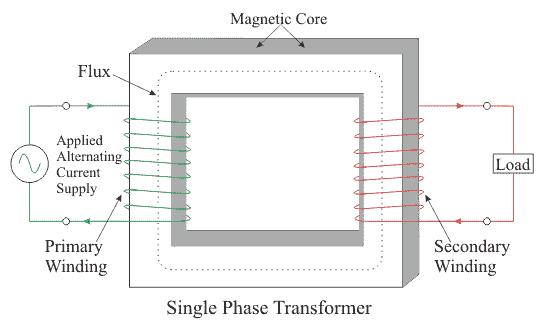
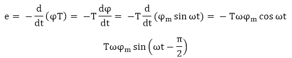
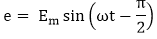
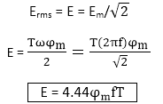
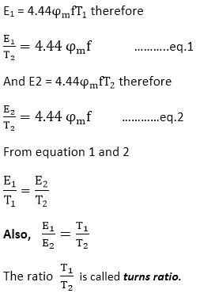

# 单相变压器

> 原文：<https://www.javatpoint.com/single-phase-transformer>

变压器是将磁能转换成电能的静态装置。它由两个或两个以上的固定回路通过一个共同的磁路连接而成；能量传递通过该电路进行，而从一个电路到另一个电路的频率没有任何变化。



变压器由两个绕组组成。与交流电源电压相连的绕组称为初级绕组，与负载相连并将能量传递给负载的绕组称为次级绕组。

## 变压器的电动势方程

让任意点的通量由下式给出

```
φ= φm sin ω t

```

由磁通量连接的 T 匝线圈中感应的瞬时电动势由法拉第定律给出



上面的等式也可以写成



其中 E<sub>m</sub>= Tψφ<sub>m</sub>= E 的最大值

对于正弦波，r.m.s .值由下式给出

E <sub>rms</sub> = E = E <sub>m</sub> / 

这称为变压器的电动势方程。

哪里，

φ <sub>m</sub> 是 webers 中的最大流量(Wb)

f 是以赫兹为单位的频率

e 是电压，单位为伏特

t 是绕组的匝数

主均方根电压为

```
E1 = 4.44φm fT1

```

二次均方根电压为

```
E2 = 4.44φm fT2

```

* * *

## 电压比和匝数比

E/T 比值称为 ***每匝电压*** 。

我们了解



**升压变压器:**这些是输出电压高于输入电压的变压器。

**降压变压器:**这些是输出电压小于输入电压的变压器。

#### 注:*同一个变压器可以通过改变连接方式，作为升压变压器和降压变压器使用。如果我们想让变压器作为升压变压器工作，那么低压绕组就是初级，如果我们想让它作为降压变压器工作，那么高压绕组就是初级。*