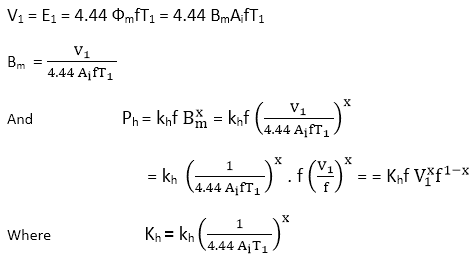
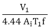
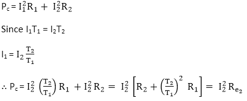

# 变压器损耗

> 原文：<https://www.javatpoint.com/losses-in-transformers>

变压器中有两种类型的损耗:

1.  铁损或铁损**PIT3】**
2.  铜损还是 **I 2 R** 损耗**PcT7】**

## 铁损或铁损(P i )

变压器中的铁损是磁滞损耗(P h )和涡流损耗(P e 的组合。这种损耗主要发生在变压器的磁芯中，取决于磁芯材料的磁性。

**Pi = Ph + Pe**

磁滞和涡流损耗的公式如下:

ph= khf BxT6】m

pe= kef2B2T8】m

哪里，

**k h** =这是一个常数，与堆芯材料的体积、数量和使用的单位成正比。

**k e** =这是一个常数，与体积、铁芯材料电阻率、叠片厚度和所用单位成正比。

**B m** =堆芯中的最大磁通密度。

**f** =交变磁通的频率。

指数“x”叫做斯坦梅茨常数。根据磁心材料的磁性，它的值从 1.5 到 2.5 不等。

因此，变压器中的总铁芯损耗为

PI= Ph+Pe

pI= khf BxT6】m+kef2B2T14】m

我们知道，施加的电压大约等于变压器中的感应电压。

上述关系表明磁滞损耗取决于施加的电压和频率。

Pe = kef2 B2m = kef2 ()2 = ke V21

上述关系表明涡流损耗与外加电压的平方成正比，与频率无关。

自，V1= 4.44 BmAIfTI，

v1bmf

这意味着对于任何电压，如果 f 降低，B m 增加。同样，如果 f 增加，B m 减少。

总铁芯损耗可以写成

Pi= Kh Vx f1-x+Ke V2

* * *

## 铜损还是 I 2 R 损(P c

由于绕组电阻而在变压器的一次和二次绕组中发生的损耗称为铜损耗或ⅰ2R 损耗。

**变压器中的总铜损耗=一次绕组铜损耗+二次绕组铜损耗**

因此，铜损耗随着负载电流的平方而变化。

## 杂散损耗

导体、储罐等中的涡流。由变压器中的漏磁产生的损耗称为杂散损耗。我们可以忽略这些损失，因为与铁和铜损失相比，这些损失的百分比非常小。

* * *

## 介电损失

绝缘材料(即变压器油和变压器的固体绝缘材料)中出现的损耗称为介电损耗。这种损耗只发生在高压变压器中，并且非常小，因此我们可以忽略这些损耗。