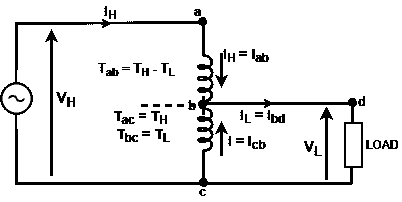
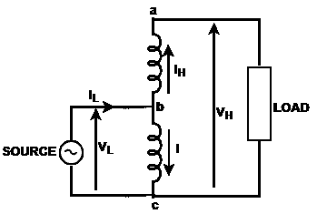

# 自耦变压器

> 原文：<https://www.javatpoint.com/auto-transformer>

## 什么是单相自耦变压器？

它是一种单绕组变压器，其中一部分绕组为高压侧和低压侧所共用

**图:降压自耦变压器**

在上图中,“abc”是单绕组，其中端子“a”和“c”是高压端子,“b”和“c”是低压端子。绕组“b”和“c”称为普通绕组，绕组“a”和“b”称为串联绕组。

降压变压器是初级电压高于次级电压的变压器。在上图中，电压“V H 施加到全绕组“abc”，负载连接到绕组“bc”。这种装置称为降压自耦变压器。

在自耦变压器中，绕组是物理连接的，这就是为什么该变压器使用不同类型的术语。

T H = T ac =全绕组的匝数' abc '

=高压侧的匝数

T L = T bc =普通绕组的匝数' bc '

=低压侧的匝数

Tab= TH-TL=串联绕组的匝数' ab '

V H =高压侧的输入电压

V L =低压侧的输出电压

I H =高压侧输入电流

I L =低压侧的输出电流

串联绕组中的电流= I ab = IH

公共绕组中的电流‘BC’= ICB= I

* * *

## 升压自耦变压器

**图:升压自耦变压器**

升压变压器如上图所示，我们可以说电源连接到绕组‘BC’，负载连接到完整的绕组‘ABC’。

* * *

## 自耦变压器的优点

1.  在自耦变压器中，与两个绕组变压器相比，使用较少的绕组材料。
2.  自耦变压器体积较小。
3.  这些比输出相同的两个绕组变压器便宜。
4.  由于导体和芯材料的使用较少，导体中的欧姆损耗和芯损耗较小。
5.  与双绕组变压器相比，自耦变压器具有高效率。
6.  当滑动触点用于次级时，自耦变压器具有可变的输出电压。

* * *

## 自耦变压器的缺点

1.  在自耦变压器中，单位阻抗的有效阻抗小于双绕组变压器。
2.  在绕组开路的情况下，全电压从低压侧转移到高压侧，这种高电压会烧坏或损坏其二次侧连接的设备。
3.  在自耦变压器中，输入和输出电路之间会失去隔离。

* * *

## 自耦变压器的应用

1.  自耦变压器用于互连不同电压等级的电力系统，如 132 千伏和 230 千伏。
2.  这些用于在配电系统中少量提升电源电压，以补偿电压降。
3.  如果自耦变压器有多个抽头，它可以用于启动感应电机和同步电机。
4.  这些变压器可用作实验室中的可变交流变压器，也就是可变交流变压器，如果在宽范围内需要连续可变电压的话。