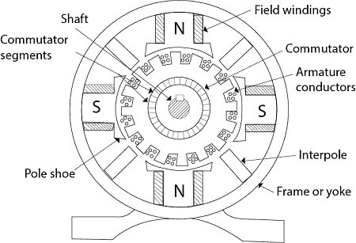
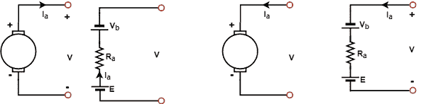

# 直流发电机

> 原文：<https://www.javatpoint.com/dc-generators>

## 电机的基本结构:

旋转机器有两部分**定子**和**转子**。定子不动，它是机器的外框，而转子是可动的，是机器的内部。这些是由铁磁性材料制成的。狭槽在定子的内边缘和转子的外周上切割。导体放置在这些槽上。这些导体连接在一起形成绕组，在这些绕组中感应出电压，称为电枢绕组。产生主磁通的绕组称为励磁绕组。永磁体也可用于在某些机器中产生主磁通。

D.交流电机主要有两种，直流发电机和直流电动机。把机械能转换成电能的装置叫直流发电机，把电能转换成机械能的装置叫直流电动机。

* * *

## 直流发电机结构:

**直流发电机主要由三个主要部分组成:**

1.  磁场系统。
2.  电枢。
3.  换向器和电刷装置。

## 磁场系统:

机器中产生主磁通量的静止部分称为磁场系统。它的外部框架是轭架，轭架由铸钢或轧钢制成的空心圆柱体组成。直流发电机的磁轭用偶数个磁极铁芯栓接。轭架有以下两个用途:

*   它是磁极铁芯的支持者和保护者。
*   它被用来构成磁路的一部分。

由于磁极指向内部，它们被称为凸极。每个极芯都有一个具有曲面的极靴。极靴有两个用途:

*   它支持磁场线圈。
*   它增加了磁路的横截面积，降低了磁阻。

磁极被层叠以减少涡流损耗。

## 电枢:

电枢是直流电机的旋转部件。它由轴组成，轴上安装有叠片铁芯(电枢铁芯)。叠片的目的是减少涡流损耗，而绝缘导体放在电枢铁芯的槽内，就叫电枢绕组。电枢中使用的两种绕组是- **波**和**圈**。

## 换向器和电刷装置:

换向器由大量由硬拉制铜制成的楔形片组成。这些段在它们的云母片的帮助下相互绝缘。它是光滑圆柱体的形状，上面有碳刷，碳刷正好接触圆柱体的圆形表面。

换向器和电枢设置在同一轴上。如果在磁场存在的情况下向机器提供机械动力，则会在电枢导体中产生交流电动势，然后通过碳刷收集该电动势，机器被称为在发电模式下运行。换向器的功能是将所有负半周期转换为正周期，并将纹波平滑为输出电压。另一方面，当电枢通过换向器中的碳刷连接到直流电源时，会产生扭矩并作用在电枢的每个导体上，机器开始作为电机工作。因此，我们可以说碳刷和换向器一起表现为机械整流器或逆变器。

* * *

## 直流电机电枢的等效电路:

等效电路用于表示直流发电机的电枢。它可以由三个串联的元件 E、R a 和 V b 来表示。元素 E 为生成电压，R a 为电枢电阻，V b 为电刷接触压降。直流发电机直流电动机电枢的等效电路如下所示。如果是直流电机，E 是后面的电动势

**图:(a)直流发电机(b)直流电机电枢等效电路**