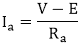
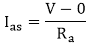
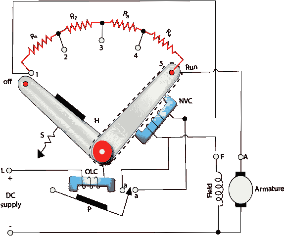
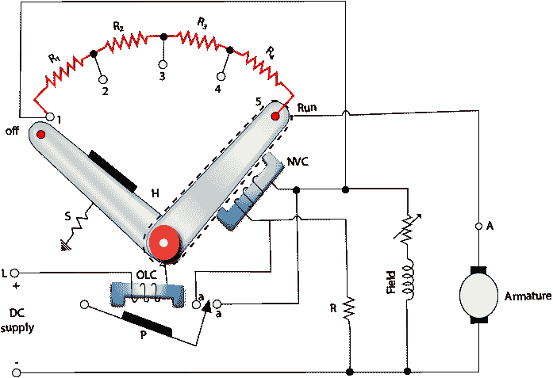

# 直流电机的启动

> 原文：<https://www.javatpoint.com/starting-of-dc-motors>

起动机是启动和加速电机的装置。控制器是启动、控制速度、反转、停止和保护电机的装置。

电机的电枢电流由下式给出

因此，如果 V 保持不变，电枢电流 I a 取决于 E 和 R a 。当我们打开电机时，电枢是静止的，所以后面的电动势将为零。作为的起动电枢电流 I 由下式给出

## 三点起动器:

当我们必须启动直流连接的电机时，操纵杆逐渐向右转动。当操纵杆接触点 1 时，励磁绕组直接与电源相连。

**图:三点直流并联电机启动器**

### 工作:

简单的高电阻步进，与电枢 f 机串联，控制电流。图为启动电机的三相并联电机，手动移动手柄 H，当其移动到与电阻接触时，螺柱 1 处于启动位置。在该位置，励磁绕组接收全电源电压，电枢电流通过分级电阻 R 1 、R 2 、R 3 和 R 4 减小。起动机手柄逐渐从一个支架移动到另一个支架，直到离开运行位置。在运行位置，电机达到全速，电阻完全切断，电源直接连接在两个绕组上。

NVC(无电压跳闸线圈)与电机的励磁绕组串联。当电源电压降至特定值以下时，NVC 为，手柄被拉回到关闭位置。它还可以防止励磁绕组开路。NVC 被称为无电压或欠电压保护的电机。

当电枢电流超过正常额定值时，P 被 OLC 电磁铁(过载线圈)吸引，闭合触点 aa，使 NVC 短路。这导致手柄 H 释放，手柄 H 返回关闭位置，电机电源被切断。

为了提高电机的速度，应增加磁场电阻，以减少分流磁场中的电流。极低的磁场电流无法保持开关，手柄将达到关闭位置。为了克服这个困难，使用了 **4 点启动器**。

* * *

## 4 点启动器:

3 点起动器和 4 点起动器之间的主要区别在于，在 4 点起动器中，励磁线圈不与无电压线圈串联，这意味着保持线圈从并联励磁电路中移除，并与限流电阻 R 串联直接跨接在线路上。

**图:四点直流并联电机起动器**

在这种布置中，形成三个并联电路:

1.  电枢，过载释放并启动电阻。
2.  并联励磁绕组和可变电阻。
3.  限流电阻和保持线圈。

通过这种布置，用于改变电机速度的励磁电流的变化不会影响通过保持线圈的电流，因为两个电路彼此独立。