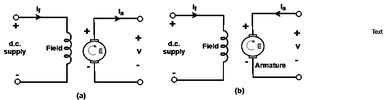
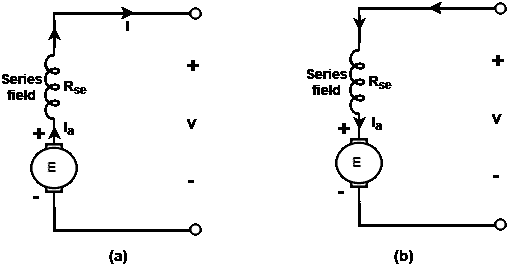
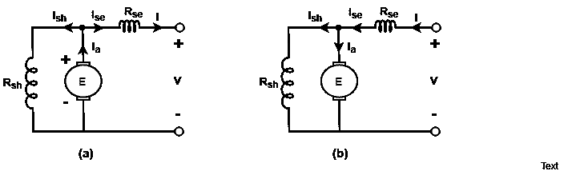
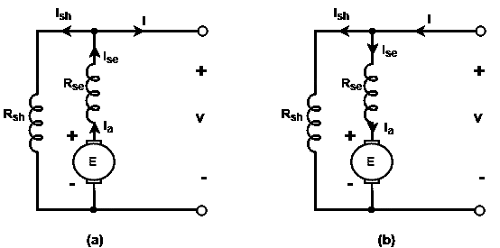
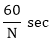
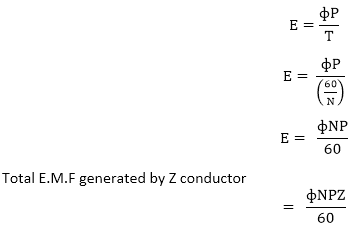
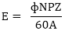
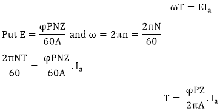

# 直流电机的类型

> 原文：<https://www.javatpoint.com/types-of-dc-machine>

直流电机中的磁通量是由载流的励磁线圈产生的。通过励磁绕组中的循环电流在装置中产生磁通量的过程称为励磁。

直流电机有两种励磁方式。独立激励和自激励。在自励磁中，流经励磁绕组的电流由电机本身提供，在单独励磁中，励磁线圈由单独的直流电源供电。

直流电机的主要类型有:

1.  独立励磁直流电机
2.  分路器或分路器。
3.  串联绕线机或串联机。
4.  复合伤口或复合机器。

* * *

## 1.独立励磁直流电机:

当一个单独的直流电源被用来激励励磁线圈时，它被称为单独励磁直流电机。图中给出了显示独立激励直流电机的连接。

**图:(a)单独励磁直流发电机，(b)单独励磁直流电机。**

## 2.并联绕线直流电机:

并联直流电机是磁场线圈与电枢并联的电机。由于分路磁场接收发电机的全部输出电压或电动机的电源电压，所以它通常由许多匝细导线组成，这些细导线携带小的磁场电流。

## 3.串联直流电机:

串联直流电机是励磁线圈与电枢串联的电机。串联励磁绕组承载电枢电流，电枢电流大，这就是为什么串联励磁绕组由几匝大横截面积的导线组成。

**图:(a)直流串联发电机(b)直流串联电机。**

## 4.复合缠绕直流电机:

复合机是既有并联又有串联的机器。机器的每一极都有两个绕组。串联绕组的匝数少，横截面积大，并联绕组的匝数多，导线细。

它可以通过两种方式连接。如果分流场单独与电枢并联，则机器称为**短分流复合机**，如果分流场同时与电枢和串联场并联，则机器称为**长分流复合机**。

**图:(a)短并联复合直流发电机(b)短并联复合直流电机。**

图:(a)长分流直流发电机(b)长分流直流电机。

* * *

## 电动势和扭矩方程:

当电枢旋转时，线圈中产生电压。在发电机的情况下，旋转的电动势称为产生的电动势和电动势。

在电机的情况下，旋转的电动势称为后电动势，E r = E b 。两种操作条件的表达式是相同的。

顺时针电流产生向下的磁场，逆时针电流产生向上的磁场。

让，

P =极数。
φ=韦伯中每极通量。
Z =电枢中导体的总数。
N =电枢速度
A =电枢中平行路径的数量。

让我们考虑在 t 中从 P 到 Q 所需的极距τPand 下，导体从位置 P 移动到 Q。

完成 N 次旋转所需的时间= 1 分钟= 60 秒。

完成一圈需要时间= 

在 P 极发电机中，电枢旋转一周，每个电枢导体将磁通量切割 P 次。所以，一个导体在一转中切割的磁通量= фP

一根导线中感应的平均电动势

E.连接在一对碳刷上的每个并联路径中产生的电动势。

E.每条路径中的

**扭矩方程:**

机械功率输入= ωT.....................等式 1
T 是由在 n . r . p . s .
下运行的电机产生的电磁转矩，产生的电功率= E×Ia.................等式 2
机械功率输入=开发的电功率

关于等式 1 和等式 2

以上方程是直流电机的扭矩方程。