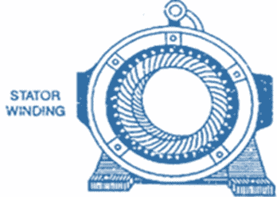
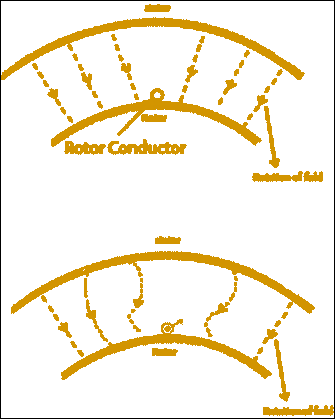
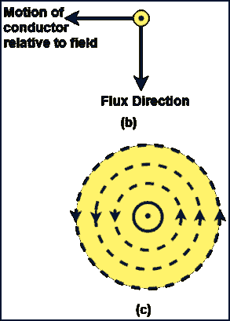
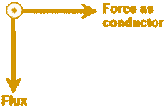
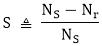

# 三相感应电动机

> 原文：<https://www.javatpoint.com/three-phase-induction-motors>

三相感应电动机是用于工业驱动的最常见和最流行的交流电动机类型。使用这种电机是因为它便宜、耐用、高效、可靠。调速性能好，扭矩大。它几乎不需要维护，并且具有合理的过载能力。

## 建筑

三相感应电动机主要有两部分:

1.  定子。
2.  转子。

电机的固定部分就是静止的，称为定子。

电机的旋转部分称为转子。



**图:部分缠绕双层绕组的感应电机定子**

电机的定子由高级合金钢叠片构成，所有叠片相互绝缘，并放置在系统的内周。这些叠片支撑在铸铁框架上。定子的导体以星形或三角形连接方式连接形成三相绕组。

## 感应电机的类型:

感应电动机分为两部分-

1.  鼠笼式转子或简称笼型转子
2.  相绕或绕线转子。使用这种转子的电机也称为滑环电机。

**三相感应电动机的工作原理**

考虑静止转子上的导体受到三相电源连接到定子三相绕组时产生的磁场的作用。如果磁场的旋转是顺时针的，那么它将具有与导体在静止磁场中逆时针运动相同的效果。根据法拉第电磁感应定律，导体中会感应出电压。

(一) 
(四)

**图:扭矩的产生**

## 速度和滑动:

转子的同步速度与实际速度之差称为**转差速度**。

因此，我们可以说“滑动速度”显示了转子相对于磁场的速度。

基本单位(p

哪里，

```
      Ns = synchronous speed in r.p.m
      Nr = actual rotor speed in r.p.m
Slip Speed = N<sub>s</sub> ?N r.p.m

```