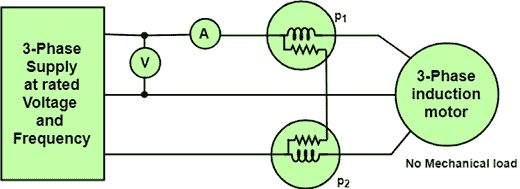
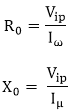
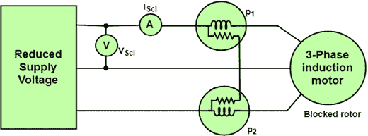
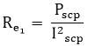
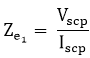
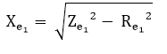

# 空载和堵转试验

> 原文：<https://www.javatpoint.com/no-load-and-blocked-rotor-test>

小型电机的效率可以通过直接加载它们并测量输入和输出功率来确定。但是在大型电机的情况下，很难为它们安排那么多负载。如果我们直接测试负载，功率损耗会很大。因此，间接法被用来确定三相感应电动机的效率。

我们可以对电机进行以下测试，以确定效率:

*   空载试验。
*   堵转试验。

## 空载测试或开路测试:

感应电动机的空载试验类似于变压器的开路试验。电机不从其负载连接，额定频率下的额定电压施加在定子上，使电机空载运行。2 瓦特计法测量系统的输入功率。

电压表测量标准额定电源电压，电流表测量空载电流。由于电机空载运行，总功率等于电机的恒定铁损、摩擦和绕组损耗。

```
Pconstant = Pi = P1 + P2 = Sum of the two wattmeter readings.

```



**图:三相感应电动机空载试验电路图。**

由于感应电动机在空载条件下的功率因数通常小于 0.5，一个瓦特计将显示负读数。因此，有必要反转电流线圈端子的方向来读取读数。

如果 V <sub>inl</sub> =输入线电压
P <sub>inl</sub> =空载时总三相输入功率
I <sub>0</sub> =输入线电流。
V <sub>ip</sub> =输入相电压
P<sub>inl</sub>=&Sqrt；3v<sub>inl</sub>I<sub>0</sub>cosφ<sub>0</sub>T20】I<sub>= I<sub>0</sub>sinφ<sub>0</sub>T27】I<sub>ω</sub>= I<sub>0</sub>cosφ<sub>0</sub></sub>



* * *

## 转子堵塞或短路测试:



**图:堵转试验电路图**

感应电机堵转试验与变压器短路试验相同。在该测试中，电机的轴被连接以使其不能移动，并且转子绕组短路。在滑环电机中，转子绕组通过滑环短路，在笼型电机中，转子条永久短路。该测试也称为锁定转子测试。

当通过三相自动变压器向定子施加降低频率的降低电压，使满负荷电流在定子中流动时，可获得以下三个读数。

1)短路时的总功率输入

```
Psc = algebraic sum of the two wattmeter readings.

```

2)电流表读数

```
  Iscl = line current on short circuit.

```

3)电压表的读数

```
  Vscl = Line voltage on the short circuit
 &therefore;Psc = &Sqrt;3Vscl  cos?Φsc

```

cos 在哪里？&varphi;<sub>c</sub>=短路时的功率因数

参考 stator<sub>e</sub><sub>1</sub>的电机等效电阻为:



参考 statorZ <sub>e</sub> <sub>1</sub> 的电机等效阻抗为:



参考定子的电机等效电抗



#### 注:*堵转试验应在与正常运行条件下相同的转子电流和频率条件下进行。*