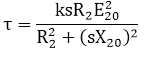
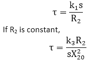
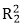

# 扭矩-滑动和扭矩-速度特性

> 原文：<https://www.javatpoint.com/torque-slip-and-torque-speed-characteristics>

感应电动机的转矩-转差率曲线显示了转矩随转差率的变化。

我们有

如果 R 2 和 X 20 保持不变，那么转矩τ将取决于滑移 s。转矩-滑移特性曲线分为三个区域:

*   低滑动区域
*   中等滑动区域
*   高滑动区域

### 低滑动区域

在同步速度 s = 0 时，扭矩将为零。当速度非常接近同步速度时，打滑非常低，(sX 20 ) 2 与 R 2 相比可以忽略不计。因此，

当 k2= k1/R2

从上面的关系可以看出，扭矩与转差率成正比。因此，当滑移很小时，扭矩-滑移曲线是一条直线。

### 中等滑动区域

随着滑移增加，术语(sX 20 ) 2 变大，因此与(sX  20  ) 2 相比可能被忽略

因此，扭矩与滑向静止状态成反比。我们可以用一条矩形双曲线来表示转矩-滑动特性。对于滑动的中间值，图表从一种形式变为另一种形式。这样，当 R 2 = sX 20 时，它通过最大扭矩点。感应电机中产生的最大扭矩称为**拉出扭矩**或击穿扭矩。这个产生的扭矩是电机短时间过载能力的量度。

### 高滑动区域

扭矩下降超过最大扭矩点，结果是电机减速，然后停止。在这个阶段，我们应该立即将电机从电源上断开，以防止过载造成的损坏。

电机在 s=0 和 s = s M 之间的滑动值下运行，其中 s M 是对应于最大扭矩的滑动值。对于典型的感应电机，拉出扭矩是额定满载扭矩的 2 至 3 倍。因此，电机可以处理短时间过载，而不会失速。起动扭矩是额定满载扭矩的 1.5 倍。

下图显示了扭矩-滑动曲线和扭矩-速度曲线:

**图:扭矩-滑动曲线**

**图:扭矩-速度曲线**