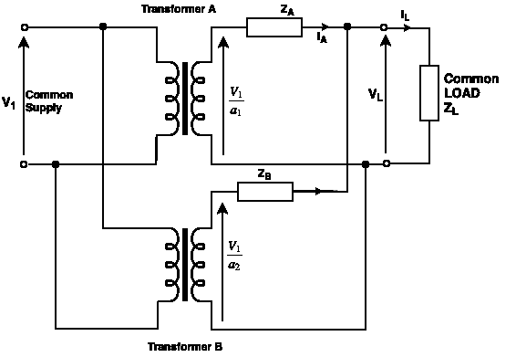
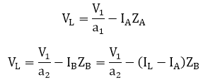
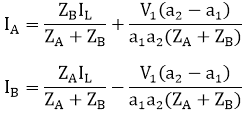

# 变压器的并联运行

> 原文：<https://www.javatpoint.com/parallel-operations-of-transformers>

当我们将两个变压器的初级绕组连接到一个共同的电源电压，并将两个变压器的次级绕组连接到一个共同的负载时，这种类型的变压器连接被称为变压器的**并联操作**。

## 并行操作的原因

并联运行变压器的原因如下:

1.  这是一种经济的方法，因为单个大型变压器对于大负载是不经济的。
2.  如果变压器并联，我们需要额外的负载，然后我们可以通过在未来增加更多的变压器来扩展系统。
3.  当我们连接标准尺寸的变压器时，并联运行减少了变电站的空间容量。
4.  并联连接最大限度地提高了电力系统的可用性，因为我们可以关闭任何系统进行维护，而不会影响其他系统的性能。

## 单相变压器并联:

下图显示了并联的两个变压器 A 和 B 的电路图。

让，

a 1 =变压器 A
a 2 的匝数比=变压器 B
Z A 的匝数比=变压器 A 参考二次侧的等效阻抗。
Z B =变压器 B 参考二次侧的等效阻抗。
Z L =二次侧的负载阻抗。
I A =变压器 A 二次供给负载的电流，
I B =变压器 B 二次供给负载的电流，
V L =负载二次电压。
I L =负载电流

**图:两台单相变压器并联。**

**由 KCL、**

我A+我B=我 L

**由 KVL，**

通过求解上述两个方程，我们得到

这些电流中的每一个都有两个分量；第一个分量代表变压器的负载电流份额，第二个分量是次级绕组中的循环电流。

循环电流有以下不良影响:

*   它们增加了铜的损失。
*   他们使一台变压器过载，降低了 KVA 允许的负载。

### 单相变压器并联运行的条件:

**必要条件**

1.  变压器必须具有相同的极性。
2.  变压器应具有相等的匝数比。

**理想条件**

1.  变压器内部阻抗的满载电压应相等。
2.  两个变压器的绕组电阻与电抗之比应该相等。这种情况确保两个变压器以相同的功率因数运行，从而根据额定功率共享有功功率和无功电压。

## 并联三相变压器

单相变压器正确并联运行的条件如下:

1.  变压器的极性应该相同。
2.  相同的一次和二次额定电压。
3.  阻抗与千伏安额定值成反比。
4.  变压器阻抗中相同的 X/R 比。

单相和三相变压器并联运行的条件相同，但增加了以下内容:

1.  变压器的相序必须相同。
2.  所有并联变压器的一次和二次电压必须具有相同的相移。

#### 注:在不平衡负载条件下，三相变压器的计算是基于每相进行的。但是，最好以单位为基础进行计算，尤其是在主连接和次连接不同的情况下。