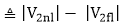
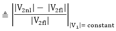
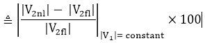
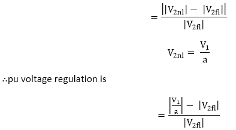
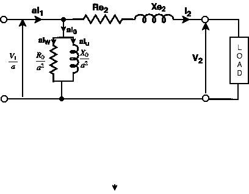
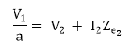
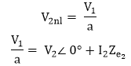
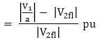
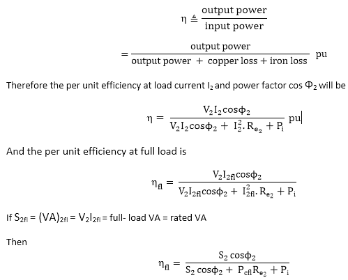

# 监管和效率

> 原文：<https://www.javatpoint.com/regulation-and-efficiency-of-transformer>

## 什么是电压调节？

术语“电压调节”标识了变压器中电压随负载变化的特性。

变压器的电压调节定义为在给定功率因数下，空载(I 2 =0)和全额定负载(I 2 = I 2fl )之间的二次端电压算术差，额定负载和空载的一次电压值相同。

空载电压和满载电压的数值差称为**固有电压调节**。

固有电压调节

其中 V 2fl =额定负载下的额定二次端电压。

V 2nl =空载二次端电压，与额定负载和空载一次电压值相同。

满载时的单位电压调节为

满载时的电压调节百分比

可以说，电压调节是衡量变压器性能的一个重要指标。我们可以根据电压调节来规定变压器的极限。

**一次值电压调节:**

单位电压调节

## 电压调节的计算

我们可以根据电路参数来计算变压器的电压调节。次级变压器的等效电路图如下所示。

**图:二次参考的变压器等效电路**

KVL

**为了计算电压调节，我们必须遵循下面给出的步骤:**

1.我们必须将 V 2 作为参考相量
∴v2= v2≈0 = v2+j0

2.将 I 2 写成相量形式
表示滞后功率因数 Cos&Fcy；2
I2= I2∩-&Fcy；2= I2Cos&Fcy； 2 ？jI2sin&Fcy； 2
为领先功率因数 Cos&Fcy；2T21】I2= I2∑+&Fcy；2= I2Cos&Fcy；2+Ji2sin&Fcy；2T36】为单位功率因数
I2= I2∠0 = I2+j0

3.计算 ZeT2【2】T3)
ZeT7】2= ReT11】2+jXeT15】2

4.计算

5.现在我们将计算电压调节

或者我们可以说，它是空载和满载电压之差与满载电压之比。

### 什么是变压器效率？

变压器效率(η)可以解释为输出功率与输入功率之比。

正如我们所知，在变压器中没有旋转部分，因此旋转电机中没有旋转损耗，如绕组和摩擦损耗。因此，我们可以在设计良好的变压器中获得高达 99%的最大效率。

### 变压器的全天(或能量)效率是多少？

24 小时的能量输出与 24 小时周期的能量输入之比称为变压器的全天效率。

如果我们知道变压器的负载周期，那么全天效率就很容易确定。