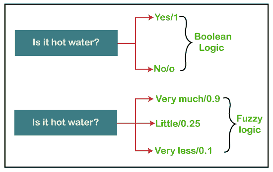
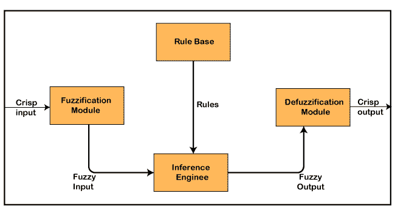
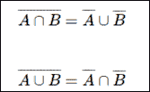
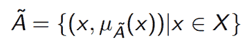
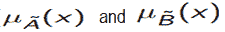

# 模糊逻辑教程

> 原文：<https://www.javatpoint.com/fuzzy-logic>

## 什么是模糊逻辑？

**‘Fuzzy’**这个词表示不清楚或模糊的事物。有时，我们在现实生活中无法判断给定的问题或陈述是对还是错。当时，这一概念提供了许多介于真与假之间的值，并为找到该问题的最佳解决方案提供了灵活性。

### 模糊逻辑与布尔逻辑的比较示例



模糊逻辑包含多个逻辑值，这些值是介于 0 和 1 之间的变量或问题的真值。这个概念是由 **1965** 中的**洛夫蒂·扎德**基于**模糊集理论**提出的。这个概念提供了计算机没有提供的可能性，但类似于人类产生的可能性范围。

在布尔系统中，只存在两种可能性(0 和 1)，其中 1 表示绝对真值，0 表示绝对假值。但是在模糊系统中，在 0 和 1 之间存在多种可能性，它们部分是假的，部分是真的。

模糊逻辑可以在诸如微控制器、基于工作站或基于大型网络的系统中实现，以获得确定的输出。它也可以用硬件或软件来实现。

## 模糊逻辑的特点

以下是模糊逻辑的特征:

1.  这个概念很灵活，我们很容易理解和实现。
2.  它用于帮助人类创造的逻辑最小化。
3.  对于那些适合近似或不确定推理的问题，它是寻找解决方案的最佳方法。
4.  它总是提供两个值，表示问题和陈述的两种可能的解决方案。
5.  它允许用户构建或创建任意复杂的非线性函数。
6.  在模糊逻辑中，一切都是度的问题。
7.  在模糊逻辑中，任何逻辑系统都可以很容易地模糊化。
8.  它基于自然语言处理。
9.  量化分析师也使用它来提高算法的执行。
10.  它还允许用户与程序集成。

## 模糊逻辑系统的体系结构

在**模糊逻辑**系统的架构中，每个组件都扮演着重要的角色。该架构由以下四个不同的组件组成。

1.  规则库
2.  模糊化
3.  推理机
4.  去模糊化

下图显示了模糊逻辑系统的体系结构或流程:



### 1.规则库

规则库是用于存储规则集的组件，专家给出的“如果-那么”条件用于控制决策系统。近年来，模糊理论有了很大的发展，为模糊控制器的设计和整定提供了有效的方法。这些更新或发展减少了模糊规则集的数量。

### 2.模糊化

**模糊化**是对系统输入进行变换的模块或组件，即将清脆的数字转换成模糊的步长。清晰的数字是由传感器测量的输入，然后模糊化，将它们传递到控制系统进行进一步处理。在任何模糊逻辑系统中，该组件将输入信号分为以下五种状态:

*   大正值
*   中等阳性
*   小型
*   中等阴性
*   大负值

### 3.推理机

该组件是任何模糊逻辑系统(FLS)中的主要组件，因为所有信息都在推理机中处理。它允许用户找到当前模糊输入和规则之间的匹配度。匹配度后，系统根据给定的输入字段决定添加哪个规则。当所有规则都被触发时，它们就被组合起来开发控制动作。

### 4.去模糊化

**去模糊**是一个模块或组件，它将**推理机**生成的模糊集输入转化为一个清晰的值。这是模糊逻辑系统过程的最后一步。清晰值是用户可接受的一种值。有多种技术可以做到这一点，但是用户必须选择最佳技术来减少错误。

## 隶属函数

**隶属函数**是表示模糊集图的函数，允许用户量化语言术语。这是一个用于将 x 的每个元素映射到 0 到 1 之间的值的图。

该功能也称为指示器或特性功能。

隶属度的这一功能是由**扎德**在模糊集的第一篇论文中引入的。对于模糊集 B，X 的隶属函数定义为:μB:X → [0，1]。在这个函数 X 中，集合 B 的每个元素被映射到 0 到 1 之间的值。这被称为隶属度或隶属值。

## 经典和模糊集合论

要学习经典和模糊集合论，首先你必须知道什么是集合。

### 一组

集合是一个术语，它是无序或有序元素的集合。以下是集合的各种示例:

1.  一组全自然数
2.  一个班里的一组学生。
3.  一个州内所有城市的集合。
4.  字母表中一组大写字母。

### 器械包的类型:

器械包有以下不同类别:

1.  有限的
2.  空的
3.  无限
4.  适当的
5.  普遍的
6.  子集
7.  一个
8.  等价集
9.  不相交集

### 经典集合

它是一种集合类型，用于收集组中不同的对象。边界清晰的集合是经典集合。在任何集合中，每个单独的实体都被称为该集合的元素或成员。

**集合的数学表示**

任何集合都可以用以下两种不同的方式来表示:

**1。烘焙表格:**也称为表格形式。在这种形式中，集合以下列方式表示:

Set_name = { element1, element2, element3, ......, element N}

集合中的元素用括号括起来，并用逗号隔开。

以下两个例子描述了烘焙器或表格形式的集合:

**例 1:**

Set of Natural Numbers: N={1, 2, 3, 4, 5, 6, 7, ......,n).

**例 2:**

Set of Prime Numbers less than 50: X={2, 3, 5, 7, 11, 13, 17, 19, 23, 29, 31, 37, 41, 43, 47}.

**2。集合生成器表单:**集合生成器表单使用集合中元素的公共属性来定义集合。在这种形式中，集合以下列方式表示:

A = {x:p(x)}

以下示例描述了生成器表单中的集合:

The set {2, 4, 6, 8, 10, 12, 14, 16, 18} is written as:
B = {x:2 ≤ x < 20 and (x%2) = 0}

### 经典集上的运算

以下是对经典集合执行的各种操作:

1.  联合行动
2.  交叉操作
3.  差分运算
4.  补码运算

**1。联合:**

这个操作用(A U B)表示。A U B 是存在于两个不同的集合 A 和 B 中的那些元素的集合。这个操作组合了来自这两个集合的所有元素，并形成一个新的集合。它也被称为逻辑或运算。

它可以描述为:

A ∪ B = { x | x ∈ A OR x ∈ B }.

**示例:**

Set A = {10, 11, 12, 13}, Set B = {11, 12, 13, 14, 15}, then A ∪ B = {10, 11, 12, 13, 14, 15}

**2。路口**

该操作用(A **∩** B)表示。A **∩** B 是集合 A 和集合 B 中共同的那些元素的集合，也称为逻辑或运算。

它可以描述为:

A ∩ B = { x | x ∈ A AND x ∈ B }.

**示例:**

Set A = {10, 11, 12, 13}, Set B = {11, 12, 14} then A **∩** B = {11, 12}

**3。差异操作**

这个操作用(A - B)表示。A-B 是那些只存在于集合 A 中而不存在于集合 b 中的元素的集合

它可以描述为:

A - B = { x | x ∈ A AND x ∉ B }.

**4。补码运算:**这个运算用(a `)表示。它应用于单个集合。‘a’是集合 a 中不存在的元素集合

它可以描述为:

A′ = {x|x ∉ A}.

### 经典集的性质

下列各种性质对于寻找模糊逻辑问题的解起着重要作用。

**1。可交换属性:**

这个性质提供了由两个有限集合 A 和 B 获得的以下两种状态:

A ∪ B = B ∪ A
A ∩ B = B ∩ A

**2。关联属性:**

这个性质也提供了以下两种状态，但是它们是由三个不同的有限集合 A、B 和 C 获得的:

A ∪ (B ∪ C) = (A ∪ B) ∪ C
A ∩ (B ∩ C) = (A ∩ B) ∩ C

**3。幂等属性:**

除了对于单个有限集合 A，该属性还提供以下两种状态:

A ∪ A = A
A ∩ A = A

**4。吸收特性**

这个属性还为任意两个有限集合 A 和 B 提供了以下两种状态:

A ∪ (A ∩ B) = A
A ∩ (A ∪ B) = A

**5。分配属性:**

此属性还为任意三个有限集合 A、B 和 C 提供以下两种状态:

A∪ (B ∩ C) = (A ∪ B)∩ (A ∪ C)
A∩ (B ∪ C) = (A∩B) ∪ (A∩C)

**6。身份属性:**

这个性质为任何有限集合 A 和泛集合 X 提供了以下四种状态:

A ∪ φ =A
A ∩ X = A
A ∩ φ = φ
A ∪ X = X

**7。可传递属性**

此属性为有限集合 A、B 和 C 提供以下状态:

If A ⊆ B ⊆ C, then A ⊆ C

**8。**溶解性能

该属性为任何有限集合 A 提供以下状态:


**9。德摩根定律**

该法律给出了以下规则来提供矛盾和同义反复:



## 模糊集合

经典集合论是模糊集合论的子集。模糊逻辑就是基于这一理论，它是扎德在 1965 年提出的经典集合论(即脆集)的推广。

模糊集是存在于 0 和 1 之间的值的集合。模糊集由波浪号(~)表示。模糊理论集是由洛夫蒂·扎德和迪特·克拉瓦在 1965 年提出的。在模糊集中，部分隶属度也是存在的。这一理论是作为经典集合论的延伸而发布的。

这一理论在数学上表示为一个模糊集(γ)是一对 U 和 M，其中 U 是话语的宇宙，M 是取值于区间[ 0，1 ]的隶属函数。话语的宇宙(U)也用ω或 x 表示。



## 模糊集上的运算

给定的γ和β是两个模糊集，X 是分别具有以下成员函数的论域:



模糊集的运算如下:

**1。联合运算:**模糊集的联合运算定义如下:

```
μA∪B(x) = max (μA(x), μB(x))

```

**示例:**

假设 A 是包含以下元素的集合:

A = {( X<sub>1</sub>, 0.6 ), (X<sub>2</sub>, 0.2), (X<sub>3</sub>, 1), (X<sub>4</sub>, 0.4)}

并且，B 是包含以下元素的集合:

B = {( X<sub>1</sub>, 0.1), (X<sub>2</sub>, 0.8), (X<sub>3</sub>, 0), (X<sub>4</sub>, 0.9)}

然后，

AUB = {( X<sub>1</sub>, 0.6), (X<sub>2</sub>, 0.8), (X<sub>3</sub>, 1), (X<sub>4</sub>, 0.9)}

**因为，按照这个操作**

**为 X<sub>1</sub>T3】**

μ<sub>A∪B</sub>(X<sub>1</sub>) = max (μ<sub>A</sub>(X<sub>1</sub>), μ<sub>B</sub>(X<sub>1</sub>))
μ<sub>A∪B</sub>(X<sub>1</sub>) = max (0.6, 0.1)
μ<sub>A∪B</sub>(X<sub>1</sub>) = 0.6

**为 X<sub>2</sub>T3】**

μ<sub>A∪B</sub>(X<sub>2</sub>) = max (μ<sub>A</sub>(X<sub>2</sub>), μ<sub>B</sub>(X<sub>2</sub>))
μ<sub>A∪B</sub>(X<sub>2</sub>) = max (0.2, 0.8)
μ<sub>A∪B</sub>(X<sub>2</sub>) = 0.8

**为 X<sub>3</sub>T3】**

μ<sub>A∪B</sub>(X<sub>3</sub>) = max (μ<sub>A</sub>(X<sub>3</sub>), μ<sub>B</sub>(X<sub>3</sub>))
μ<sub>A∪B</sub>(X<sub>3</sub>) = max (1, 0)
μ<sub>A∪B</sub>(X<sub>3</sub>) = 1

**为 X<sub>4</sub>T3】**

μ<sub>A∪B</sub>(X<sub>4</sub>) = max (μ<sub>A</sub>(X<sub>4</sub>), μ<sub>B</sub>(X<sub>4</sub>))
μ<sub>A∪B</sub>(X<sub>4</sub>) = max (0.4, 0.9)
μ<sub>A∪B</sub>(X<sub>4</sub>) = 0.9

**2。交集运算:**模糊集的交集运算定义如下:

```
μA∩B(x) = min (μA(x), μB(x))

```

**示例:**

假设 A 是包含以下元素的集合:

A = {( X<sub>1</sub>, 0.3 ), (X<sub>2</sub>, 0.7), (X<sub>3</sub>, 0.5), (X<sub>4</sub>, 0.1)}

并且，B 是包含以下元素的集合:

B = {( X<sub>1</sub>, 0.8), (X<sub>2</sub>, 0.2), (X<sub>3</sub>, 0.4), (X<sub>4</sub>, 0.9)}

然后，

A**∩**B = {( X<sub>1</sub>, 0.3), (X<sub>2</sub>, 0.2), (X<sub>3</sub>, 0.4), (X<sub>4</sub>, 0.1)}

**因为，按照这个操作**

**为 X<sub>1</sub>T3】**

μ<sub>A∩B</sub>(X<sub>1</sub>) = min (μ<sub>A</sub>(X<sub>1</sub>), μ<sub>B</sub>(X<sub>1</sub>))
μ<sub>A∩B</sub>(X<sub>1</sub>) = min (0.3, 0.8)
μ<sub>A∩B</sub>(X<sub>1</sub>) = 0.3

**为 X<sub>2</sub>T3】**

μ<sub>A∩B</sub>(X<sub>2</sub>) = min (μ<sub>A</sub>(X<sub>2</sub>), μ<sub>B</sub>(X<sub>2</sub>))
μ<sub>A∩B</sub>(X<sub>2</sub>) = min (0.7, 0.2)
μ<sub>A∩B</sub>(X<sub>2</sub>) = 0.2

**为 X<sub>3</sub>T3】**

μ<sub>A∩B</sub>(X<sub>3</sub>) = min (μ<sub>A</sub>(X<sub>3</sub>), μ<sub>B</sub>(X<sub>3</sub>))
μ<sub>A∩B</sub>(X<sub>3</sub>) = min (0.5, 0.4)
μ<sub>A∩B</sub>(X<sub>3</sub>) = 0.4

**为 X<sub>4</sub>T3】**

μ<sub>A∩B</sub>(X<sub>4</sub>) = min (μ<sub>A</sub>(X<sub>4</sub>), μ<sub>B</sub>(X<sub>4</sub>))
μ<sub>A∩B</sub>(X<sub>4</sub>) = min (0.1, 0.9)
μ<sub>A∩B</sub>(X<sub>4</sub>) = 0.1

**3。补码运算:**模糊集的补码运算定义如下:

```
μĀ(x) = 1-μA(x),

```

**示例:**

假设 A 是包含以下元素的集合:

A = {( X<sub>1</sub>, 0.3 ), (X<sub>2</sub>, 0.8), (X<sub>3</sub>, 0.5), (X<sub>4</sub>, 0.1)}

然后，

Ā= {( X<sub>1</sub>, 0.7 ), (X<sub>2</sub>, 0.2), (X<sub>3</sub>, 0.5), (X<sub>4</sub>, 0.9)}

**因为，按照这个操作**

**为 X<sub>1</sub>T3】**

μ<sub>Ā</sub>(X<sub>1</sub>) = 1-*μ<sub>A</sub>*(X<sub>1</sub>)
μ<sub>Ā</sub>(X<sub>1</sub>) = 1 - 0.3
μ<sub>Ā</sub>(X<sub>1</sub>) = 0.7

**为 X<sub>2</sub>T3】**

μ<sub>Ā</sub>(X<sub>2</sub>) = 1-μ<sub>A</sub>(X<sub>2</sub>)
μ<sub>Ā</sub>(X<sub>2</sub>) = 1 - 0.8
μ<sub>Ā</sub>(X<sub>2</sub>) = 0.2

**为 X<sub>3</sub>T3】**

μ<sub>Ā</sub>(X<sub>3</sub>) = 1-μ<sub>A</sub>(X<sub>3</sub>)
μ<sub>Ā</sub>(X<sub>3</sub>) = 1 - 0.5
μ<sub>Ā</sub>(X<sub>3</sub>) = 0.5

**为 X<sub>4</sub>T3】**

μ<sub>Ā</sub>(X<sub>4</sub>) = 1-μ<sub>A</sub>(X<sub>4</sub>)
μ<sub>Ā</sub>(X<sub>4</sub>) = 1 - 0.1
μ<sub>Ā</sub>(X<sub>4</sub>) = 0.9

| 经典集合论 | 模糊集合论 |
| 1.这个理论是一类有明确界限的集合。 | 1.这个理论是一类没有明确界限的集合。 |
| 2.这个集合论是由只有 0 和 1 的精确边界定义的。 | 2.这个集合论是由模糊的边界定义的。 |
| 3.在这个理论中，集合的边界位置没有不确定性。 | 3.在这个理论中，集合的边界位置总是存在不确定性。 |
| 4.这一理论被广泛用于数字系统的设计。 | 4.它主要用于模糊控制器。 |

## 模糊逻辑的应用

以下是模糊逻辑概念被广泛使用的不同应用领域:

1.  在**业务**中用于决策支持系统。
2.  用于**自动系统**中，控制交通和速度，提高自动变速器的效率。**自动系统**也使用自动变速器的换档调度方法。
3.  这个概念也用在各个领域的**防御**中。国防主要采用模糊逻辑系统进行水下目标识别和热红外图像的自动目标识别。
4.  它还以基于模糊逻辑的识别和手写识别的形式广泛应用于**模式识别和分类**中。它也用于模糊图像的搜索。
5.  模糊逻辑系统也用于**证券**。
6.  也用于**微波炉**中，用于设定伦琴功率和烹饪策略。
7.  该技术也用于**现代控制系统**领域，如专家系统。
8.  **金融**也是另一个应用，其中这个概念被用于预测股票市场和管理基金。
9.  它也用于控制刹车。
10.  它也用于化学品的**行业，用于控制 ph 值和化学蒸馏过程。**
11.  它还用于制造的**行业，以优化牛奶和奶酪的生产。**
12.  它也用于真空吸尘器和洗衣机的定时。
13.  它也用于加热器、空调和加湿器。

## 模糊逻辑的优势

模糊逻辑有各种优点或好处。其中一些如下:

1.  这个概念的方法论与人类推理的工作原理相似。
2.  任何用户都可以容易地理解模糊逻辑的结构。
3.  它不需要很大的内存，因为算法可以很容易地用更少的数据来描述。
4.  它被广泛应用于生活的各个领域，容易为复杂程度高的问题提供有效的解决方案。
5.  这个概念是基于数学的集合论，所以很简单。
6.  它允许用户控制控制机器和消费产品。
7.  与传统方法相比，模糊逻辑的开发时间较短。
8.  由于其灵活性，任何用户都可以轻松地在 FLS 系统中添加和删除规则。

## 模糊逻辑的缺点

模糊逻辑有各种缺点或局限性。其中一些如下:

1.  模糊逻辑系统的运行时间很慢，产生输出需要很长时间。
2.  简单的话用户很容易理解。
3.  模糊逻辑系统产生的可能性并不总是准确的。
4.  许多研究人员使用这种技术给出了解决给定语句的各种方法，这导致了歧义。
5.  模糊逻辑不适合那些要求高精度的问题。
6.  模糊逻辑系统需要大量的测试来验证和确认。

* * *