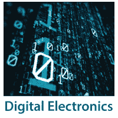

# 数字电子教程

> 原文：<https://www.javatpoint.com/digital-electronics>

我们的数字电子教程是为希望了解数字电子核心概念的有志之士设计的。我们的教程涵盖了基本和学术概念，包括各种转换类型、解码器、多路复用器、逻辑门等。

数字电子、数字电路和数字技术是对数字信号进行操作的电子产品。数字技术更容易获得电子设备。除了再现连续范围的值之外，这些设备还用于切换到已知状态之一。数字电路由大量逻辑门和布尔逻辑函数的简单电子表示组成。

## 先决条件

数字电子是数字计算机的概念。要更好地理解数字电子的概念，需要很好地理解计算机的核心概念。

## 观众

本教程对那些有兴趣了解数字电路是如何设计的以及计算机如何理解人类语言的学生很有帮助。本教程涵盖了数字电子的所有基础知识，有助于我们理解电路设计。

## 问题

我们保证您不会发现本数字电子教程的任何问题。但是如果有任何错误，请在联系表格中发布问题。

* * *