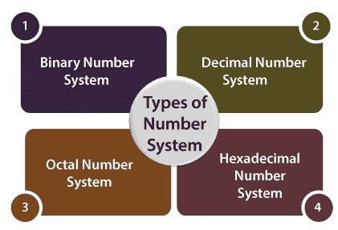

# 数系

> 原文：<https://www.javatpoint.com/number-system-in-digital-electronics>

在数字系统中，系统只能理解可选的数字系统。在这些系统中，数字符号用于表示不同的值，这取决于它在数字系统中的索引。

简单地说，为了表示信息，我们使用数字系统中的数字系统。


数字系统中的数字值使用以下公式计算:

1.  数字
2.  索引，其中数字出现在数字中。
3.  最后是基数，数字系统中可用的总位数。

#### 注:当数字系统表示 0 - 9 之间的数字时，数字的基数为 10。

## 数字系统的类型

在数字计算机中，有各种类型的数字系统用于表示信息。

1.  二进制数系
2.  十进数制
3.  十六进制数系统
4.  八进位数制



### 二进制数系

通常，在数字计算机中使用二进制数字系统。在这个数字系统中，它只携带两位数字，0 或 1。二进制数字系统中有两种电子脉冲。第一个是不存在代表“0”的电子脉冲，第二个是存在代表“1”的电子脉冲。每个数字被称为一位。四位集合(1101)称为半字节，八位集合(11001010)称为字节。二进制数中一个数字的位置表示数字系统的基数(2)的特定幂。

**特征:**

1.  它只保存两个值，即 0 或 1。
2.  它也被称为基数为 2 的数字系统。
3.  数字的位置代表基数(2)的 0 次方。示例:2 <sup>0</sup>
4.  最后一个数字的位置代表基数(2)的 x 次方。例:2 <sup>x</sup> ，其中 x 代表最后一个位置，即 1

**示例:**

(10100) <sub>2</sub> 、(11011) <sub>2</sub> 、(11001) <sub>2</sub> 、(000101) <sub>2</sub> 、(011010) <sub>2</sub> 。

### 十进数制

十进制数字在我们的日常生活中使用。十进制数字系统包含从 0 到 9(以 10 为基数)的十位数字。这里，小数点左边的连续位置值或位置代表单位、十、百、千等等。

十进制数字系统中的位置指定基数(10)的幂。0 是数字的最小值，9 是数字的最大值。例如，十进制数 2541 由单位位置的数字 1、十进制位置的数字 4、百进制位置的数字 5 和千进制位置的数字 2 组成，该值将写成:

```
(2×1000) + (5×100) + (4×10) + (1×1)
(2×103) + (5×102) + (4×101) + (1×100)
2000 + 500 + 40 + 1
2541

```

### 八进位数制

八进制数字系统的基数为 8(意味着它只有 8 个数字，从 0 到 7)。一个数字只有八个可能的数字值。仅借助三位，就可以表示一个八进制数。每组位都有一个介于 0 和 7 之间的不同值。

下面，我们描述了八进制数字系统的某些特征:

**特征:**

1.  八进制数字系统携带从 0、1、2、3、4、5、6 和 7 开始的八位数字。
2.  它也被称为 8 进制。
3.  数字的位置代表基数(8)的 0 次方。示例:8 <sup>0</sup>
4.  最后一个数字的位置代表基数(8)的 x 次方。例:8 <sup>x</sup> ，其中 x 代表最后一个位置，即 1

| 数字 | 八进制数 |
| Zero | 000 |
| one | 001 |
| Two | 010 |
| three | 011 |
| four | One hundred |
| five | One hundred and one |
| six | One hundred and ten |
| seven | One hundred and eleven |

**示例:**

(273) <sub>8</sub> 、(5644) <sub>8</sub> 、(0.5365) <sub>8</sub> 、(1123) <sub>8</sub> 、(1223) <sub>8</sub> 。

### 十六进制数系统

这是另一种在数字系统中表示数字的技术，称为**十六进制数字系统**。数字系统以 16 为基数，意味着总共有 16 个符号(0、1、2、3、4、5、6、7、8、9、A、B、C、D、E、F)用于表示一个数字。十进制值 10、11、12、13、14 和 15 的单比特表示由 A、B、C、D、E 和 f 表示。用十六进制数表示一个数只需要 4 比特。每组位都有一个介于 0 和 15 之间的不同值。八进制数字系统有以下特征:

**特征:**

1.  从 0 到 9 有十个数字，从 A 到 f 有六个字母。
2.  字母 A 到 F 定义了从 10 到 15 的数字。
3.  它也被称为 16 进制。
4.  在十六进制数中，数字的位置代表基数(16)的 0 次方。示例:16 <sup>0</sup>
5.  在十六进制数中，最后一位的位置代表基数(16)的 x 次方。例:16 <sup>x</sup> ，其中 x 代表最后一个位置，即 1

| 二进制数 | 十六进制数 |
| 0000 | Zero |
| 0001 | one |
| 0010 | Two |
| 0011 | three |
| 0100 | four |
| 0101 | five |
| 0110 | six |
| 0111 | seven |
| One thousand | eight |
| One thousand and one | nine |
| One thousand and ten | A |
| One thousand and eleven | B |
| One thousand one hundred | C |
| One thousand one hundred and one | D |
| One thousand one hundred and ten | E |
| One thousand one hundred and eleven | F |

**示例:**

(FAC2) <sub>16</sub> ，【564】<sub>16</sub>，(0ABD5) <sub>16</sub> ，(1123) <sub>16</sub> ，(11F3) <sub>16</sub> 。

* * *