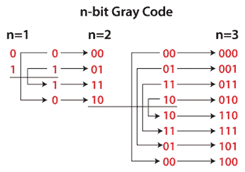
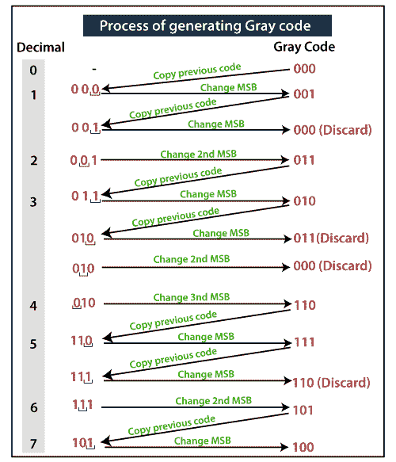

# 格雷码

> 原文：<https://www.javatpoint.com/gray-code-in-digital-electronics>

**格雷码**是二进制数系统的序列，也称为**反射二进制码**。将此代码称为反射二进制代码的原因是前 N/2 个值与后 N/2 个值的顺序相反。在该代码中，两个连续值相差一位二进制数字。格雷码用于硬件生成的二进制数的一般序列。当从一个数字到它的后续数字的转换完成时，这些数字会引起歧义或错误。这段代码简单地解决了这个问题，当数字之间的转换完成时，只改变一位。

格雷码是一种非常轻的代码，因为它不依赖于位置指定的数字值。这种代码也被称为循环变量代码，因为一个值到其连续值的转换只携带一位的变化。

### 如何生成格雷码？

前缀和反射方法被递归地用于生成数字的格雷码。用于生成格雷码:

1.  我们找到表示一个数所需的位数。
2.  接下来，我们找到 0 的代码，即 0000，与二进制相同。
3.  现在，我们取前面的代码，即 0000，并更改它的最高有效位。
4.  我们秘密地执行这个过程，直到所有的代码都没有被唯一地识别。
5.  如果通过改变最高有效位，我们找到先前获得的相同代码，那么第二个最高有效位将被改变，以此类推。

### 生成格雷码的过程

### 格雷码表

| 小数 | 二进制数 | 格雷码 |
| Zero | 0000 | 0000 |
| one | 0001 | 0001 |
| Two | 0010 | 0011 |
| three | 0011 | 0010 |
| four | 0100 | 0110 |
| five | 0101 | 0111 |
| six | 0110 | 0101 |
| seven | 0111 | 0100 |
| eight | One thousand | One thousand one hundred |
| nine | One thousand and one | One thousand one hundred and one |
| Ten | One thousand and ten | One thousand one hundred and eleven |
| Eleven | One thousand and eleven | One thousand one hundred and ten |
| Twelve | One thousand one hundred | One thousand and ten |
| Thirteen | One thousand one hundred and one | One thousand and eleven |
| Fourteen | One thousand one hundred and ten | One thousand and one |
| Fifteen | One thousand one hundred and eleven | One thousand |

* * *