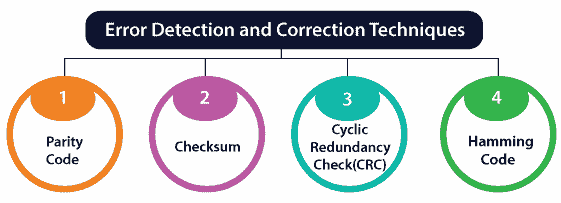

# 错误检测和纠正代码

> 原文：<https://www.javatpoint.com/error-detection-and-correction-code-in-digital-electronics>

错误检测和纠正代码在从一个源到另一个源的数据传输中起着重要的作用。当数据从一个系统传输到另一个系统时，噪声也会加入到数据中，这会导致其他系统接收的二进制数据出现错误。在传输过程中，数据的位可能会发生变化(0 到 1 或 1 到 0)。

避免噪声的干扰是不可能的，但可以得到原始数据。为此，我们首先需要使用错误检测代码检测错误 **z** 是否存在。如果代码中存在错误，我们将在纠错码的帮助下进行纠正。

## 错误检测码

错误检测码是用于检测接收数据**比特流**中的错误的代码。在这些代码中，一些位被附加到原始比特流中。

错误检测代码在通过噪声信道发送消息之前对消息进行编码。编码方案以这样的方式执行，使得接收端的解码器能够容易地在接收数据中找到错误，并且成功的机会更高。

### 奇偶检验码

在奇偶校验码中，我们在原始比特流的 LSB 右侧或 MSB 左侧添加一个奇偶校验位。基于所选择的奇偶校验类型，两种类型的奇偶校验码是可能的，即偶数奇偶校验码和奇数奇偶校验码。

### 检错码的特点

以下是错误检测代码的特征:

*   当我们使用消息反向纠错技术进行可靠的数据传输时，会用到这些代码。接收方发送反馈消息，通知发送方消息是否在接收方没有任何错误地被接收。如果邮件包含错误，发送方会重新发送邮件。
*   在错误检测代码中，在固定大小的位块中，包含消息。在这种情况下，添加冗余位是为了纠正和检测错误。
*   这些代码包括检查错误。不管有多少错误位和错误的类型。
*   奇偶校验、校验和和循环冗余校验是错误检测技术。

## 误差校正码

纠错码是通过使用特定算法生成的，该算法用于从通过噪声信道传输的消息中消除和检测错误。纠错码找出损坏比特的正确数量和它们在消息中的位置。有两种类型的纠错码，如下所示。

### 分组码

在分组码中，在固定大小的比特组中，包含消息。在这种情况下，添加冗余位是为了纠正和检测错误。

### 卷积码

消息由随机长度的数据流组成，奇偶符号是通过布尔函数滑动应用于数据流而生成的。

汉明码技术用于纠错。

**汉明码**

汉明码是分组码的一个例子。检测到两个同时发生的位错误，并通过该代码纠正单个位错误。在汉明编码机制中，发送方通过在数据中添加不重要的位来编码消息。这些位被添加到消息中的特定位置，因为它们是用于校正的额外位。

* * *