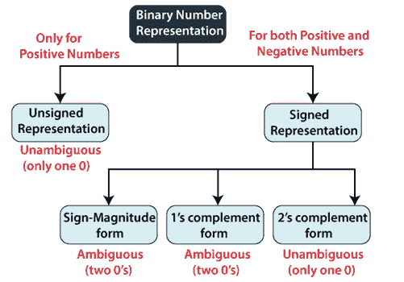

# 有符号和无符号二进制数

> 原文：<https://www.javatpoint.com/signed-and-unsigned-binary-numbers-in-digital-electronics>

整数变量以有符号和无符号的方式表示。通过在带符号的数字中使用符号标志来区分正值和负值。无符号数字不使用任何标志，即无符号数字只能存储正数。

在我们的日常生活中，表示正数和负数是非常容易的。我们表示正数，前面不加任何符号，负数前面加(-)符号。但是在数字系统中，不可能在它们之前使用负号，因为数据在数字计算机中是二进制形式的。为了用二进制数表示符号，我们需要一种特殊的符号。

## 二进制数表示法

我们的计算机只能理解(0，1)语言。二进制数有两种表示方式，即有符号和无符号。正数有符号和无符号两种表示方式，但负数只能用有符号的方式来描述。无符号数和有符号数的区别在于，无符号数不使用任何符号位来标识正数和负数，而是使用有符号数。

### 无符号数字

正如我们已经知道的，无符号数字没有任何表示负数的符号。所以无符号数总是正数。默认情况下，十进制数字表示为正数。我们总是假设每个十进制数字前面都有一个正号。

无符号二进制数中没有符号位，因此它只能表示其大小。在零和一中，零是无符号二进制数。这个表示中只有一个零(0)，它总是正的。由于一个数字在无符号数表示中的唯一二进制等价形式，它被称为明确表示技术。无符号二进制数的范围从 0 到(2 n -1)。

**示例:**表示无符号二进制数中的十进制数 102。

我们将把这个十进制数变成二进制数，它只有给定名字的大小。

| 小数 | 操作 | 结果 | 剩余物 |
| One hundred and two | 102/2 | Fifty-one | Zero |
| Fifty-one | 51/2 | Twenty-five | one |
| Twenty-five | 25/2 | Twelve | one |
| Twelve | 12/2 | six | Zero |
| six | 6/2 | three | Zero |
| three | 3/2 | one | one |
| one | 1/2 | Zero | one |

所以(102) 10 的二进制数是(1100110) 2 ，十进制数 102 的 7 位数值。

### 有符号数字

有符号的数字有一个符号位，以便区分正整数和负整数。有符号二进制数技术既有符号位，也有数值大小。为了表示负十进制数，将在二进制数前面添加相应的符号。

有符号的数字有三种表示方式。有符号位表示零的两种可能表示形式(正(0)和负(1))，这是一种不明确的表示。第三种表示是 2 的补码表示，其中零不可能有双重表示，这使它成为明确的表示。有符号二进制数有以下几种表示形式:

1.  **符号量级形式**
    在这种形式中，二进制数有一位表示符号。如果该位设置为 1，数字将为负，否则如果设置为 0，数字将为正。除了这个符号位，n-1 位代表数字的大小。
2.  **1 的补码**
    通过反转一个数的每一位，我们可以得到一个数的 1 的补码。负数可以用 1 的补码来表示。在这种形式中，二进制数还有一个额外的位用于符号表示，作为符号幅度形式。
3.  **2 的补码**
    通过反转一个数的每一位，并在其最低有效位上加 1，我们可以得到一个数的 2 的补码。负数也可以用 2 的补码来表示。在这种形式中，二进制数还有一个额外的位用于符号表示，作为符号幅度形式。

* * *