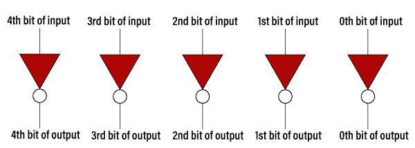
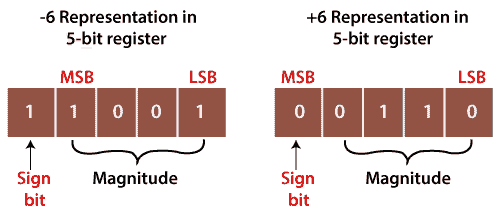

# 1 的补码

> 原文：<https://www.javatpoint.com/1s-complement-in-digital-electronics>

在数字表示技术中，二进制数字系统是数字电子中最常用的表示技术。补码用于以二进制形式表示负十进制数。二进制数可能有不同类型的补码，但 1 和 2 的补码主要用于二进制数。我们可以通过简单地反转给定的数来找到二进制数的 1 的补码。例如，二进制数 1011001 的 1 的补码是 0100110。我们可以通过改变每个位(0 到 1 和 1 到 0)并将 1 加到最低有效位来找到二进制数的 2 补码。例如，二进制数 1011001 的 2 的补码是(0100110)+1=0100111。

为了求二进制数的 1 的补码，我们也可以用非门实现逻辑电路。我们对二进制数的每一位使用非门。因此，如果我们想实现 5 位 1 补码的逻辑电路，将使用五个非门。

**例 1: 11010.1101**

要查找给定数字的 1 的补码，请将所有 0 更改为 1，将所有 1 更改为 0。所以数字 11010.1101 的 1 的补码出来 **00101.0010** 。

**例 2: 100110.1001**

要查找给定数字的 1 的补码，请将所有 0 更改为 1，将所有 1 更改为 0。于是，数字 100110.1001 的 1 的补码就出来了 **011001.0110** 。

### 1 的补码表

| 二进制数 | 1 的补码 |
| 0000 | One thousand one hundred and eleven |
| 0001 | One thousand one hundred and ten |
| 0010 | One thousand one hundred and one |
| 0011 | One thousand one hundred |
| 0100 | One thousand and eleven |
| 0101 | One thousand and ten |
| 0110 | One thousand and one |
| 0111 | One thousand |
| One thousand | 0111 |
| One thousand and one | 0110 |
| One thousand and ten | 0101 |
| One thousand and eleven | 0100 |
| One thousand one hundred | 0011 |
| One thousand one hundred and one | 0010 |
| One thousand one hundred and ten | 0001 |
| One thousand one hundred and eleven | 0000 |

## 1 补码的使用

1 的补码在表示有符号的二进制数时起着重要的作用。1 的补码主要用于表示有符号的二进制数。除此之外，它还用于执行各种算术运算，如加法和减法。

在有符号的二进制数表示中，我们既可以表示正数，也可以表示负数。对于表示正数，没有什么可做的。但是为了表示负数，我们必须使用 1 的补码技术。为了表示负数，我们首先要用一个正号来表示，然后找到它的 1 的补码。

让我们举一个正数和负数的例子，看看这些数字是如何表示的。

**例 1: +6 和-6**

数字+6 表示为与二进制数相同。为了表示这两个数字，我们将使用 5 位寄存器。

因此+6 在 5 位寄存器中表示为 0 0110。

-6 在 5 位寄存器中以下列方式表示:

1.  +6=0 0110
2.  求数字 0 0110 的 1 的补码，即 1 1001。这里，MSB 表示一个数是负数。

这里，最高有效位是指最高有效位，最低有效位是指最低有效位。

**例 2: +120 和-120**

数字+120 表示为与二进制数相同。要表示这两个数字，请使用 8 位寄存器。

因此+120 在 8 位寄存器中表示为 0 1111000。

8 位寄存器中的-120 以下列方式表示:

1.  +120=0 1111000
2.  现在，找出数字 0 1111000 的 1 的补码，即 1 0000111。这里，MSB 表示数字是负数。

* * *