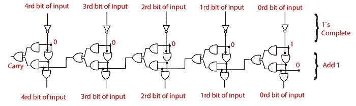
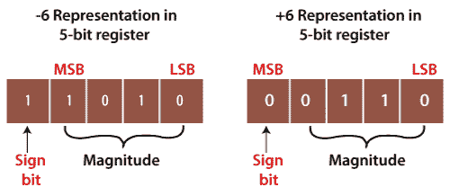

# 2 的补码

> 原文：<https://www.javatpoint.com/2s-complement-in-digital-electronics>

就像 1 的补码一样，2 的补码也被用来表示有符号的二进制数。为了找到二进制数的 2 的补码，我们将首先找到二进制数的 1 的补码，然后将 1 加到它的最低有效位上。

例如，如果我们想计算数字 1011001 的 2 的补码，那么首先，我们找到数字 0100110 的 1 的补码，并将 1 加到 LSB 上。所以，在 LSB 上加 1，这个数就是(0100110)+1=0100111。我们也可以使用或、与、非门来创建逻辑电路。用于寻找 5 位二进制数的二进制补码的逻辑电路如下:

**例 1: 110100**

要找到给定数字的二进制补码，请将所有 0 更改为 1，将所有 1 更改为 0。所以数字 110100 的 1 的补码是 001011。现在在这个数的 LSB 上加 1，即(001011)+1=001100。

**例 2: 100110**

要查找给定数字的 1 的补码，请将所有 0 更改为 1，将所有 1 更改为 0。所以，数字 100110 的 1 的补码是 011001。现在把这个数的 LSB 加一，即(011001)+1=011010。

### 2 的补码表

| 二进制数 | 1 的补码 | 2 的补码 |
| 0000 | One thousand one hundred and eleven | 0000 |
| 0001 | One thousand one hundred and ten | One thousand one hundred and eleven |
| 0010 | One thousand one hundred and one | One thousand one hundred and ten |
| 0011 | One thousand one hundred | One thousand one hundred and one |
| 0100 | One thousand and eleven | One thousand one hundred |
| 0101 | One thousand and ten | One thousand and eleven |
| 0110 | One thousand and one | One thousand and ten |
| 0111 | One thousand | One thousand and one |
| One thousand | 0111 | One thousand |
| One thousand and one | 0110 | 0111 |
| One thousand and ten | 0101 | 0110 |
| One thousand and eleven | 0100 | 0101 |
| One thousand one hundred | 0011 | 0100 |
| One thousand one hundred and one | 0010 | 0011 |
| One thousand one hundred and ten | 0001 | 0010 |
| One thousand one hundred and eleven | 0000 | 0001 |

### 2 补码的使用

2 的补码用于表示有符号的数字，并执行算术运算，如减法、加法等。正数简单地表示为一个量级形式。所以代表正数是没有用的。但是如果我们表示负数，那么我们必须选择 1 的补码或 2 的补码技术。1 的补码是一种模糊的技术，2 的补码是一种明确的技术。让我们看一个例子来理解如何在有符号二进制数表示中计算 2 的补码。

**例 1: +6 和-6**

数字+6 表示为与二进制数相同。要表示这两个数字，请使用 5 位寄存器。

因此+6 在 5 位寄存器中表示为 0 0110。

-6 在 5 位寄存器中以下列方式表示:

1.  +6=0 0110
2.  现在，找出数字 0 0110 的 1 的补码，即 1 1001。
3.  现在，在它的 LSB 上加 1。当我们把 1 加到 11001 的 LSB 上，新生成的数字就出来了 11010。这里，符号位是 1，这意味着数字是负数。

**例 2: +120 和-120**

数字+120 表示为与二进制数相同。要表示这两个数字，请使用 8 位寄存器。

因此+120 在 8 位寄存器中表示为 0 1111000。

8 位寄存器中的-120 以下列方式表示:

1.  +120=0 1111000
2.  现在，找出数字 0 1111000 的 1 的补码，即 1 0000111。这里，MSB 表示数字是负数。
3.  现在，在它的 LSB 上加 1。当我们把 1 加到 1 0000111 的 LSB 上，新生成的数字就出来了 1 0001000。这里，符号位是 1，表示数字是负数。

* * *