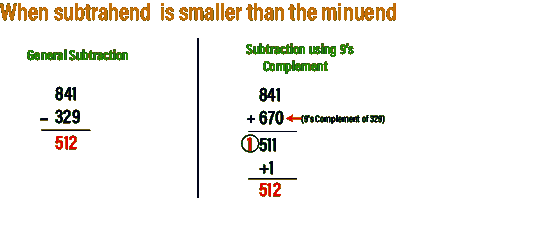
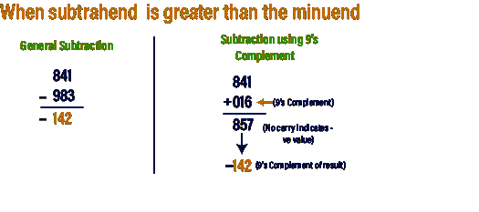
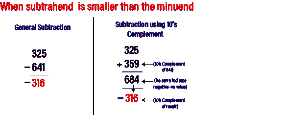
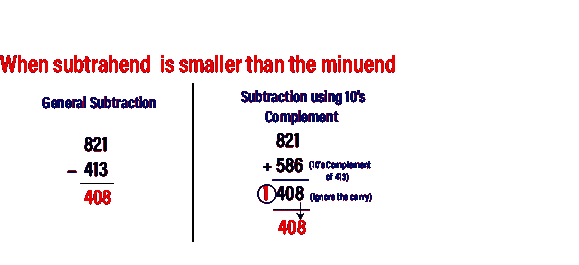

# 9 和 10 的补码

> 原文：<https://www.javatpoint.com/9s-and-10s-complement-in-digital-electronics>

如果这个数是二进制的，那么我们使用 1 的补码和 2 的补码。但是在这种情况下，当数字是十进制数时，我们将使用 9 和 10 的补码。10 的补码是从数的 9 的补码得到的，我们也可以用 r 和(r-1)的补码公式找到 9 和 10 的补码。

## 9 的补码

9 的补码用来求十进制数的减法。数字的 9 的补码是通过将数字的每个数字减去 9 来计算的。例如，假设我们有一个数字 1423，我们想找到这个数字的 9 的补码。为此，我们用 9 减去数字 1423 的每个数字。所以，数字 1423 的 9 的补码是 9999-1423= 8576。

### 用 9 的补码做减法

在 9 的补码的帮助下，减法的过程以一种简单得多的方式完成。一般来说，我们从被减数中减去减数，但是在使用 9 的补码进行减法的情况下，没有必要这样做。

为了用 9 的补码减去两个数，我们首先要找到减数的 9 的补码，然后我们将这个补码值与被减数相加。当我们用 9 的补码减去数字时，有两种可能的情况。

**情况 1:当减数小于被减数时。**

为了用 9 的补码从较大的数中减去较小的数，我们将找到减数的 9 的补码，然后我们将这个补码值与被减数相加。通过将这两个值相加，结果将形成进位。最后，我们将把这个进位加到前面得到的结果上。

**情况 2:当减数大于被减数时。**

在这种情况下，当我们将补码值和被减数相加时，结果不会形成进位。这表明数字是负数，为了找到最终结果，我们需要找到结果的 9 的补码。

## 10 的补码

10 的补码也用来求十进制数的减法。一个数的 10 的补码是通过将每个数字减去 9，然后将 1 加到结果中来计算的。简单地说，把 1 加到 9 的补码上，我们就可以得到 10 的补码值。例如，假设我们有一个数字 1423，我们想找到这个数字的 10 的补码。为此，我们找到了数字 1423 的 9 的补码，即 9999-1423= 8576，现在我们将在结果中加上 1。所以数字 1423 的 10 的补码是 8576+1=8577。

### 用 10 的补码做减法

为了用 10 的补码减去两个数，我们首先要找到减数的 10 的补码，然后我们将这个补码值与被减数相加。当我们用 10 的补码减去数字时，有两种可能的情况。

**情况 1:当减数小于被减数时。**

为了用 10 的补码从较大的数中减去较小的数，我们将找到减数的 10 的补码，然后将这个补码值与被减数相加。通过将这两个值相加，结果将形成进位。我们忽略这个进位，剩下的数字就是答案。

**情况 2:当减数大于被减数时。**

在这种情况下，当我们将补码值和被减数相加时，结果不会形成进位。这表示这个数是负数，为了找到最终结果，我们需要找到通过将减数和被减数的补码值相加得到的结果的 10 的补码。

* * *