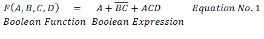
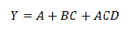
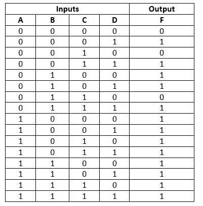
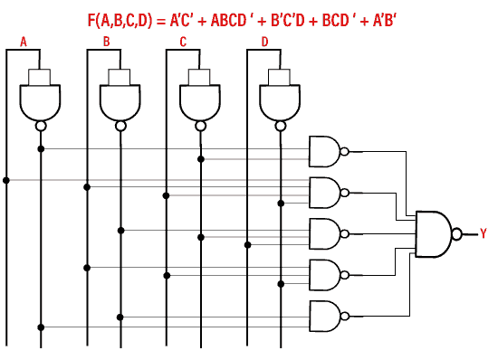

# 布尔函数

> 原文：<https://www.javatpoint.com/boolean-functions-in-digital-electronics>

布尔代数中使用二进制变量和逻辑运算。该代数表达式被称为**布尔表达式**，用于描述**布尔函数**。布尔表达式由常数值 1 和 0、逻辑运算符号和二进制变量组成。

**例 1: F=xy' z+p**

我们根据四个二进制变量 x，y，z 和 p 定义了布尔函数 **F=xy' z+p** ，当 x=1，y=0，z=1 或 z=1 时，这个函数将等于 1。

**例 2:**

输出 Y 表示在等式的左侧。所以，

除了代数表达式，布尔函数也可以用真值表来描述。我们可以用多个代数表达式来表示一个函数。它们在逻辑上是等价的。但是对于每个函数，我们只有一个唯一的真值表。

在真值表表示中，我们表示输入及其结果的所有可能组合。我们可以把转换方程转换成真值表。

**例:F(A，B，C，D)=A+BC'+D**

当 A=1 或 BC'=1 或 D=1 或全部设置为 1 时，输出将为高电平。上面例子的真值表如下。2 n 是真值表的行数。n 定义了输入变量的数量。所以可能的输入组合是 2 3 =8。

## 简化布尔函数的方法

简化布尔函数有两种方法。这些功能如下:

### 卡诺图或 K 图

德摩根定律对于操纵逻辑表达式非常有帮助。逻辑门也可以实现逻辑表达式。k-map 方法用于将逻辑门减少到实现逻辑表达式所需的最小可能值。K-map 方法将以两种不同的方式完成，我们将在后面的**简化布尔表达式**部分讨论。

### 与非门的实现

除了 K 图，我们还可以使用与非门来简化布尔函数。让我们看一个例子:

例 1: F(A，B，C，D)=A' C'+ABCD'+B' C' D+BCD'+A'B '

* * *