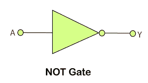
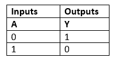
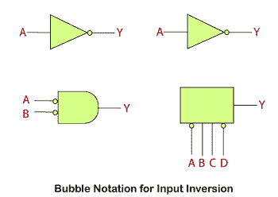
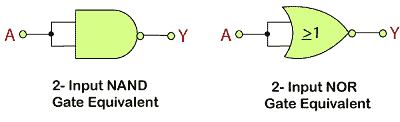

# 非门

> 原文：<https://www.javatpoint.com/not-gate-in-digital-electronics>

非门是所有其他逻辑门中最基本的逻辑门。非门也称为**反相器**或**反相缓冲器**。“非”门只有一个输入和一个输出。当输入信号为“低”时，输出信号为“高”，当输入信号为“高”时，输出信号为“低”。“非”门的布尔表达式如下:

A'=Y

当 A 不是真的，那么 Y 就是真的

标准的“非”门有一个符号，形状像三角形，末端有一个圆圈，指向右边。这个圆被称为“反转气泡”，用于表示非、与非和非符号输出中非函数的逻辑运算。

### 逻辑设计

### 真值表

补码值由非门产生。所谓“非”门是因为当输入信号为 0 时，输出信号不会为 0，同样，当输入信号为 1 时，输出信号也不会为 1。

在非门中，气泡表示输出信号的单个反转。但是这个气泡也可以存在于门的输入端，表示一个不活跃的输入。输入信号的这种反转不仅仅限于“非”门，还可用于任何数字电路或门，如反转操作所示，无论是在输入端还是输出端。最简单的方法是把泡泡想象成一个逆变器。

## 活动低输入气泡的使用

## 等效门

“非”门也可以在通用门，即“与非”和“或非”门的帮助下形成。为此，我们必须将两个输入端连接到一个公共输入信号。与非门和或非门的非门表示如下:

* * *