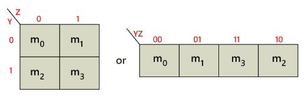
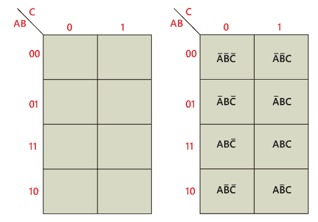
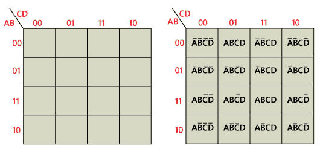
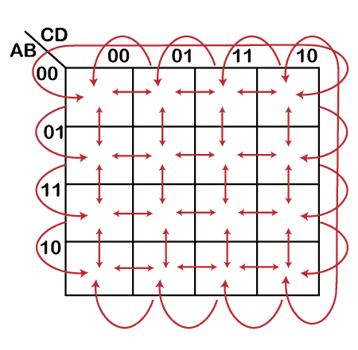
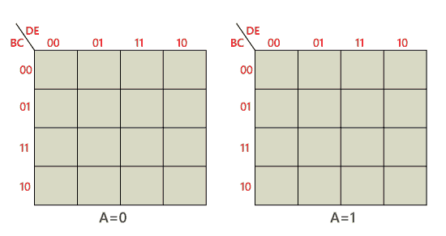

# 卡诺图法

> 原文：<https://www.javatpoint.com/karnaugh-map-in-digital-electronics>

**K 图**是一种简化布尔表达式的系统方法。借助 K-map 方法，我们可以找到最简单的 POS 和 SOP 表达式，这就是所谓的最小表达式。K-map 为简化提供了一本食谱。

就像真值表一样，K-map 包含输入变量的所有可能值及其相应的输出值。但是，在 K-map 中，值存储在数组的单元格中。在每个单元格中，存储了每个输入变量的二进制值。

K-map 方法用于包含 2、3、4 和 5 个变量的表达式。对于更高数量的变量，还有另一种用于简化的方法，称为奎因-麦克劳斯基方法。在 K-map 中，单元格的数量类似于变量输入组合的总数。例如，如果变量数为 3，单元数为 2 3 =8，如果变量数为 4，单元数为 2 4 。k 线图采用标准操作程序和位置表。用 0 和 1 填充 K 图网格。通过分组来解决 K 图。使用 K-map 求解表达式有以下步骤:

1.  首先，我们根据变量的数量找到 K 图。
2.  在给定的表达式中找到 maxterm 和 minterm。
3.  在标准操作程序的 K-map 单元格中填入 1，对应最小项。
4.  在位置块的单元格中填入与最大值相对应的 0。
5.  接下来，我们创建包含 2，4，8…等 2 次方项的矩形组，并尝试在一个组中覆盖尽可能多的元素。
6.  在这些小组的帮助下，我们找到产品术语，并将其总结为标准操作程序表格。

## 2 可变 k 线图

在一个 2 变量的 K 图中总共有 4 个变量。双变量 K 图中有两个变量。下图显示了 2 变量 K 图的结构:

*   在上图中，只有一种可能将四个相邻的小条目分组。
*   将两个相邻的子组分组的可能组合是{(m 0 、m 1 )、(m 2 、m 3 )、(m 0 、m 2 )和(m 1 、m 3 )}。

## 三变量 k 线图

三变量 K 图表示为一个由八个单元组成的数组。在这种情况下，我们使用 A、B 和 C 作为变量。我们可以使用任何字母作为变量的名称。变量 A 和 B 的二进制值沿左侧，C 的值跨顶部。给定单元格的值是同一行左侧的 A 和 B 的二进制值与同一列顶部的 C 的值的组合。例如，左上角单元格的二进制值为 000，右下角单元格的二进制值为 101。

## 四变量卡诺图

4 变量 K 图表示为 16 个单元的数组。A 和 B 的二进制值沿左侧，C 和 D 的值跨顶部。给定单元格的值是同一行左侧的 A 和 B 的二进制值与同一列顶部的 C 和 D 的二进制值的组合。例如，右上角的单元格的二进制值为 0010，右下角的单元格的二进制值为 1010

## 五变量 k 线图

借助 32 单元 K 图，可以简化 5 变量的布尔表达式。为了构造一个 5 变量的 K 图，我们使用了两个 4 变量的 K 图。5 变量映射的每个 4 变量映射内的单元邻接类似于 4 变量映射。

五个变量的 K 图可以用两个 4 变量图来构造。每个映射包含 16 个单元格，所有单元格都是变量 Q、R、S 和 t 的组合。一个映射用于 P = 0，另一个映射用于 P = 1)。

* * *