# 用卡诺图简化布尔表达式

> 原文：<https://www.javatpoint.com/simplification-of-boolean-expressions-using-karnaugh-map>

正如我们所知，k 线图采用标准操作程序和位置表的形式。所以，K-map 有两种可能的解，即最小项解和最大项解。让我们开始学习如何找到 K-map 的最小项和最大项解。

## k 图的中期解

有以下步骤可以找到最小项解决方案或 K 图:

**第一步:**

首先，我们以规范形式定义给定的表达式。

**第二步:**

接下来，我们通过在 K-map 单元格中为每个乘积项输入 1 来创建 K-map，并用零填充剩余的单元格。

**第三步:**

接下来，我们通过考虑 K 图中的每个组来形成组。

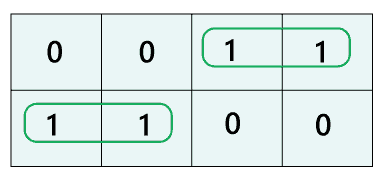

请注意，每个组应该有最大数量的“1”。组不能包含空单元格或包含 0 的单元格。

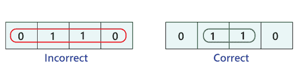

在一个组中，总共有 2 n 个 1。这里，n=0，1，2，…n。

**例:** 2 0 =1，2 1 =2，2 2 =4，2 3 =8，或 2 4 =16。

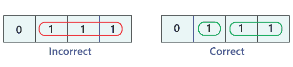

我们把 1 的数目按递减顺序分组。首先，我们必须设法组成八国集团，然后是四国，然后是两国，最后是一国。

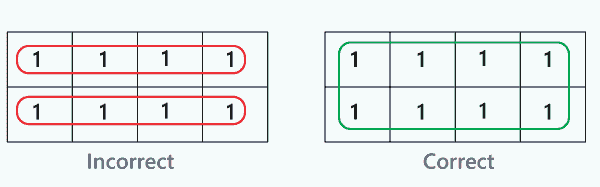

以水平或垂直的方式，一组一组形成矩形和正方形。我们不能在 K 图中执行对角线分组。

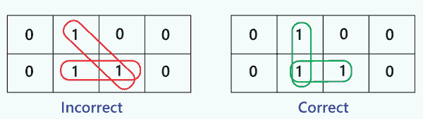

只有当组的大小增加时，一个组中的元素也可以在不同的组中使用。

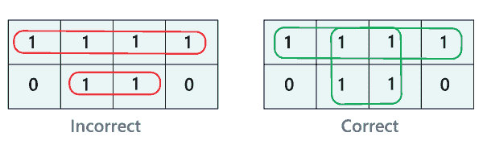

位于表格边缘的元素被认为是相邻的。所以，我们可以将这些元素分组。

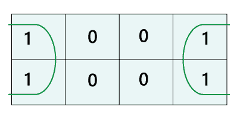

只有当‘不在乎条件’有助于增加群体规模时，我们才能考虑。否则，将丢弃“不在乎”元素。

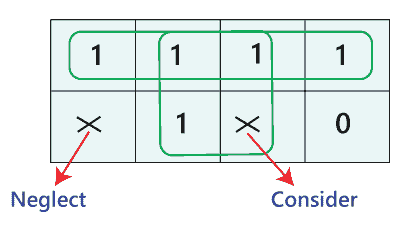

**第四步:**

在下一步中，我们找到每个组的布尔表达式。通过查看单元格标记中的公共变量，我们根据输入变量来定义组。在下面的例子中，总共有两个组，即组 1 和组 2，有两个和一个数量的“1”。

在第一组中，A 的值为 0 的行中存在这些值。因此，它们包含变量 a 的补码。剩余的两个“1”出现在相邻的列中。在这些列中，只有 B 项是与 A'B 组相对应的乘积项。就像组 1 一样，在组 2 中，1 出现在 A 值为 1 的行中。所以，这个列对应的变量是 B'C '。这个组的整体产品术语是 AB'C。

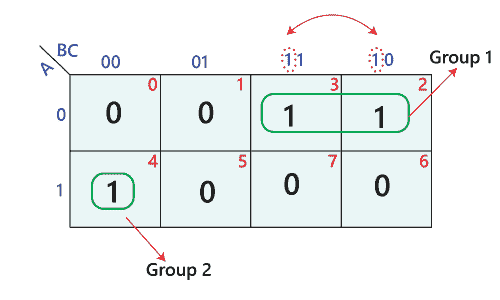

**第五步:**

最后，我们找到输出的布尔表达式。为了找到标准操作程序形式的简化布尔表达式，我们将所有单个组的乘积项组合起来。因此，上述 k-map 的简化表达式如下:

A'+AB'C'

让我们举一些 2 变量、3 变量、4 变量和 5 变量 K-map 的例子。

**例 1: Y=A'B' + A'B+AB**

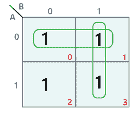

**简化表达:Y = A’+B**

**例 2:Y = A ' b ' C '+A ' BC '+AB ' C '+AB ' C+ABC '+ABC**

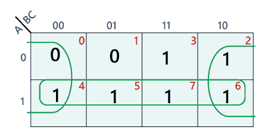

**简化表达式:Y=A+C'**

**例 3:Y = A ' B ' C ' D '+A ' B ' CD '+A ' BCD '+A ' BCD+AB ' C ' D '+ABCD '+ABCD**

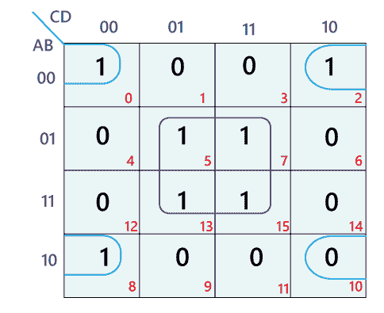

**简化表达式:Y=BD+B'D'**

## K-映射的最大项解

使用 K-map 寻找简化的最大项解与寻找最小项解是一样的。maxterm 解决方案中有一些小的变化，如下所示:

1.  我们将通过在 K-map 单元格中输入每个和项的值 0 来填充 K-map，并用 1 填充剩余的单元格。
2.  我们将使“0”组不代表“1”。
3.  现在，我们将把每个组的布尔表达式定义为和项。
4.  最后，为了找到 POS 形式的简化布尔表达式，我们将组合所有单个组的和项。

让我们举一些 2 变量、3 变量、4 变量和 5 变量 K-map 的例子

**例 1: Y=(A'+B')+(A'+B)+(A+B)**

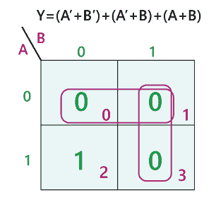

**简写:A'B**

**例 2:Y =(A+b+ C ')+(A+B '+C ')+(A '+B '+C)+(A '+B '+C ')**

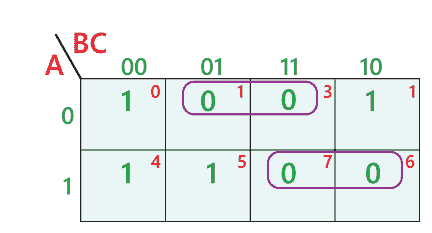

**简化表达式:Y =(A+C’)。(A' + B')**

**例 3: F(A，B，C，D)=π(3，5，7，8，10，11，12，13)**

**简化表达式:Y =(A+C’)。(A' + B')**

* * *