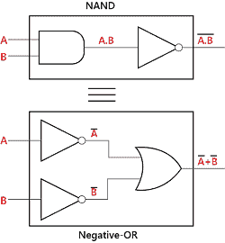
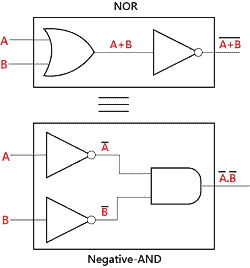
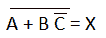
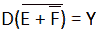
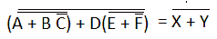
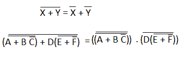
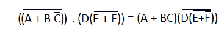
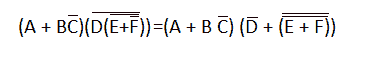
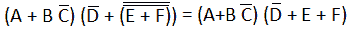
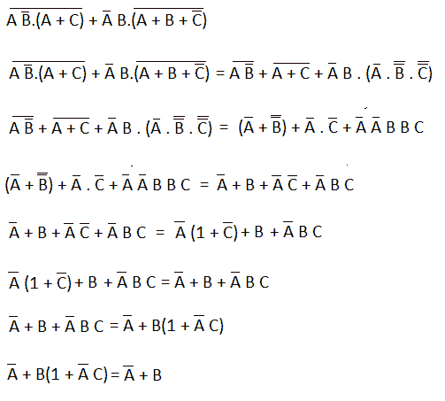

# 德摩根定理

> 原文：<https://www.javatpoint.com/de-morgans-theorem-of-boolean-algebra-in-digital-electronics>

一位著名的数学家 **DeMorgan** 发明了布尔代数最重要的两个定理。道德根定理被用于或非门和负与门以及负或门和与非门的等价性的数学验证。这些定理在求解各种布尔代数表达式中起着重要作用。在下表中，定义了输入变量的每个组合的逻辑运算。

| 输入变量 | 输出条件 |
| **A** | **B** | **和** | **与非** | **或** | **或非** |
| Zero | Zero | Zero | one | Zero | one |
| Zero | one | Zero | one | one | Zero |
| one | Zero | Zero | one | one | Zero |
| one | one | one | Zero | one | Zero |

德摩根定理的规则是由[或](https://www.javatpoint.com/or-gate-in-digital-electronics)、[和](https://www.javatpoint.com/and-gate-in-digital-electronics)的布尔表达式产生的，而不是使用两个输入变量 x 和 y。德摩根定理的第一个定理说，如果我们对两个输入变量执行“与”运算，然后对结果执行“非”运算，结果将与该变量补码的“或”运算相同。DeMorgan 的第二个定理说，如果我们对两个输入变量执行 OR 运算，然后对结果执行 [NOT](https://www.javatpoint.com/not-gate-in-digital-electronics) 运算，结果将与该变量补码的 and 运算相同。

## 德摩根第一定理

根据第一个定理，“与”运算的补码结果等于该变量补码的“或”运算。因此，它相当于[与非门](https://www.javatpoint.com/nand-gate-in-digital-electronics)函数，是证明(A.B)' = A'+B '的负或函数，我们可以用下表来表示。

| 输入 | 每个术语的输出 |
| **A** | **B** | **甲乙** | **(甲乙)'** | **A'** | **B’** | **A'A+B'** |
| Zero | Zero | Zero | one | one | one | one |
| Zero | one | Zero | one | one | Zero | one |
| one | Zero | Zero | one | Zero | one | one |
| one | one | one | Zero | Zero | Zero | Zero |

## 德摩根第二定理

根据第二个定理，或运算的补码结果等于该变量补码的与运算。因此，它相当于或非门函数，是证明(A+B)' = A '的负与函数。我们可以用下面的真值表来展示这一点。

| 输入 | 每个术语的输出 |
| **A** | **B** | **A+B** | **(A+B)'** | **A'** | **B’** | **A’。' B'** |
| Zero | Zero | Zero | one | one | one | one |
| Zero | one | one | Zero | one | Zero | Zero |
| one | Zero | one | Zero | Zero | one | Zero |
| one | one | one | Zero | Zero | Zero | Zero |

让我们举一些例子，在这些例子中，我们取一些表达式并应用 DeMorgan 定理。

**实施例 1:(公元前)'**

(公元前)' =甲'+乙'+丙'

**例 2: (A+B+C)'**

(A+B+C)'=A '。b’。C

**例 3: ((A+BC')'+D(E+F')')'**

为了在这个表达式上应用德蒙根定理，我们必须遵循以下表达式:

1)在完整的表达式中，首先，我们找到那些我们可以应用 DeMorgan 定理的项，并将每个项视为单个变量。

所以，

2)接下来，我们应用 DeMorgan 第一定理。所以，

3)接下来，我们使用规则编号 9，即(A=(A '))来取消双杠。

4)接下来，我们应用 DeMorgan 第二定理。所以，

5)再次应用第 9 条规则取消双栏

现在，这个表达式没有我们可以应用任何规则或定理的术语。所以，这是最后的表达。

**例 3:(AB’。(A + C))'+ A'B。(A + B + C')'**

* * *