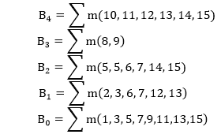
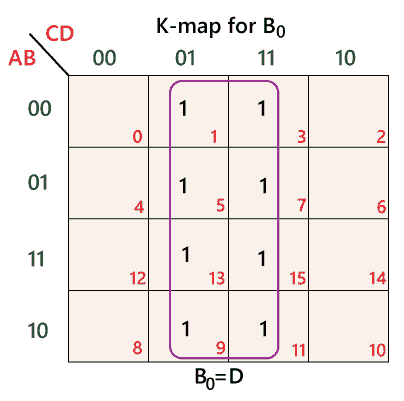
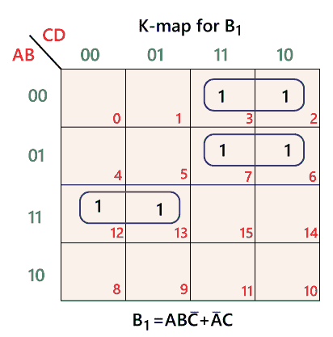
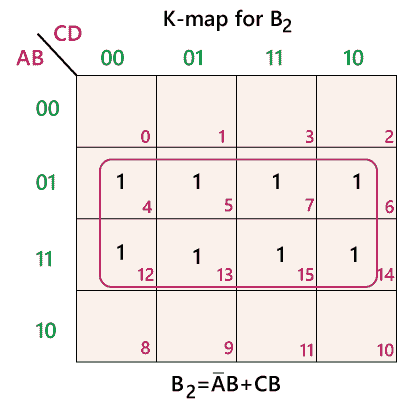
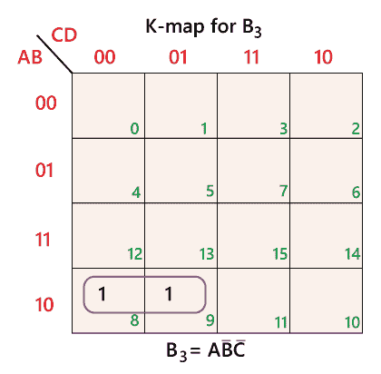
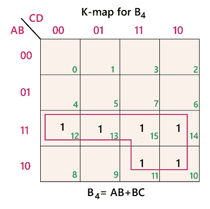

# 二进制到 BCD 码的转换

> 原文：<https://www.javatpoint.com/binary-to-bcd-conversion-in-digital-electronics>

BCD 码在数字电路中起着重要的作用。BCD 代表二进制编码的十进制数。在 BCD 码中，十进制数的每一位都表示为其等价的二进制数。所以，十进制数的最低有效位和最高有效位表示为二进制数。将二进制数转换为 BCD 有以下步骤:

1.  首先，我们将二进制数转换成十进制数。
2.  我们将把十进制数转换成 BCD。

让我们举一个例子来理解将二进制数转换为 BCD 的过程

### 例 1: (11110) 2

**1。首先，将给定的二进制数转换成十进制数。**

二进制数:(11110) 2

查找数字的十进制等价物:

| 步伐 | 二进制数 | 小数 |
| 1) | (11110) 2 | ((1×24)+(1×23)+(1×22)+(1×21)+(0×20)10 |
| 2) | (11110) 2 | (16 + 8 + 4 + 2 + 0) 10 |
| 3) | (11110) 2 | (30) 10 |

二进制数(11110) 2 的十进制数为(30) 10

**2。现在，我们将小数转换为 BCD**

我们将十进制数的每个数字转换成四位二进制数的组。

| 步伐 | 小数 | 转换 |
| 第一步 | 30 10 | (0011) 2 (0000) 2 |
| 第二步 | 30 10 | (00110000) BCD |

**结果:**

(11110)2=(00110000)BCD

下表包含十进制和二进制数的 BCD 代码。

| 二进制码 | 小数 | BCD 代码 |
| **甲乙丙丁** |  | **B4:B3B2B1B0** |
| 0 0 0 0 | Zero | 0 : 0 0 0 0 |
| 0 0 0 1 | one | 0 : 0 0 0 1 |
| 0 0 1 0 | Two | 0 : 0 0 1 0 |
| 0 0 1 1 | three | 0 : 0 0 1 1 |
| 0 1 0 0 | four | 0 : 0 1 0 0 |
| 0 1 0 1 | five | 0 : 0 1 0 1 |
| 0 1 1 0 | six | 0 : 0 1 1 0 |
| 0 1 1 1 | seven | 0 : 0 1 1 1 |
| 1 0 0 0 | eight | 0 : 1 0 0 0 |
| 1 0 0 1 | nine | 0 : 1 0 0 1 |
| 1 0 1 0 | Ten | 1 : 0 0 0 0 |
| 1 0 1 1 | Eleven | 1 : 0 0 0 1 |
| 1 1 0 0 | Twelve | 1 : 0 0 1 0 |
| 1 1 0 1 | Thirteen | 1 : 0 0 1 1 |
| 1 1 1 0 | Fourteen | 1 : 0 1 0 0 |
| 1 1 1 1 | Fifteen | 1 : 0 1 0 1 |

在上表中，十进制数的最高有效位由位 B4 表示，最低有效位由 B3、B2、B1 和 B0 表示。从上表中，我们可以表达不同位的 BCD 码的 SOP 函数如下:

上述标准操作程序功能的 K 图如下:

## 二进制转换

将 BCD 码转换为二进制的过程与将二进制码转换为 BCD 的过程相反。将 BCD 代码转换为二进制有以下步骤:

**在第一步中，我们将通过制作四位组，并为每组找到等效的十进制数，将**BCD 数转换为十进制数。

**在最后一步中，我们将使用十进制转换为二进制数的过程将**一个十进制数转换为二进制数。

例 1: (00101000) BCD

**1)将 BCD 转换为十进制**

组成 4 位数的组，找出等价的十进制数，如下所示:

| 步伐 | BCD 号码 | 转换 |
| 第一步 | (00101000) BCD | (0010) 2 (1000) 2 |
| 第二步 | (00101000) BCD | (2) 10 (8) 10 |
| 第三步 | (00101000) BCD | (28) 10 |

给定 BCD 码的小数为:(28) 10

**2。将十进制转换为二进制**

使用长除法将十进制数转换为二进制数，如下所示:

| 步伐 | 操作 | 结果 | 剩余物 |
| 1. | 28 / 2 | Fourteen | Zero |
| 2. | 14 / 2 | seven | Zero |
| 3. | 7 / 2 | three | one |
| 4. | 3 / 2 | one | one |
| 5. | 1 / 2 | Zero | one |

按照相反的顺序排列余数。所以，二进制数的 LSB 是第一个余数，二进制数的 MSB 是最后一个余数。

十进制数(18) 10 的二进制数为:(11100) 2

**结果:**

(00101000)BCD=(11100)2

* * *