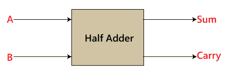
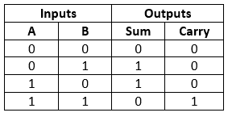
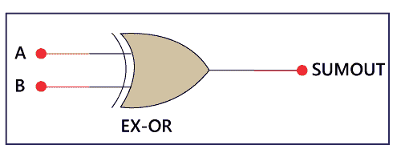
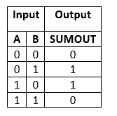
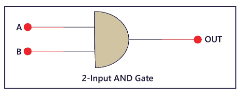
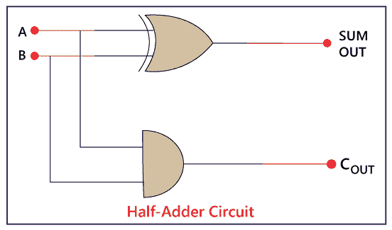

# 半加器

> 原文：<https://www.javatpoint.com/half-adder-in-digital-electronics>

半加法器是将两个数相加作为两个输入并产生两个输出的基本构件。加法器用于对两个单比特二进制数进行或运算。**加数**和**加数**位是两种输入状态，**【进位】****【求和】**是半加法器的两种输出状态。

### 框图

### 真值表

在上表中，

1.  “a”和“B”是输入状态，“sum”和“carry”是输出状态。
2.  如果两个输入都不是 1，进位输出为 0。
3.  总和的最低有效位由“总和”位定义。

总和和进位的标准操作程序形式如下:

总和= x'y+xy'
进位= xy

## 半加法器电路的构造；

在框图中，我们看到它包含两个输入和两个输出。**加数**和**加数**位为输入状态，**进位**和**和**为半加法器的输出状态。半加法器是在以下两个逻辑门的帮助下设计的:

1.  2 输入与门。
2.  2 输入异或门或异或门

### 1.2 输入异或门或异或门

**和**位是在**异或**或**异或**门的帮助下生成的。

以上是 **EX-OR** 门的符号。在上图中，“A”和“B”是输入，“SUMOUT”是对两个数进行异或运算后的最终结果。

异或门的真值表如下:

从上表可以看出，当两个输入都不同时，[异或门](https://www.javatpoint.com/xor-gate-in-digital-electronics)给出结果 1。当两个输入相同时，异或运算的结果为 0。要了解更多关于异或门的信息，[点击这里](https://www.javatpoint.com/xor-gate-in-digital-electronics)。

### 2.2 输入与门:

异或门无法产生进位。为此，我们使用另一个门[和门](https://www.javatpoint.com/and-gate-in-digital-electronics)。与门给出进位的正确结果。

以上是**和**门的符号。在上图中，“A”和“B”是输入，“OUT”是对两个数进行“与”运算后的最终结果。

与门的真值表如下:

从上表可以看出，当两个输入都为 1 时，“与”门给出的结果是 1。当两个输入都不同且为 0 时，“与”门给出的结果为 0。要了解更多关于与门的信息，请点击此处。

### 半加法器逻辑电路:

因此，半加法器是通过组合“异或”和“与”门来设计的，并提供和与进位。

**半加法器电路**有如下**布尔表达式**:

**和= A 异或 B (A+B)**

**进位= A 和 B (A.B)**

* * *