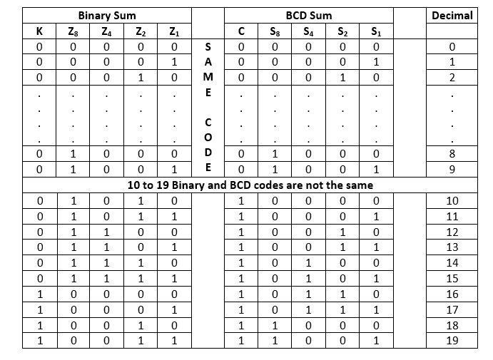
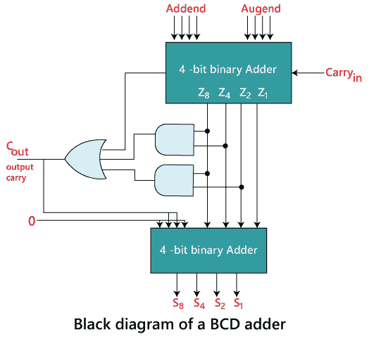

# 十进制或 BCD 加法器

> 原文：<https://www.javatpoint.com/decimal-or-bcd-adder-in-digital-electronics>

BCD 加法器用于直接在十进制数字系统中执行算术运算的计算机和计算器。BCD 加法器接受十进制数的二进制编码形式。十进制加法器至少需要九个输入和五个输出。

#### 注:十进制数在 BCD 码中需要 4 位表示，电路必须有一个输入进位和一个输出进位。

下面是用于设计 BCD 加法器的表格。

从上表可以清楚地看出，如果产生的和在 1 到 9 之间，则二进制码和 BCD 码是相同的。但是对于 10 到 19 的十进制数，这两个代码是不同的。在上表中，从 10 到 19 的二进制和组合给出了无效的 BCD。以下几点有助于电路识别无效的脑机接口。

1.  从表中可以明显看出，当**“二进制和”**的输出进位 K=1 时，需要进行校正。
2.  从 10 到 15 的其他六个组合需要修正，其中 Z 8 位置的位为 1。
3.  在 8 和 9 的二进制和中，Z 8 位置的位也是 1。所以，第二步失败了，我们需要修改它。
4.  为了区分这两个数字，我们规定 Z 4 或 Z 2 位置上的位也需要为 1，位为 Z 8
5.  校正和输出进位的条件可以用布尔函数表示:

**C=K+Z 8 。Z 4 +Z 8 。z2T9】**

一旦电路发现无效的 BCD，电路就将二进制数 6 加到无效的 BCD 码中，使其有效。

在上图中，

1.  我们采用一个 4 位二进制加法器，它以加数和加数位作为输入，输入进位**“进位输入”**。
2.  二进制加法器产生五个输出，即 Z8、Z4、Z2、Z1 和一个输出进位 k
3.  在输出进位 K 和 Z8、Z4、Z2、Z1 输出的帮助下，逻辑电路被设计成识别出 C 输出
4.  二进制加法器的 Z8、Z4、Z2 和 Z1 输出作为一个加数被传送到 2 和 4 位二进制加法器。
5.  2 nd 4 位二进制加法器的加数位设计为加数的第 1 st 和第 4T5 位为 0，第 2 nd 和第 3 rd 位与 C out 相同。当 C out 的值为 0 时，加数将为 0000，产生与 1 st 4 位二进制数相同的结果。但当 C out 的值为 1 时，加数位将为 0110，即 6，与被加数相加得到有效的 BCD 数。

**例:1001+1000**

1.  首先，使用 4 位二进制加法器将两个数相加，并将输入进位传递到 0。
2.  二进制加法器产生结果 0001，并携带输出“K”1。
3.  然后，使用表达式 C out =K+Z 8 找到 C out 值，以识别产生的脑机接口无效或有效。Z 4 +Z 8 。Z 2 。
    K = 1
    Z8= 0
    Z4= 0
    Z2= 0
    Cout= 1+0 * 0+0 * 0
    Cout= 1+0+0
    Cout= 1
4.  C out 的值为 1，表示产生的 BCD 码无效。然后，将 1 st 4 位二进制加法器的输出与 0110 相加。
    = 0001+0110
    = 0111
5.  BCD 由进位输出表示为:
    BCD = CoutZ8Z4Z2Z1= 1 0 1 1 1

* * *